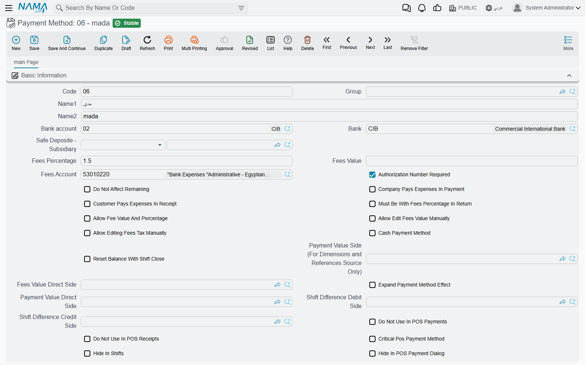
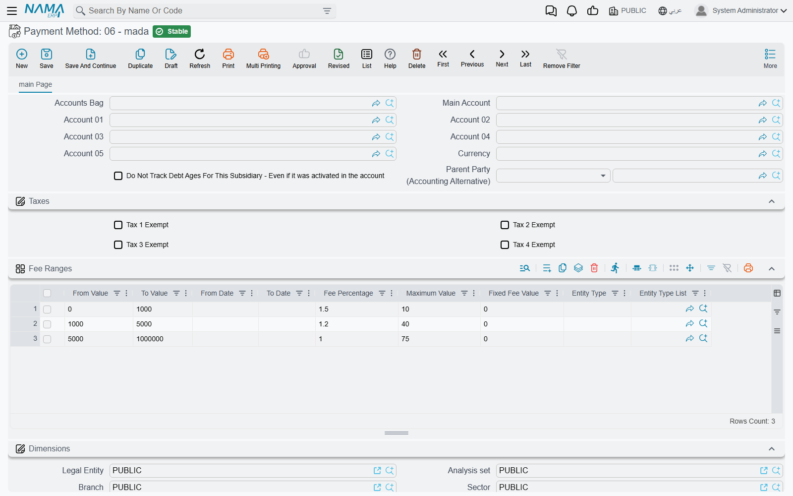
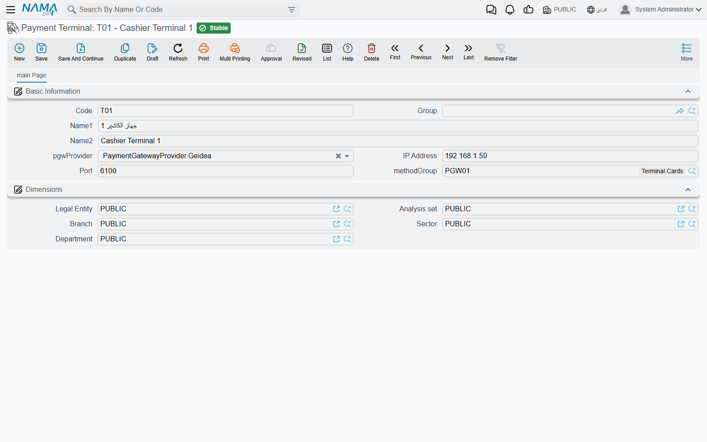
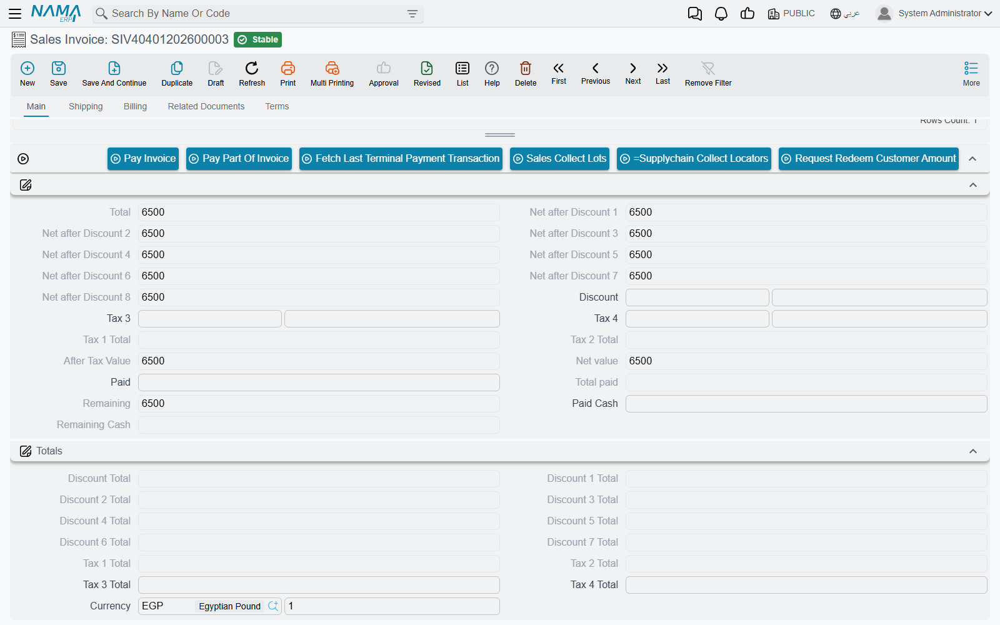
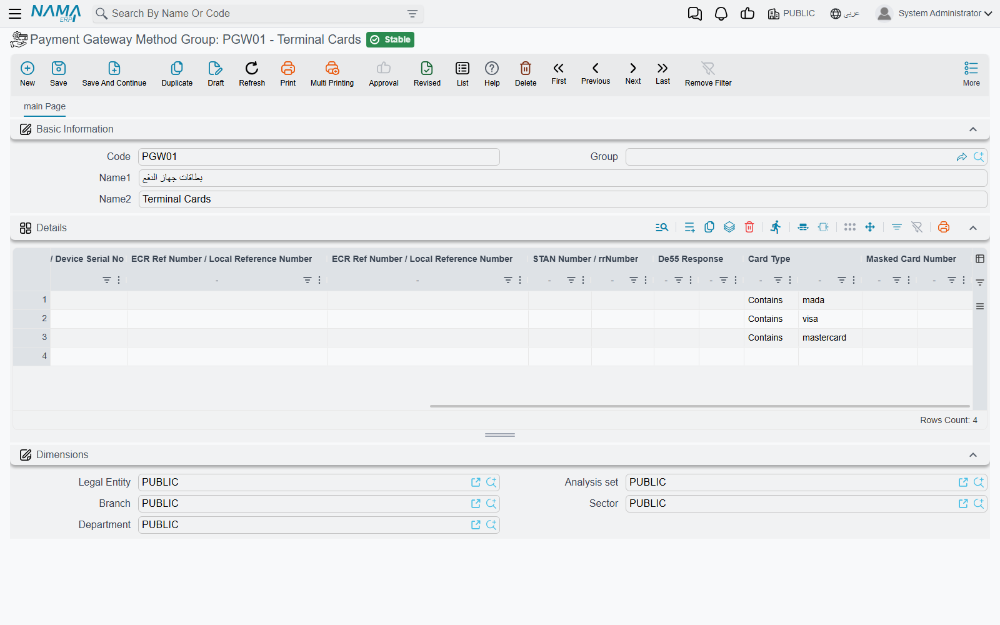

# Payment Methods and Payment Terminals

Cash, mada, Visa, a bank transfer, a store voucher: from the customer's side these are all just ways to pay. Accounting treats them differently. Cash lands in a safe, a card payment lands in a bank account a day or two later minus the bank's commission, and a transfer may arrive with no commission at all. A **Payment Method** (طريقة دفع) is the record that holds those differences. Each payment line on an invoice, voucher, POS receipt or shift names a payment method. The method then decides where the money goes in the ledger, what fee is deducted and where that fee is booked, and how the method behaves at the POS counter.

A **Payment Terminal** is the card machine on the counter. When a sales document is linked to a terminal, the cashier can send the amount to the machine and let the approved transaction fill in the payment line, method included, instead of typing it in.

All three screens are in the basic module, under `Basic → Master Files`: **Payment Method**, **Payment Terminal** and **Payment Gateway Method Group**.

## Where the money goes

The first group on the screen says which cash or bank account a payment by this method ends up in:

- **Bank account** (رقم حساب البنك) — for a card or transfer method, the bank account the money is credited to.
- **Safe Deposite - Subsidiary** (الخزينة - الذمة) — for a method that does not go through a bank account. It can be a safe, a third party or a plain account.
- **Bank** (البنك) — the bank itself, for reference.

When both are filled, the bank account wins. A document's payment line debits (or, on a return, credits) the main account of that bank account or safe.

Three account sides can change that default. Each one is an [account side](/platform/shared-master-files/accounting-side-config): an account, subsidiary and dimension rule saved once and reused.

- **Payment Value Direct Side** (التوجيه المباشر لقيمة الدفع) replaces the default completely. The payment value is booked wherever this side says.
- **Payment Value Side (For Dimensions and References Source Only)** (توجيه قيمة الدفع (لمصدر المحددات و المراجع فقط)) keeps the default account but takes the dimensions and references of the line from this side. As the label says, it does not change the account.
- **Fees Value Direct Side** (التوجيه المباشر لقيمة الرسوم) does the same for the fee line, described below.

The **Subsidiary Accounts** block (حافظة الحسابات) at the bottom is the method's own account set, the same block that customers, banks and safes carry.

## Fees and commissions

A card acquirer typically keeps a percentage of each payment. Nama calculates that fee for each payment line and books it separately from the payment itself.

**Fees Percentage** (نسبة الرسوم) and **Fees Value** (قيمة الرسوم) give the simple case: a percentage of the line, a fixed amount per line, or both added together. **Fees Account** (حساب الرسوم) is where the fee is booked, and it is required as soon as either is filled. For example, a mada method with 1.5% and a Fees Account of *Bank charges* turns a 2,000 payment into a 30 fee.

When the fee depends on the amount, the date or the document, use the **Fee Ranges** grid (شرائح الرسوم) instead. Each row can set:

| Column | Meaning |
|---|---|
| **From Value** / **To Value** (من قيمة / إلي قيمة) | The payment amounts the row applies to. Leave either end empty for no limit. |
| **From Date** / **To Date** (من تاريخ / إلى تاريخ) | The period the row applies to, compared with the document's value date. |
| **Entity Type** / **Entity Type List** (النوع / قائمة الأنواع) | The document types the row applies to. Leave both empty for all documents. |
| **Fee Percentage** / **Fixed Fee Value** (نسبة الرسوم / قيمة الرسوم الثابتة) | The fee for a matching payment. |
| **Maximum Value** (أقصي قيمة) | A cap on the fee calculated by the row. |

Rows are checked from top to bottom, and the first row that matches the amount, the date and the document type is used. If none matches, the header's percentage and value apply. A row normally carries either a percentage or a fixed value. Tick **Allow Fee Value And Percentage** (السماح بوجود قيمة رسوم ثابته بالإضافة الي نسبة رسوم) to allow both on one row, which is how a "1% + 1 riyal" tariff is entered.

**Allow Edit Fees Value Manually** (السماح بتعديل قيمة الرسوم يدويا) lets the user overwrite the calculated fee on the document. Once a non-zero fee is typed, it is kept.

### Who bears the fee

On a receipt, the fee normally reduces what the company actually receives, so it is booked as an expense on the Fees Account. On a payment it works the other way round. Two switches change that:

- **Customer Pays Expenses In Receipt** (يتحمل العميل المصاريف عند القبض) — on a receipt voucher, the fee is charged to the paying party instead of being the company's expense.
- **Company Pays Expenses In Payment** (تتحمل الشركة المصاريف عند الصرف) — on a payment voucher, the fee is the company's expense, booked as a debit on the Fees Account.

By default, a voucher books the cash or bank side net of the fee: a 2,000 receipt with a 30 fee debits the bank with 1,970. Tick **Expand Payment Method Effect** (عدم إختصار قيود مصروفات طرق الدفع) to book the full 2,000 on the bank side instead, with the fee as a separate counter-line. The entry then shows the gross amount and the commission side by side, as the bank statement does.

### Tax on the fee

Banks charge VAT on their commission. The **Fees Tax** group (ضريبة الرسوم) calculates it:

- **Tax Plan** takes the rate from a tax plan, by legal entity and date. When a tax plan is set, it wins.
- Otherwise, **Fees Tax Percentage** (نسبة ضريبة الرسوم) applies, limited to the period between **Apply Fees Tax From Date** and **Apply Fees Tax To Date**.
- **Fees Tax Debit** and **Fees Tax Credit** (مدين / دائن ضريبة الرسوم) are the two account sides the tax is booked to. Both must be set for an entry to be made.
- **Reverse Fees Tax Debit And Credit In Returns And Purchase** (عكس مدين ودائن ضريبة الرسوم في المردودات والمشتريات) swaps the two sides on returns and purchases.
- **Allow Editing Fees Tax Manually** (السماح بتعديل قيمة ضريبة الرسوم يدوياً) lets the user overwrite the calculated tax.

## Behaviour on documents

- **Authorization Number Required** (رقم العملية مطلوب) — a payment line with this method cannot be saved without an **Authorization Number** (رقم العملية). Turn it on for card methods so every line can be matched to the acquirer's statement.
- **Do Not Affect Remaining** (عدم التأثير على المتبقي) — the line is recorded but does not reduce the invoice's remaining amount. Use it for a payment that is recorded for information only.
- **Tax Authority Code** (كود مصلحة الضرائب) — the code the e-invoicing integrations send as the payment means. For ZATCA, see [the payment-means rule](/modules/invoicing/zatca-guide).
- **Used With Reward Point Discount Coupons** (يستخدم مع قسائم الخصومات الخاصة بنقاط المكأفاة) and **Reward Points Configuration** tie the method to the loyalty programme. **Use To Sell And Purchase Reward Points** (تستخدم لشراء و بيع نقاط الولاء) marks the method used when points themselves are bought or sold.

## Cash, shifts and the POS counter

These settings matter only where cash drawers and shifts are used, in [cashier shifts](/modules/accounting/cashier-shifts) and in [Nama POS](/modules/pos/).

| Setting | What it does |
|---|---|
| **Cash Payment Method** (طريقة دفع نقدي) | Marks the method as cash, so it is counted with the cash in the drawer. Do not change it once the method has been used. Changing it is the cause of *Payment method {0} repeated in multi line* at shift close, described in the [POS FAQ](/modules/pos/pos-faq). |
| **Reset Balance With Shift Close** (تصفير الرصيد مع غلق الوردية) | Closing a cashier shift clears the whole system balance of this method instead of carrying it to the next shift. |
| **Shift Difference Debit Side** / **Shift Difference Credit Side** (الجانب المدين / الدائن لفرق الورديه) | Where a shortage or an overage counted at shift close is booked for this method. |
| **Hide In Shifts** (اخفاء في شاشة الورديات) | Leaves the method off the POS shift screens. |
| **Disable Actual Balance In POS** (تعطيل الرصيد الفعلي في نقطة البيع) / **Actual Balance Is Required In POS** (الرصيد الفعلي في نقطة البيع إجباري) | Whether the cashier enters a counted balance for this method at shift close, and whether that balance is mandatory. |
| **Hide In POS Payment Dialog** (إخفاء في شاشة الدفع في نقاط البيع) | Hides the method from the POS payment screen. Ticking it also ticks the next two. |
| **Hide In Sales Payment** (إخفاء في دفع المبيعات) / **Hide In Returns Payment** (إخفاء في دفع المردودات) | Hides the method on sales only or on returns only. |
| **Do Not Use In POS Payments** / **Do Not Use In POS Receipts** (لا تستخدم في مصروفات / مقبوضات نقاط البيع) | Keeps the method off the POS pay-out and pay-in screens. |
| **Critical Pos Payment Method** (طريقة دفع حرجه لنقاط البيع) | Only POS users whose security profile has **Can Use Critical Methods** (امكانية استعمال طرق الدفع الحرجة) can pick the method. |
| **Must Be With Fees Percentage In Return** (الأرتجاع بها مع عدم خفض العموله في الفاتورة الاصليه) | A POS return must refund through this method at least the same share of the total as the original invoice was paid with it. If 60% of the invoice was paid by mada, at least 60% of the return goes back by mada. |
| **Days Before Allowing Return** (عدد الأيام قبل السماح بالمرتجع) | A POS invoice paid with this method cannot be returned until this many days have passed. The global setting **Enable Days Before Allowing Return in Payment Methods** (تفعيل عدد الأيام قبل السماح بالمرتجع حسب طريقة الدفع) must be on first. |
| **Apply Header Discount Offer with Payment Method in Invoice** (خصم نسبة من الفاتورة مع طريقة الدفع (في خصم الهيدر)) | A percentage discount the POS gives on the whole invoice when it is paid with this method, for example a bank-card promotion. |
| **Keyboard Shortcut** (الاختصار) | A key, with optional Ctrl, Alt or Shift, that selects the method on the POS payment screen. |

## Payment terminals

A **Payment Terminal** record stands for one card machine. It is part of the **Payment Gateway** licence feature (`basic-payment-gateway`). In the Arabic interface its menu entry and screen title are shown in English. The screen has four fields beside the code and name:

| Field | What it does |
|---|---|
| **Provider** | **NearPay**, **InterPay** or **Geidea**. Only NearPay changes how Nama reaches the machine. See below. |
| **IP Address** (عنوان السيرفر) | The address of a NearPay device on the shop network. |
| **Port** (المنفذ) | The port that device listens on. |
| **Method Group** | The **Payment Gateway Method Group** that turns the card the customer used into a payment method. Always fill it. |

### Which documents use a terminal

The terminal is chosen on the document or on the register:

- **Sales Invoice** (and the Service Center sales invoice) has a **Payment Terminal** field in the header. Its payment area has three buttons: **Pay Invoice** (ادفع الفاتورة), **Pay Part Of Invoice** (دفع جزء من الفاتورة) and **Fetch Last Terminal Payment Transaction** (ايجاد اخر عمليه دفع تمت ولم تصل معلوماتها).
- The CRM maintenance order and maintenance invoice have the same field and buttons.
- **Receipt Voucher** and **Payment Voucher** show **Pay Invoice** above their payment-methods grid when **Allow Multiple Payment In Payment Voucher And Receipt Voucher Documents** (السماح بطرق الدفع المتعددة في سندات الصرف والقبض) is on in the accounting configuration. Their **Payment Terminal** field is not on the default screen, so add it with the [Screen Modifier](/platform/screen-modifier/screen-modifier-edit-screen) before using the button.
- In **Nama POS**, the terminal is set on the **Register** (ماكينة). A register without one uses the terminal in the POS configuration. Card payments at the counter are described in [Payment & Tender](/modules/pos/pos-payment-and-tender).

### What happens when the cashier presses Pay Invoice

1. Nama takes the amount: the remaining amount of the invoice for **Pay Invoice**, the amount the cashier enters for **Pay Part Of Invoice**, or the voucher amount on a voucher. The amount for a partial payment cannot be more than the remaining amount.
2. It sends that amount to the terminal and waits while the customer taps or inserts the card.
3. The approved transaction comes back with its card details: card type, masked card number, scheme, terminal and merchant IDs, and the authorization code. Nama writes them on a payment line. The authorization code goes into **Authorization Number**, and the line is marked as paid from the terminal.
4. Nama looks up the terminal's **Method Group** and fills in the line's **Payment Method** from the first row that matches the card. The fee, the accounts and everything else on this page then follow from that method.

If the connection drops after the customer has paid but before the answer arrives, do not charge the card again. Press **Fetch Last Terminal Payment Transaction** to ask the terminal for the result of the last transaction and fill in the line from it.

### Payment Gateway Method Groups

The method group answers the question: *this card was mada, so which payment method is it?* Each row of its **Details** grid (التفاصيل) names a **Payment Method** (طريقة الدفع) and the card details that select it. Each detail has a value column and a matching-rule column:

- **PAN Number / ApprovalCode**
- **Merchant Id**
- **Scheme Id / Card Scheme Name**
- **Terminal Id / Device Serial No**
- **ECR Ref Number / Local Reference Number**
- **STAN Number / rrNumber**
- **De55 Response**
- **Card Type**
- **Masked Card Number**

The matching rule is **Contains** (يحتوي علي), **Starts With** (يبدأ بـ) or **Ends With** (ينتهي بـ). Contains is used when the rule is left empty, and letter case is ignored. A detail with no value matches every card.

Rows are checked from the top, and the first row whose filled details all match wins. A typical group has a row with Card Type `mada` pointing at the *mada* method, rows for `visa` and `mastercard`, and a last row with nothing filled in pointing at a general *Cards* method to catch everything else. If no row matches, the payment line is filled in without a payment method, and the cashier picks one by hand.

### How Nama reaches the machine

#### Geidea and InterPay: the PGW application on the cashier's PC

Geidea and InterPay terminals are reached through the **PGW application**, a small program installed on the cashier's Windows PC. It talks to the card machine on one side and listens for Nama on port `7842` of the same PC on the other. With these providers, the terminal record's IP Address and Port are not used. Nama always calls the PGW application on the cashier's own PC, so every cashier PC that takes card payments needs its own copy. Installing and setting up PGW is covered in [Installing and Setting Up the Card Terminal Program](/platform/payments/pgw-card-terminal-app), the path of a payment through it in [How a Card Payment Travels Through PGW](/platform/payments/pgw-card-payment-flow), and the decline codes in [Card Refusal Codes](/platform/payments/pgw-card-refusal-codes).

If the PGW application is not running, the browser shows *There is no connection on port 7842, please make sure that the PGW server is running.* That message links to the setup file. It also mentions a Chrome setting, `chrome://flags/#block-insecure-private-network-requests`, which must be disabled so that a page served by the Nama server is allowed to call a program on the local PC.

#### NearPay: an Android device on the shop network

NearPay terminals are Android devices running the Nama POS app in payment gateway mode, and they are reached over the network:

- Set **IP Address** to the device's address on the shop network. **Port** can be left empty, and then `7843` is used. An address typed as `192.168.1.5:7843` also works.
- When the Nama server can reach the device, the server sends the payment to it. The device reports the result back to the server, and the browser waits for it for up to 90 seconds.
- When the Nama server is outside the shop, for example in the cloud, it cannot reach a device on the shop's network. In that case, run Nama in the browser on the device itself and set **IP Address** to `127.0.0.1` or `localhost`. The browser then talks to the Nama POS app on the same device directly.
- If a NearPay payment times out, use **Fetch Last Terminal Payment Transaction** to get the result.

## Messages you may see

Most of these messages have no Arabic text in the product and appear in English on Arabic screens too.

| Message | Why | What to do |
|---|---|---|
| *Payment method {0} fees account is required* — «حساب الرسوم لطريقة الدفع {0} مطلوب» | A voucher calculated a fee for this method, from the fee ranges, but the method has no **Fees Account**. | Fill **Fees Account** on the payment method, then reprocess the voucher. |
| *you should insert only one field fee percentage {0} or fee value {1}* — «يجب ادخال قيمة واحدة نسبة الرسوم {0} او  قيمة الرسوم {1}» | A fee-range row has both a percentage and a fixed value. | Keep one of them, or tick **Allow Fee Value And Percentage**. |
| *The line at {0} is completely empty, please remove it or set any field value in it* — «السطر رقم {0} فارغ تماماً، يرجى حذفه أو ملء أي حقل فيه» | A fee-range row has no amounts and no fee. | Delete the row. |
| *You must enable (Enable Days Before Allowing Return In Payment Method) in global configuration before using the option (Days Before Allowing Return)* | **Days Before Allowing Return** was filled while the global setting is off. | Turn on **Enable Days Before Allowing Return in Payment Methods** in Global Configuration first. |
| *You must select key* — «يجب اختيار مفتاح» | The keyboard shortcut has Ctrl, Alt or Shift ticked but no key. | Pick the key, or clear the modifiers. |
| *Cannot return invoice paid with {0} before {1} days* — «لا يمكن إرجاع فاتورة مدفوعة بطريقة {0} قبل مرور {1} يوم» | A POS return of an invoice paid with a method that has **Days Before Allowing Return**. | Wait until the period has passed, or refund through another channel your policy allows. |
| *Required payment method  - {0}* | A POS return pays nothing through a method marked **Must Be With Fees Percentage In Return** that the original invoice was paid with. | Refund at least part of the return through that method. |
| *Invalid Payment percentage with method  - {0}* | The return refunds a smaller share through that method than the original invoice was paid with it. | Raise that method's amount on the return. |
| *Actual balance is required for payment method {0}* — «الرصيد الفعلي إجباري لطريقة الدفع {0}» | Closing a POS shift without a counted balance for a method marked **Actual Balance Is Required In POS**. | Enter the counted amount for that method. |
| *Please select payment terminal* — «برجاء إختيار payment terminal» | **Pay Invoice** or **Fetch Last Terminal Payment Transaction** was pressed on a document with no **Payment Terminal**. | Pick the terminal on the document. |
| *There is no uncompleted transaction* | **Fetch Last Terminal Payment Transaction** was pressed in a browser that has not sent any payment to a terminal. | Use the button in the same browser that sent the payment. |
| *Purchase Transaction refused* | The card machine or the acquirer declined the payment. The response code and its reason are added after the message when the terminal returns them. | Ask for another card or another payment method. |
| *Purchase Transaction not completed successfully* | The terminal returned an answer without any transaction details, for example because the customer cancelled. | Try the payment again. |
| *Payment terminal has no IP address* | A NearPay terminal record has an empty **IP Address**. | Fill in the device's address. |
| *Cannot reach the payment device on* followed by the device address | Nama could not connect to the NearPay device. | Check that the device is on, on the same network, and that the Nama POS app is open in payment gateway mode. |
| *The payment device did not report a result. Use Fetch Last Terminal Payment Transaction to recover it.* | The NearPay device sent no result within 90 seconds. | Press **Fetch Last Terminal Payment Transaction** before charging the card again. |
