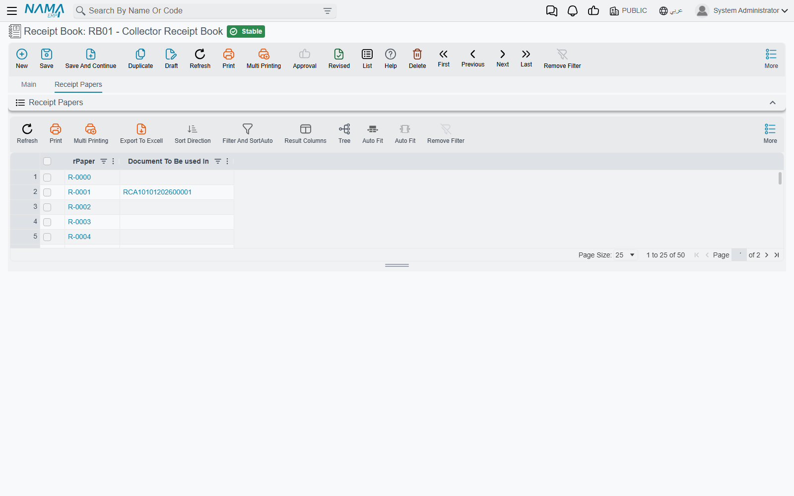
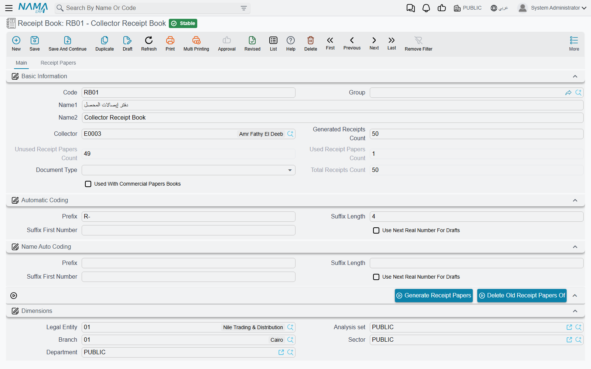
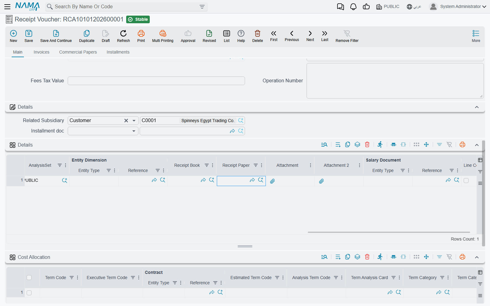

# Receipt Books and Receipt Papers

A collector who goes out to customers usually carries a pad of pre-printed, numbered receipts. Each receipt he hands over is a promise that the money will reach the company, so the pad has to be controlled: which receipts exist, which collector holds them, which have been used, and on which voucher. **Receipt Book** (دفتر إيصالات) is the system's copy of that pad, and **Receipt Paper** (إيصال) is one numbered leaf inside it.

Once the pad is entered, every voucher that records a collection names the leaf it was written on. The system then marks that leaf as used, refuses to use it a second time, and keeps a running count of used and unused leaves on the book. Losing track of a numbered receipt is exactly what this screen exists to prevent.

Both screens are in the basic module: `Basic → Master Files → Receipt Book` and `Basic → Master Files → Receipt Paper`.

## Setting up a book

Suppose the company has printed a pad of 50 receipts numbered `R-0101` to `R-0150` and hands it to collector Ahmed. Open a new **Receipt Book** and fill in:

| Field | What it does |
|---|---|
| **Collector** (المحصل) | The employee who holds the pad. The lookup offers only employees marked as collectors. Leave it empty for a pad any collector may use. |
| **Generated Receipts Count** (عدد ايصالات الدفترالمنشأه) | How many leaves the pad has — 50 in the example. |
| **Document Type** (نوع المستند) | Restricts the pad to one kind of document, for example **Receipt Voucher**. Leave it empty to allow any document. |
| **Used With Commercial Papers Books** (يستخدم مع دفاتر الاوراق التجارية) | Tick it for a pad whose receipts are given against cheques. Such a pad is used through a commercial-paper book, not directly on vouchers — see [below](#Receipts-given-against-cheques). |

The **Automatic Coding** group (التكويد الآلي) decides the receipt numbers. **Prefix** is the fixed start, **Suffix Length** is how many digits follow it, and **Suffix First Number** is where counting starts. For the example, use prefix `R-`, suffix length `4` and first number `101`, which gives `R-0101`, `R-0102` and so on up to `R-0150`.

The **Name Auto Coding** group (التكويد الآلي للإسم) works the same way for the receipts' names. Leave it empty if the code is enough.

In both groups only the prefix, suffix length and first number matter. The fourth field, **Use Next Real Number For Drafts**, has no effect on generated receipts.

Save the book, then press **Generate Receipt Papers** (إنشاء أوراق الدفتر). The system creates one Receipt Paper per leaf. Each paper copies the book's collector, document type, commercial-papers setting and dimensions. The papers appear on the book's **Receipt Papers** tab (إيصالات), and each one shows the document it was later used in.

::: warning Generate works once per book
Generating is refused while the book already has any papers, with *To generate new receipt papers ,it is a must to delete old papers*. A printed pad is a fixed set of leaves anyway, so a new pad gets a new book. To start the same book again, for example because the count or numbering was wrong, press **Delete Old Receipt Papers Of** (حذف اوراق الدفترالقديمه) first. That works only while none of the papers has been used.
:::

You can also add a single leaf by hand on the **Receipt Paper** screen by naming its **Receipt Book**. The book's counts are updated in the same way.

## The three counters

The book keeps three numbers that update themselves:

- **Total Receipts Count** (إجمالي عدد إيصالات الدفتر) — how many papers the book holds.
- **Used Receipt Papers Count** (عدد ايصالات الدفترالمستخدمة) — how many have been written on a saved document.
- **Unused Receipt Papers Count** (عدد ايصالات الدفتر الغيرالمستخدمة) — how many are still blank.

The Receipt Book list shows the used and unused counts beside the collector, so a supervisor can see at a glance who is running out of receipts.

## Using a receipt on a voucher

The **Receipt Voucher** and the **Payment Voucher** have a **Receipt Book** (دفتر الايصالات) and a **Receipt Paper** (الايصال) field in the header. The quickest way is to pick the paper directly, because choosing a paper fills in its book.

The lookups only offer what makes sense for this voucher:

- **Receipt Book** lists books that still have unused papers, that are for this document type or for no specific type, and that belong to the voucher's collector or to no collector.
- **Receipt Paper** lists unused papers that match the same type and collector rules, are not reserved for commercial papers, and belong to the chosen book when one is chosen.

When the voucher is saved, the paper is marked **Is Used** (مستخدم), its **Document To Be used In** (المستند المستخدم به الايصال) points at the voucher, and the book's counters move by one. Changing the voucher to another paper frees the old one. Deleting the voucher frees its paper too, so the leaf can be used again.

### One voucher, several receipts

A collector sometimes brings back one deposit covering several customers, each of whom received their own receipt. For that case, the lines of the Receipt Voucher and Payment Voucher have their own **Receipt Book** and **Receipt Paper** columns, so each line names its own leaf. The same checks apply to every line. A voucher takes papers either in the header or on the lines, not in both, and the same paper cannot appear on two lines.

### Other documents

Every document type has the same pair of fields, but the default screens show them only on the receipt and payment vouchers. If you need them on another document, add them with the [Screen Modifier](/platform/screen-modifier/screen-modifier-edit-screen). The same rules then apply there.

## Receipts given against cheques

When a customer pays by cheque, some companies still hand over a numbered receipt for the cheque. These receipts come from a separate pad that is tied to the cheque register rather than to vouchers:

1. Create the Receipt Book with **Used With Commercial Papers Books** ticked. Its generated papers are marked **Used With Commercial Papers** (يستخدم مع الاوراق التجارية).
2. On the **Commercial Paper Book** (دفتر أوراق تجارية), set its **Receipt Book** to that pad. Only pads with the box ticked are offered there.
3. On each **Commercial Paper** (ورقة تجارية) in that book, pick the **Receipt Paper**. The lookup lists the unused papers of the book's pad.

The two kinds of pads are kept apart. A commercial-papers receipt cannot be used on a voucher, and an ordinary receipt cannot be used on a commercial paper. Once one of its receipts has been used on a paper, a commercial-paper book cannot be switched to a different receipt book. The whole cheque cycle is described in [Cheques & Financial Papers](/modules/accounting/cheques-financial-papers).

## Messages you may see

| Message | Why | What to do |
|---|---|---|
| *To generate new receipt papers, delete the old papers first* — «لإنشاء إيصالات جديدة لهذا الدفتر، احذف إيصالاته القديمة أولًا» | **Generate Receipt Papers** was pressed on a book that already has papers. | Create a new book for a new pad, or delete the old papers first if none of them has been used. |
| *Receipt paper {0} is used in {1}* — «الإيصال {0} مستخدم في {1}» | Deleting a paper, directly or through **Delete Old Receipt Papers Of**, that is already written on a document. | Leave the paper. To free it, change or delete the document that uses it. |
| *Please select a receipt paper from receipt book {0}* — «من فضلك اختر إيصالًا من دفتر الإيصالات {0}» | The document names a receipt book but no paper. | Pick the paper, or clear the book. |
| *Receipt paper {0} is already used* — «الإيصال {0} مستخدم بالفعل» | The paper is already written on another document. | Pick an unused paper. The paper record shows which document used it. |
| *Receipt book {0} does not contain receipt paper {1}* — «دفتر الإيصالات {0} لا يحتوي على الإيصال {1}» | The book and the paper on the document do not belong together. | Clear the book and pick the paper again. The book then fills itself in. |
| *The receipt paper or receipt book is set for a different document type* — «الإيصال أو دفتر الإيصالات مخصص لنوع مستند مختلف» | The book or the paper is limited by **Document Type** to another kind of document. | Use a pad meant for this document type, or clear the **Document Type** on the book. |
| *Receipt paper {0} can be used only with commercial papers* — «الإيصال {0} لا يُستخدم إلا مع الأوراق التجارية» | A receipt from a commercial-papers pad was used on a voucher or another document. | Use a receipt from an ordinary pad. |
| *Receipt paper {0} cannot be used with commercial papers* — «الإيصال {0} لا يمكن استخدامه مع الأوراق التجارية» | An ordinary receipt was put on a commercial paper. | Use the pad set on the paper's commercial-paper book. |
| *Put the receipt paper either in the header or in the lines, not in both* — «ضع الإيصال إما في رأس المستند وإما في سطوره، لا في الاثنين» | A voucher has a receipt paper in the header and on a line. | Keep the papers in one place only. |
| *Receipt paper {0} in line number {1} is repeated in line number {2}* — «الايصال {0} في السطر رقم {1} متكرر في السطر رقم {2}» | The same paper is on two voucher lines. | Give each line its own paper. |
