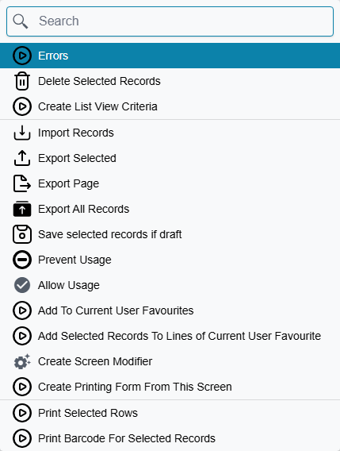
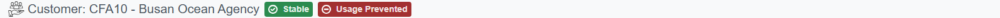

# Preventing a Record From Being Used

An item is withdrawn from the catalogue. A customer is blocked after a payment dispute. A warehouse
closes, a cost centre is folded into another one, a supplier stops trading. The record has served its
purpose and should not be used again.

Deleting it is not an option. Every document that ever named it would lose the thing it was pointing
at — invoices, stock movements, entries, reports, all of it. What you want instead is to retire the
record: leave it exactly where it is, keep every document that refers to it intact, and stop anyone
from choosing it on anything **new**. That is what **Prevent Usage** does, and it is available on
every record in the system.

## Where the switch is

There is no tick box for this. You will not find "Prevent Usage" anywhere on the record's own screen,
on any tab, on any entity — the only way to set it is from a **More** menu, and the two More menus
behave differently.

On a **record's own screen**, More offers exactly one of the pair, chosen from where the record
currently stands: **Prevent Usage** on a record that is still in use, **Allow Usage** on one that is
already retired. Choosing it changes nothing on its own — it marks the record the way typing in a
field would, and **you still have to save**. Close the screen without saving and nothing happened.

On a **list screen**, More offers **both** commands, always, at the very bottom of the menu. These
work on the rows you have ticked, and they are immediate: the records are saved and processed for
you, with no further confirmation and nothing to save afterwards.

| | On the record's own screen | On a list screen |
|---|---|---|
| Which commands appear | one of the pair, depending on the record | both, always |
| How many records | the one you are looking at | every row you ticked |
| Does it save by itself | no — you must save | yes, immediately |

::: warning On the record's screen, nothing happens until you save
This is the single most common way to get this wrong. Clicking **Prevent Usage** on an open record
marks it and leaves the screen unsaved. If you then navigate away, the record is still in use and
nobody was told. Save the record.
:::

Because both commands are part of the standard set, they are on **every** entity in the product —
master files and documents alike. See [Buttons on Every Screen](/platform/screen-buttons) for the
rest of what More offers.

## How you can tell a record is retired

Open it and look at the chips beside the screen title, where **Draft** and **Revised** appear. A
retired record carries **Usage Prevented**:

That chip is the only visual marker there is. Nothing distinguishes a retired record in a list —
no colour, no icon, no column — so if you need to review what has been retired, filter the list on
the field itself rather than looking for a marking.

## What being retired actually stops

This is worth being precise about, because "prevented" sounds broader than it is.

The block is on **being referenced by something else**. When a document is saved, every record it
names is checked, and if one of them is retired the save is refused with a message naming the record
and saying its usage is prevented. That is the whole mechanism.

Three things follow from that, and all three surprise people:

**Existing documents are untouched.** Retiring an item does not reach back into the two thousand
invoices that already name it. They keep their lines, their values and their entries, and they still
print and report exactly as before. Retirement is about what happens next, not about what already
happened.

**The record itself stays fully editable.** It is not locked, not read-only and not hidden from you.
You can still open it, change its name, correct its data and save it. Retirement stops other records
from *pointing at* it; it does not stop you from maintaining it.

**The check happens when the document is saved, not while you are typing.** Somebody can build a
whole invoice around a retired item and only find out at the end. In practice this is rare, because
retired records also disappear from most pickers — which is the next thing to understand.

## Two visibility settings that behave differently

Retiring a record changes where it shows up, and the two places it can show up are governed
separately — with opposite defaults. This catches people out, so it is worth stating plainly.

**In reference lookups — the pickers you use to fill a field — retired records are hidden by
default.** This is the behaviour that makes the feature work day to day: the clerk writing the next
invoice simply never sees the withdrawn item, so there is nothing to explain and no error to hit.

**In list screens, retired records still appear by default.** Also deliberate: the list is where you
go to *manage* records, and a record you cannot find is a record you cannot un-retire, correct or
report on.

Both can be changed, in **Global Config** on the **Security And Login** tab, in the **Records
Security** group:

| Setting | What ticking it does |
|---|---|
| Display Prevented Records In Search | Brings retired records back into reference lookups, so they can be picked again |
| Do Not Display Prevented Records In List View | Removes retired records from list screens as well |

The same two settings exist on a **security profile**, where they apply to the users carrying that
profile. A profile that grants either one wins over the global setting — these settings only ever
loosen what the system-wide setting allows, never tighten it.

For list screens there is a third, finer level. A security profile's **Standard Authorities** grid
has a **Display Prevent Usage Records** column, set per entity type, with three values: **Display**,
**Hide**, and **Same As Config**. A row set to Display or Hide decides the matter for that one entity
type; **Same As Config** — the value every row starts on — hands the decision back to the profile
setting, and then to the global one. So you can hide retired customers from every list while leaving
retired items visible, without touching anything global. See
[Security Profiles](/platform/security/security-profiles.md).

## Letting some people use them anyway

Sometimes a retired record legitimately has to be named on a new document, and there are three ways
to allow it — by person, and by field.

On a **user** record and on a **security profile**, in Basic Information, two settings do this:

| Setting | What it allows |
|---|---|
| Allow Using Prevented Records In Insert | Naming a retired record on a document that has not been processed before |
| Allow Using Prevented Records In Update | Naming a retired record while editing a document that has already been processed |

The split between the two is not about the field, it is about **the document you are saving**. A
document being written for the first time is governed by the Insert setting; one that has already
been processed and is being edited again is governed by the Update setting.

::: tip The reason to grant "In Update" even when you would not grant "In Insert"
Retirement is checked on every save, including saves of old documents. So an invoice written last
year, naming an item that was retired last month, will refuse to save the moment somebody opens it
and changes anything at all — the retired item is still on it, and the check does not care that it
was already there.

If your users edit historical documents, granting **Allow Using Prevented Records In Update** avoids
this without loosening anything about new documents.
:::

The third way is per field rather than per person: the **Allow Usage Of Prevented Records** grid on
the Fields and Entities Settings screen lifts the block on one named field of one named screen — the
classic case being a returns document, which has to be able to name the very item that was withdrawn.
That grid, and the trap of leaving its scope empty, is covered in
[Lifting Built-in Restrictions](/platform/fields-and-entities-settings/fields-settings-relaxing-restrictions).

## Prevent Usage As From Doc

Alongside the main pair sits a narrower one: **Prevent Usage As From Doc** and **Allow Usage As From
Doc**. It appears on the record's own More menu the same way, and it exists **only on documents** —
customers, suppliers, items, accounts and warehouses do not have it.

It blocks one specific thing: using that document as the **source** another document is generated
from. A quotation that has already been turned into an order, or an order that has been fully
delivered, can be closed off this way — it stays selectable everywhere else, it can still be opened,
printed and reported on, but nobody can build anything else on top of it.

The two are independent. A document can be freely usable but closed to further generation, retired
outright but still a valid source, or both, or neither.

By default this block applies when a document is processed. Global Config carries one setting that
widens it — **Apply Prevent Usage Of From Doc With Drafts**, on the **Documents And Books** tab in the
**Documents And Drafts Behavior** group — which extends the same check to drafts, so a closed-off
document cannot be used as a source even on a document that is only being saved as a draft.

## Where the settings live

| Setting | Where |
|---|---|
| Display Prevented Records In Search · Do Not Display Prevented Records In List View | Global Config → Security And Login → Records Security, and on each security profile |
| Display Prevent Usage Records (per entity type) | Security profile → Standard Authorities grid |
| Allow Using Prevented Records In Insert / In Update | User → Basic Information, and security profile → Basic Information |
| Allow Usage Of Prevented Records (per field) | Fields and Entities Settings → Allow Usage Of Prevented Records |
| Apply Prevent Usage Of From Doc With Drafts | Global Config → Documents And Books → Documents And Drafts Behavior |

Retirement is recorded like any other change to a record, so who retired something and when is
visible in the [audit trail](/platform/audit-trail).
