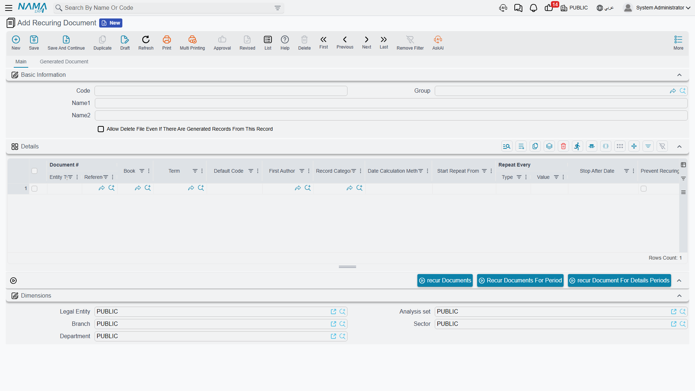

# Recurring Documents

Some documents come back on a rhythm. The rent invoice you raise on the first of every month. The quarterly maintenance charge. The monthly depreciation journal entry. The subscription sales invoice that goes out to the same customers every 30 days. Re-typing these by hand—or hunting down last month's copy to duplicate it—is tedious and easy to forget.

A **Recurring Document** is a small master file that captures *one* template document plus the rule for how often to reproduce it. Define it once, and Nama ERP will keep stamping out fresh copies for you—either automatically on a schedule, or in a single batch whenever you ask. You'll find it under **Basic → Documents → Recuring Document**.

## The idea in one picture

Think of a Recurring Document as a rubber stamp. You point it at an existing document—say last month's rent invoice—and describe the cadence: *repeat every 1 month, starting January, on the first of the month*. Every time the recurrence runs, the system takes a fresh **duplicate** of that template (exactly like using the **Duplicate** action on the document yourself), adjusts its dates to the new period, and saves it. The template itself is never touched; it's just the mould.

Because every generated copy is a genuine, independent document, it flows through the system normally—it gets its own code, its own accounting and inventory effects, and its own place in the fiscal period.

## Building the definition

A Recurring Document is mostly one grid. Each **line** is a separate recurring series, so a single definition can drive several unrelated documents at once—for example one line for the monthly rent invoice and another for a monthly cleaning-service invoice.

The most important columns on each line:

| Column | What it does |
|---|---|
| **Document** | The template to copy. This is a reference to any existing document in the system—an invoice, a journal entry, a voucher, and so on. Required. |
| **Date Calculation Method** | How the new copy's date is worked out from the run date. See [below](#Choosing-the-date). Required. |
| **Repeat Every** (Type + Value) | The cadence: a number plus **Day / Week / Month / Year**. "1 Month" means the series should produce at most one document a month. |
| **Start Repeat From** / **Stop After Date** | The window the series is active in. Nothing is generated for a date before **Start Repeat From** or after **Stop After Date**. Leave them blank for an open-ended series. |
| **Book** / **Term** | Optionally force the generated copies onto a specific document book and term, instead of inheriting the template's. The pickers only offer books and terms that are valid for that document type. |
| **Save as Draft** | When ticked, each copy is saved as a **draft** for someone to review and commit later. When left unticked, the copy is saved and processed straight away (respecting any approval cycle on that document type). |
| **First Author** | Optionally record a specific user as the author of the generated copies. |
| **Record Category** | Optionally tag every generated copy with a document (record) category. |
| **Default Code** | A short label that identifies this series. It stamps every copy this line produces so the system can tell one series apart from another (and so you can trace copies back to the line that made them). If you leave it blank the system fills in the row number. |
| **Set Default Code to Remark** | Copies the Default Code into the generated document's **Remarks**, handy for spotting recurring copies at a glance. |
| **Prevent Recurring in Same Date** | A safety catch: if a copy for this series already exists on the target date, skip it. This one needs a **Default Code** filled in—the system enforces that. |
| **Prevent Editing** | Locks the generated copies against later editing. |

### Choosing the date

Every copy needs a value date and issue date. The **Date Calculation Method** decides how those are derived from the date the recurrence runs on:

- **Today Date** — use the run date itself.
- **Month Start** / **Month End** — the first / last day of the run date's month.
- **Year Start** / **Year End** — the first / last day of the run date's year.

So a rent invoice set to **Month Start** and run any time in March comes out dated 1 March, no matter which day the job actually fired.

::: warning A fiscal period must exist for the date
The generated date has to fall inside a defined fiscal period for the document's legal entity—otherwise the system can't file the copy and the run stops with an error. Make sure the year or period is open before the recurrence runs. See [Fiscal Period Control](/platform/fiscal-period-control-guide.md).
:::

## How a run decides what to create

When a recurrence fires for a given date, it walks each line and asks a short series of questions before producing a copy:

1. **Is the date inside the window?** If it's before **Start Repeat From** or after **Stop After Date**, skip.
2. **Does a copy already exist for this exact date?** If **Prevent Recurring in Same Date** is on and one is found, skip.
3. **Has enough time passed since the last copy?** If **Repeat Every** is set, the system looks at the most recent copy this series already produced and only creates a new one if the cadence interval has elapsed. This is what stops a daily job from producing a *monthly* invoice thirty times a month.

If a line clears all three checks, the system duplicates the template, sets its dates, applies the book/term/category/author overrides, stamps it with the series' Default Code and a link back to this Recurring Document, and then either saves it as a draft or processes it—according to **Save as Draft**.

## Two ways to run it

### Automatically, on a schedule

This is the usual setup and the reason most people create a Recurring Document. Pair the definition with a **scheduled task** so it runs by itself:

1. Open **Task Scheduler** and create a task.
2. Set **Schedule Type** to **Recurring Document**.
3. In the **Recurring Document** field, pick your definition.
4. Choose when it should run—for a monthly series, "first day of every month at midnight" is typical, but a daily run works just as well.

Each run recurs the definition for *that day's* date. The per-line **Repeat Every** and **Prevent Recurring in Same Date** controls are what make a frequent schedule safe: even if you run the task every night, a "1 Month" line still produces just one document a month. For the full task-scheduler walkthrough—scheduling options, run-now, execution logs and error alerts—see [Scheduled Tasks](/platform/scheduled-tasks.md#Recurring-Document).

### Manually, in a batch

Sometimes you don't want to wait for the schedule—you want to back-fill a whole year at once, or generate this quarter's copies right now. The action bar at the bottom of the Recurring Document screen gives you three on-demand buttons that produce a batch of copies immediately:

- **Recur Documents For Period** — give a start date, an end date, and an interval (every *N* days/weeks/months/years), or a fixed number of repetitions, and the system creates a copy for each date in that range.
- **Recur Document For Details Periods** — uses each line's own **Start Repeat From**, **Stop After Date** and **Repeat Every** to work out all the dates and generate them in one go.
- **Recur Documents** — enter up to twelve individual dates and get a copy for each.

These are perfect for the initial catch-up when you first set a series up, or for one-off corrections. Day-to-day, the scheduled task carries the load.

## Keeping copies traceable

Every document a recurrence produces is stamped with the Recurring Document (and the specific line) that generated it, so there's always a clear trail back to the source. You can see everything a definition has produced on its **Generated Document** tab. That trail is also protected: **you can't delete a Recurring Document that has already generated copies**, which stops you from accidentally severing the history. If you genuinely need to remove one anyway, tick **Allow Delete File Even If There Are Generated Records From This Record** on the definition to lift the guard.
