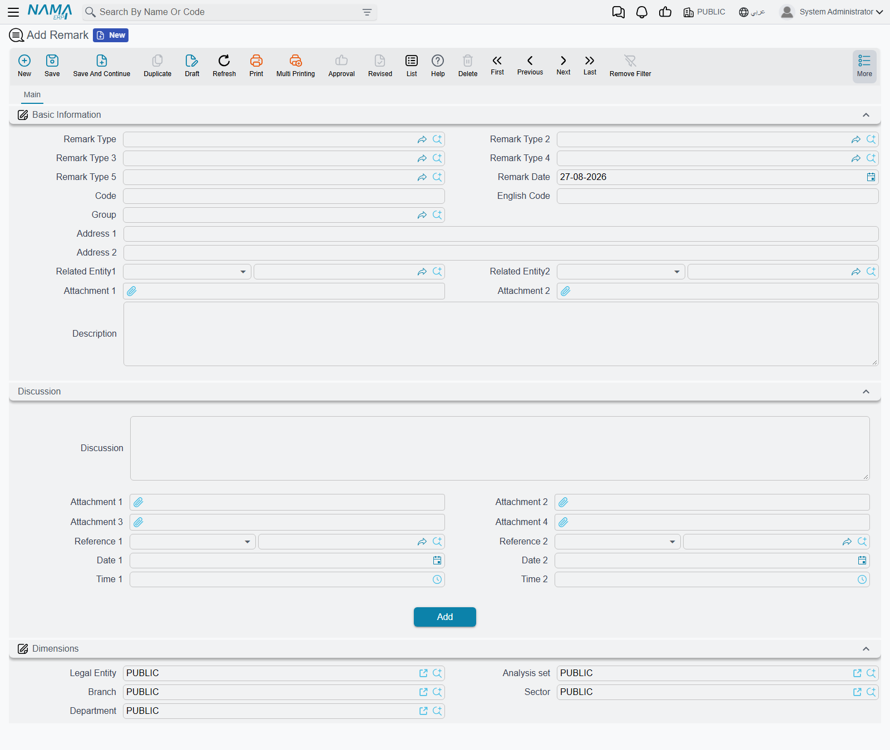
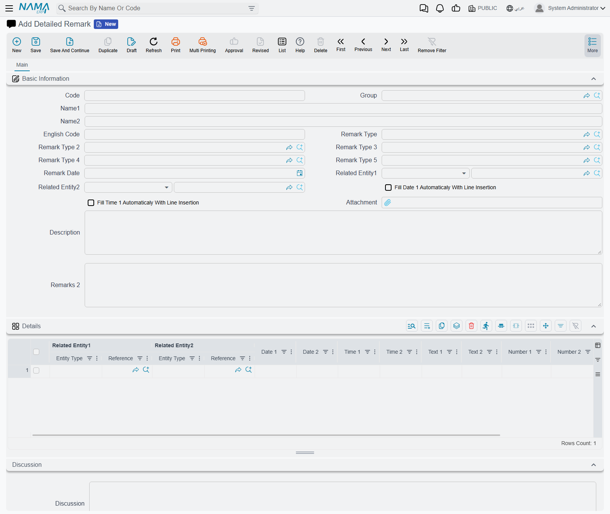
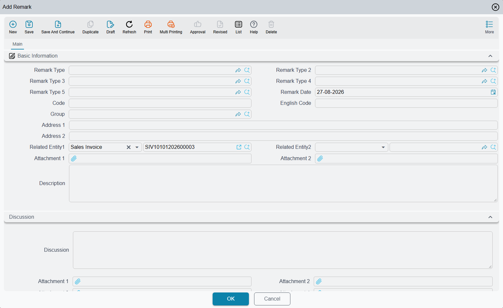
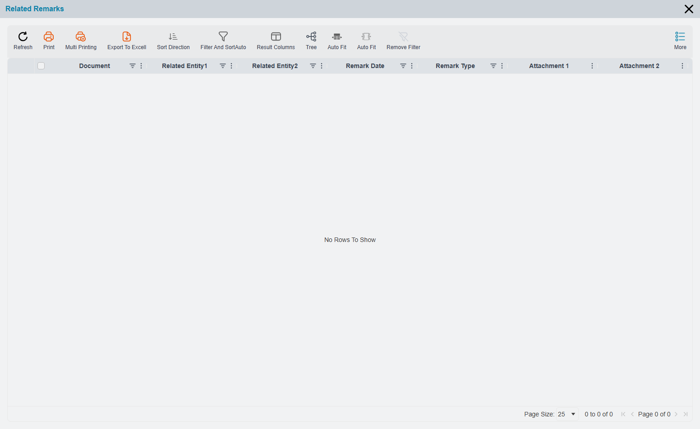
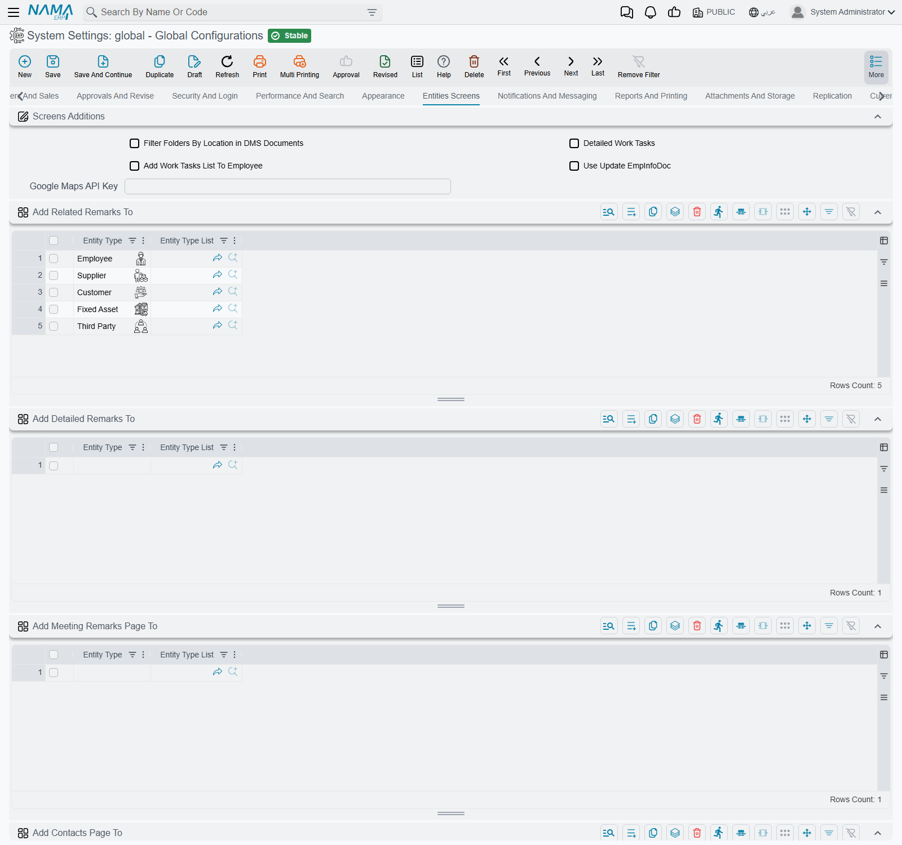
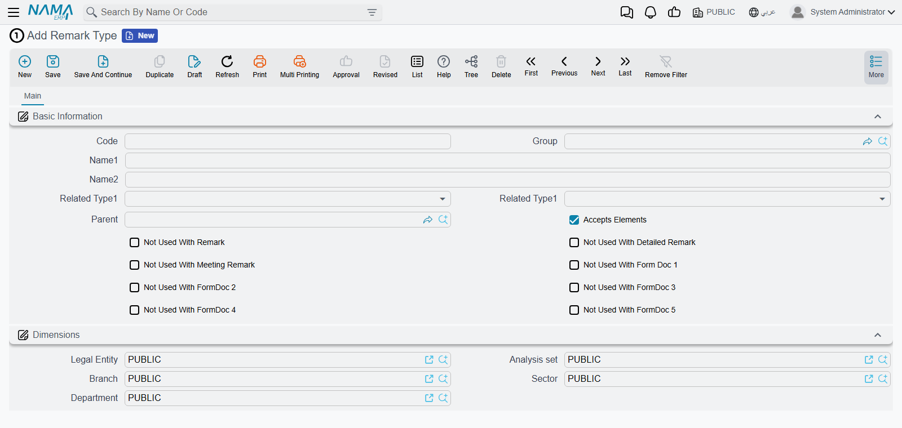
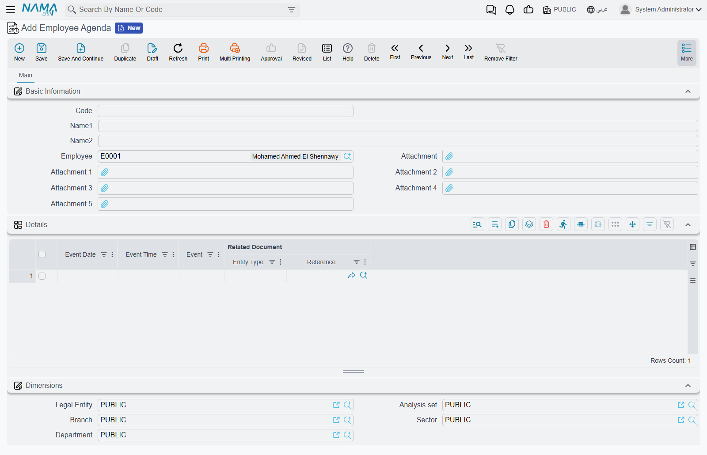
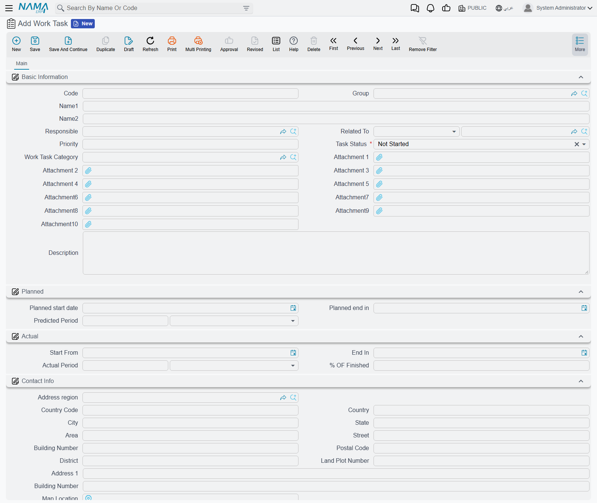

# Remarks, Agenda and Work Tasks

Sooner or later somebody needs to write something down against a record. A customer called about
invoice SIV-3417 and wants the delivery moved. A supplier's price list is out of date and the buyer
should be told before the next order. A meeting decided that a contract gets renewed, and six months
from now nobody will remember who decided it.

None of that fits in a field. Nama gives you three places to put it — **remarks**, the **agenda**,
and **work tasks** — and they are available on every record in the system, without any setup.

::: info The Remarks *field* is a different thing
Almost every document and master file already has a **Remarks** box on its own screen — a free-text
field that is part of the document and is saved with it. That is not what this page is about.

A **remark record** is a separate record of its own, with its own code, date, classification,
attachments and grid, that *points at* the document. One document can carry any number of them, each
written by a different person on a different day, and none of them changes the document itself.
:::

## Three kinds of note that are really one

The system offers **Remark**, **Detailed Remark** and **Meeting Remark**. It is worth knowing up
front that these are not three different features with three different behaviours. They hold exactly
the same information: the same fields, the same classification levels, the same attachments, the same
link back to the record. They are three separate drawers of identical shape.

What actually differs is what you see on screen and how each one is switched on:

| | Remark | Detailed Remark | Meeting Remark |
|---|---|---|---|
| A grid for line-by-line entries | no | yes | yes |
| Date filled in with today automatically | yes | no | no |
| A second description box, and a main attachment | no | yes | yes |
| Its own pair of More-menu commands | yes | yes | yes |
| Its own list in Global Config | yes | yes | yes |

So the practical rule is: use **Remark** for a short note — a paragraph, a date, a classification, and
you are done. Use **Detailed Remark** or **Meeting Remark** when the note has *parts* — several
points, each with its own date, time, text, number and attachment. Which of those two you use is a
matter of convention in your organisation, not of capability. Most sites use Meeting Remark for
minutes and Detailed Remark for everything else, and keep them apart so the two lists stay readable.

A remark carries a code like any master file, a **Remark Date**, up to five levels of
classification (**Remark Type** through **Remark Type 5**), two attachments, a **Description**, and
two generic links — **Related Entity1** and **Related Entity2** — which are what tie it to the record
it is about. It also carries the usual dimensions, so remarks can be filtered by legal entity, branch
and department like anything else.

The detailed and meeting versions add the grid:

Each line takes two related records, two dates, two times, two texts, two numbers and two
attachments. The columns are deliberately generic — they are named **Date 1**, **Text 1**,
**Number 1** and so on — because the grid is meant to be relabelled per site with the
[Screen Modifier](/platform/screen-modifier/) to match whatever you are actually recording.

::: tip Stamp the time automatically
Two switches on the header — **Fill Date 1 Automaticaly With Line Insertion** and the matching one
for the time — put today's date and the current time into the first line columns the moment you add
a line. For minutes of a meeting, or a running call log, that saves typing on every entry.
:::

## Writing a note against a record

You never have to leave the record you are looking at. Open any screen, click **More**, and the
commands are there — the same seven on every screen in the product, from a sales invoice to an item
to an employee.

They come in pairs: a **Create …** command that writes a new note, and a **Related …** command that
shows you the notes already written. Between them sits **Add To Agenda**, which is covered
[further down](#The-agenda).

Choosing **Create Remark** opens the remark screen in a window on top of the record you were on:

**Related Entity1 arrives already filled in with the record you came from** — that is the whole point
of starting from the More menu rather than from the menu tree. Fill in the description, classify it
if your site uses remark types, and press OK. The window closes and you are back on the invoice,
which was never touched and never needed saving.

Everything else on the screen is optional. A remark has no required fields and no validation of its
own, so a note with nothing but a description in it will save happily.

## Reading the notes back

The **Related …** commands open the matching list in a window:

The list finds every note whose **Related Entity1 or Related Entity2** points at the record you are
on — so a note filed against the record in either slot shows up.

The window carries its own toolbar, and the **Tree** button on it regroups the list by remark type.
That is what makes the classification worth filling in: with types in use, a record carrying forty
notes reads as a handful of folders instead of a flat wall of rows.

### Putting the notes on the record's own screen

Reaching for the More menu every time is fine for the occasional note. For records where notes are
part of the daily routine — customers, contracts, service jobs — you can have the list appear as a
**tab on the record's own screen** instead, always visible, no menu needed.

That is switched on centrally rather than per user. In **Global Config**, on the **Entities Screens**
tab, the **Screens Additions** group holds one list per note type:

Add an entity to **Add Related Remarks To** and every screen of that type grows a **Remarks** tab
showing its remarks. **Add Detailed Remarks To** and **Add Meeting Remarks Page To** do the same for
the other two. See [Entity Screens settings](/platform/global-config/global-config-entity-screens)
for the tab as a whole.

::: warning The tab only appears on the standard screen
The extra tab is added to the screen the product ships with. If that entity has been given a
purpose-built screen of its own through the Screen Modifier, the tab is not added to it — the notes
are still there and still reachable from the More menu, but the tab will not show up. If you switch
this on and see no tab, that is the first thing to check.
:::

The **Employee** screen is a special case: it always carries related detailed remarks and meeting
remarks, with no configuration at all.

## Classifying notes — Remark Types

Remark types are what turn a pile of notes into something you can search. They are ordinary master
files, set up under **Basic → Remarks**, and there are five independent levels of them so a site can
classify along more than one axis at once — say the subject at level 1 and the department at level 2.

Level 1 is a **tree**: a type can have a parent, so you can build *Complaint → Delivery → Late*. The
other four levels are flat lists that simply reference the levels above them, and picking a type at
one level narrows what is on offer at the next.

Three settings on a type are worth understanding, because they decide where it can be used:

**Accepts Elements** controls whether the type can be chosen at all. Only types with this ticked are
offered in the Remark Type field — the branches of the tree exist to organise the leaves, not to be
selected themselves. If you create a type and then cannot find it in the field, this is why.

**Related Type1** and **Related Type2** restrict what the note can be attached to. Set Related Type1
to Customer on a type called *Credit hold*, and choosing that type on a blank remark limits Related
Entity1 to customers. Note that this only applies while the field is still empty — a remark started
from the More menu already has its Related Entity1 filled in, so the restriction has nothing to do.

**The "Not Used With" switches** — *Not Used With Remark*, *Not Used With Detailed Remark*, *Not Used
With Meeting Remark* — remove the type from one of the three screens. This is how you keep a set of
meeting-minute categories out of the ordinary remark list and vice versa, so each screen offers only
the classifications that make sense on it.

## The agenda

**Add To Agenda** on the More menu is the "come back to this" command. It does something quite
different from the remark commands, and it is worth knowing what before you use it.

Each employee has an **Employee Agenda** — a single record holding a running list of dated entries.
Add To Agenda finds yours, appends a line pointing at the record you were looking at, and **opens
your agenda on screen**. You are taken off the record you were on, rather than shown a window over
it.

The new line arrives with only the **Related Document** filled in. Type the **Event Date** — this one
is required, so the agenda will not save without it — add the **Event Time** and a description of
what you need to do, and save. If you had unsaved changes on the record you came from, deal with
those first; the agenda opens as an unsaved record and you have to save it yourself.

What the agenda is, then, is a dated logbook: date, time, what happened or what to do, and the record
it concerns. It is not a calendar and it does not chase you — there is no reminder, no alert and no
notification when an entry falls due, and entries are not marked done. You read your agenda by
opening it. If you want to be prompted, that is built separately with a
[notification](/platform/notifications/) driven by a
[scheduled task](/platform/scheduled-tasks).

The agenda also grows indefinitely — every Add To Agenda appends to the same record rather than
starting a new one per week or per month. On a heavily used agenda it is worth deleting lines you are
done with, or filtering the grid by date, rather than scrolling.

## Work tasks

A **Work Task** is the one member of this family that is genuinely a different thing. It is not a
note about a record — it is a unit of work assigned to somebody, with a plan, a status and a
percentage complete. It lives under **Basic → Master Files → Work Task**, and unlike remarks there is
no More-menu command that creates one.

The screen is in three parts. **Basic Information** carries the name, the **Responsible** employee
who owns the task, a **Priority**, a **Task Status**, an optional category, up to ten attachments,
and **Related To** — the record the task concerns. Related To is deliberately narrow: a work task can
be attached to an **employee, a customer or a supplier**, and nothing else. It is not the general
"attach to anything" link that remarks have.

**Task Status** moves through *Not Started* → *In Progress* → *Finished*, with *Cancelled* for work
that was dropped. A new task starts at Not Started. Five spare values (*Other 1* to *Other 5*) are
there for sites that need extra states of their own.

Then the same two dates twice over: **Planned** holds the start and end you intended, **Actual** the
ones that happened, each with a **Period** beside it that stays in step with the dates — change the
dates and the period recalculates, set the period and the end date follows. **% Of Finished** on the
actual side is where progress is recorded; nothing derives it, somebody types it.

### Splitting a task across several people

Responsible names one owner, which is enough for most work. When a task is shared, switch on
**Detailed Work Tasks** in Global Config (**Entities Screens → Screens Additions**, the same group as
the remark lists) and the task screen grows an extra **Details** page holding an **Executers** grid.
Each row names an employee with their own planned and actual hours, planned and actual cost, and
their own percentage complete — so a task can be costed per person rather than as a lump.

The neighbouring switch, **Add Work Tasks List To Employee**, puts a **Work Tasks** tab on the
employee screen listing everything that employee is responsible for. Between the two, work tasks
become a light per-person workload view.

## Where to find everything on the menu

Everything here is reachable from the **Basic** module without going through a record:

| Screen | Menu path |
|---|---|
| Remark, Detailed Remark, Meeting Remark | Basic → Remarks |
| Remark Type 1 to 5 | Basic → Remarks |
| Employee Agenda | Basic → Remarks |
| Work Task, Work Task Category | Basic → Master Files |

Opening them this way gives you the full list screen — filters, columns, export, mass operations —
which is how you would review every open remark of a given type, or every unfinished work task,
rather than looking at one record's notes.

Notes, agenda entries and work tasks are ordinary records in every other respect: they can be edited
and deleted by anyone with rights to them, they are covered by the
[audit trail](/platform/audit-trail), and they respect record-level permissions and dimensions like
anything else in the system. See [Buttons on Every Screen](/platform/screen-buttons) for the rest of
what the More menu offers.
