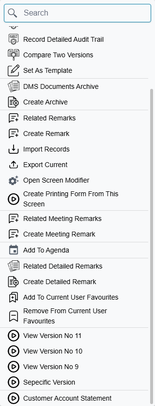
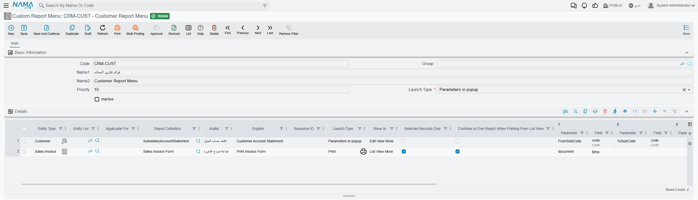

# Custom Report Menu

A user is looking at a sales invoice on screen. They want the statement of account for that customer,
or the packing list for that invoice. Without help, the route is long: leave the screen, open the
Reports menu, find the right report among dozens, then retype the customer or the document number into
its parameters — and hope they typed it correctly.

The **Custom Report Menu** removes all of that. It adds your own entries to the **More (⋮) menu** of an
entity's edit screen or list screen, and each entry launches a report with its parameters already
filled in from the record the user is looking at. One click, right context, no retyping.

This is one of the most widely deployed customisations in the product: across the customer
configurations Nama keeps on file, **191 entries are spread over 80 of 192 sites**. If a site has been
configured at all, there is a good chance it has a few of these.

::: info It does not change the Print button
Custom menu entries sit alongside the existing More menu items; they never replace or alter what the
Print button does. Printed forms are chosen by a separate mechanism.
:::

## The shape of a record

Open **Administration → Reports → Custom Report Menus** and you get a screen with a short header and
one grid. The header carries the identity of the record — Code, Group, Name1, Name2 — plus three
settings that matter:

- **Priority** — where this record's entries sit relative to entries coming from other records.
- **Launch Type** — the default way the reports open, used by any line that does not set its own.
- **Inactive** — switches the whole record off.

Everything else happens in the **lines** grid. Each line is one menu entry. A single record can hold
one entry or twenty, and how you group them is up to you: some sites keep one record per module, others
one record per report family. The only thing that grouping actually decides is that all the lines share
the header's Priority and Inactive setting.

::: warning A record with no lines does nothing
The header on its own is not a menu entry. If the grid is empty, the record is skipped entirely.
:::

## Pointing an entry at a screen

The first job of a line is to say *where* the entry should appear. There are three columns for this,
and they are two alternative ways of answering the same question:

- **Entity Type** — one specific screen, for example Sales Invoice.
- **Entity List** — a list of specific screens, when the same entry makes sense on several documents.
- **Applicable For** — a broad bucket instead of naming types: **All Screens**, **Documents**, or
  **Master Files**.

You may fill Entity Type and Entity List together, or you may use Applicable For on its own — but not
both approaches at once. Mixing them is rejected when you save, with a message telling you to fill one
field alone or the other two.

Every line must name a target one way or the other. A line with all three columns empty saves happily
and is never shown on any screen, which is the most common reason a new entry cannot be found.

### Edit screen, list screen, or both

**Show In** decides which More menu the entry joins:

| Show In | Where the entry appears |
|---|---|
| *(empty)* | Edit screen only |
| Edit View More | Edit screen only |
| List View More | List screen only |

The asymmetry is worth remembering: leaving Show In empty is not "both", it is "edit screen". An entry
that should appear when the user is looking at the list of invoices must say **List View More**
explicitly. And because a line carries a single Show In value, an entry you want in both places needs
two lines — one for each.

## Naming the entry

The caption the user reads comes from the first of these that is filled:

1. **Resource ID** — the key of an existing system translation. If you fill it, it wins over
   everything else, and the caption follows the user's interface language automatically.
2. **Arabic** and **English** on the line — the caption in each language.
3. The header record's **Name1** and **Name2**, used when the line leaves both caption columns empty.

For a record holding a single entry, naming the header well and leaving the line captions blank is the
tidiest arrangement. For a record holding several, fill the line captions.

## Choosing the report and how it opens

**Report Definition** is required on every line — it is the report the entry launches.

**Launch Type** decides how it opens. The line's own value wins; if the line leaves it empty, the
header's value is used. The five choices split along two axes — whether the user is asked for
parameters first, and where the result appears:

| Launch Type | What the user experiences |
|---|---|
| Direct in popup | The report runs straight away and the result opens in a dialog over the current screen |
| Direct in new page | The report runs straight away and the result opens in a new browser tab |
| Parameters in popup | A dialog asks the report's questions first, then shows the result |
| Parameters in new page | The report's questions are asked in a new browser tab |
| Print | The report is produced as PDF and sent to printing without showing anything on screen |

"Direct" does not mean the report has no parameters — it means the user is not asked about them. The
parameters you mapped are filled from the record and everything else takes the report's own default
values. Use one of the "Parameters" types when the user legitimately has a choice to make, such as a
date range the record cannot supply.

The **Print** type is the one to choose for things like "print the gate pass for this delivery": it
produces the PDF and hands it either to the Nama Printing Server or to the browser's print flow,
depending on how printing is configured for that user.

## Feeding the report from the record

This is what makes the feature worth configuring. Each line has nine parameter slots, and each slot is
a pair of columns:

- **Parameter** — the name of a parameter as it is defined on the report.
- **Field** — where its value comes from on the record the user is looking at.

The Field side is normally a field of the current record — the customer, the branch, the document date.
There is also a special value, **`$this`**, meaning the record itself rather than one of its fields. A
very common single-slot configuration is exactly that: parameter `document`, field `$this` — the report
receives the whole document and reads whatever it needs from it.

Nothing checks these names for you. A Parameter name that does not match any parameter on the report is
simply ignored at run time, and the report falls back to that parameter's default — usually producing an
empty or unfiltered result rather than an error. When an entry runs but returns the wrong data, a
misspelled parameter name is the first thing to check.

When the entry is launched from a **list screen**, three values are always sent in addition to whatever
you mapped: the ids of the rows involved, the record context, and the entity type. A report designed to
be launched from a list can read the row ids without you configuring anything.

## Running from a list

Two columns only matter for entries shown on a list screen.

**Selected Records Only** narrows the entry to the rows the user has ticked, instead of everything on
the visible page. This is almost always what you want for anything that produces output per row.

**Combine In One Report When Printing From List View** decides what "several rows" means. Tick it and
the rows are handed to a single report run, producing one document covering all of them — the natural
choice for a summary or a batch listing. Leave it unticked and the entry launches the report once for
each row: ten selected invoices means ten separate report runs, which is what you want for "print each
of these" but which will flood the screen if a user selects two hundred rows.

## Ordering the entries

More than one record can contribute entries to the same screen — one attached to Sales Invoice
specifically, another applying to All Screens. **Priority** on the header decides the order they appear
in, **highest first**.

Records sharing the same priority are left in no particular order relative to each other, so if the
sequence of your menu entries matters, give each record a distinct priority rather than leaving them
all at the same value.

## Switching an entry off

**Inactive** on the header removes the whole record from every menu. It also gets copied down onto each
line every time the record is saved, so the Inactive column inside the grid is not an independent
switch — whatever you set there is overwritten by the header's value on the next save. If you need to
retire one entry while keeping its neighbours, either delete the line or move it to a record of its own.

## Who sees an entry

The entries are built for every user from the same shared metadata, without any permission filtering. A
user who has no rights on the report still sees the menu entry, and gets an error message when they
click it — the rights check happens at that moment, not before.

So the Custom Report Menu is not a way to hide a report from someone. Control access on the report
itself; treat the menu entry purely as a shortcut.

## Why a new entry does not show up

This catches almost everyone the first time.

::: warning The menu is loaded once, at login
The complete set of custom menu entries is sent to the browser when the user signs in, and it is not
re-read while the session continues. Add a record, tick Inactive, change a caption — nothing changes on
a screen that is already open, or in any session that started before your change. Sign out and back in
to see it, and tell your users to do the same before they report it as broken.
:::

If a re-login does not help, walk back through the three things that silently produce an invisible
entry: the line has no Entity Type, Entity List or Applicable For; Show In is empty on an entry meant
for a list screen; or the header record is Inactive, or has no lines at all.

## A worked example

A distributor wants "Print Journal Entry" available directly on their accounting documents.

1. Create a Custom Report Menu record. Give it a code, name it *Accounting Prints*, set **Priority**
   to 10 and leave **Launch Type** on the header as *Print*.
2. Add one line. In **Entity List**, list the document types it should appear on. Set **Report
   Definition** to the journal entry print report. Fill **Arabic** and **English** with the caption the
   user should read.
3. Override the header on this line by setting its own **Launch Type** to *Direct in new page*, so the
   user sees the result and can decide whether to print it.
4. In the first parameter slot, set **Parameter** to the name the report expects — `document` — and
   **Field** to `$this`.
5. Leave **Show In** empty, because this belongs on the edit screen.
6. Save, sign out, sign back in, open one of those documents, and the entry is in the ⋮ More menu.

::: info An extra tab you may not see
On Nama's own implementation servers this screen shows a second tab used to catalogue the customisation
internally. It has no effect on how the menu entry behaves, and it does not appear on a normal
installation.
:::