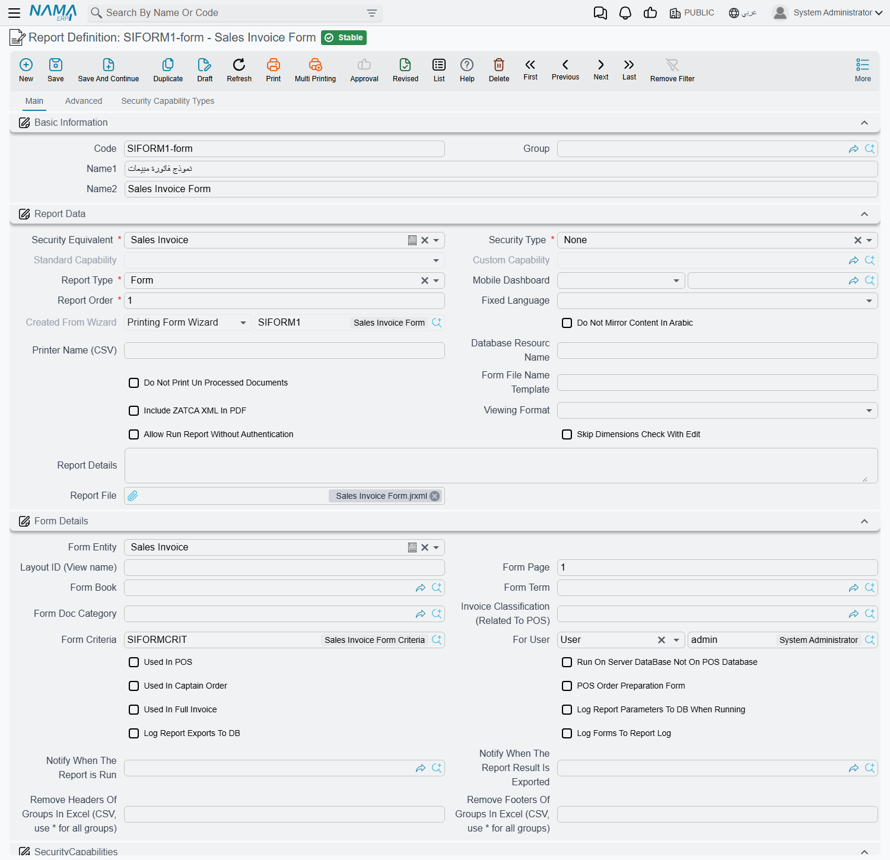

# Which Printed Form Comes Out

Press **Print** on a sales invoice and nothing is asked of you. No list of layouts appears, no
"choose a form" dialog — a document comes out, or nothing does. That silence is deliberate: the
server works out on its own which single form belongs to this record, this user and this moment,
and runs it.

It is also why printing complaints all sound alike. *"It printed the old layout."* *"It prints for
me but the branch accountant gets nothing."* *"It printed once and now the button does nothing."*
None of those are printer faults. Each one is a rule in the resolution, and the point of this page
is to let you name the rule from the symptom.

A **printed form** is a report definition whose **Report Type** is **Form**, with **Form Entity**
set to the type of record it prints. Everything below is about how the system chooses between them.

## Before the server is asked

Two things happen in the browser before a single form is considered.

First, the record has to be saved. Press Print on a record with unsaved edits, or on a screen that
has never been saved, and you get *"Cannot print record before saving changes"*. Nothing was
resolved; save and press Print again.

Second, the browser asks the server a much simpler question than "which form?" — it asks *"is there
any form at all for this record and this tab?"*. If the answer is no, the user sees
*"Could not find form to print record"* and the print stops there. That answer is remembered for
the rest of the login session, keyed on the record type, the tab and the view. So when you add a
form for a user who has just been told there is nothing to print, that user must log out and back
in before the new form is noticed. This catches people out mid-implementation: the form is correct,
the configuration is correct, and the user's browser is still repeating an answer it was given an
hour ago.

## Which forms are even candidates

Assuming a form exists, the server collects every form registered against the record's type. Two
fields decide membership:

- **Form Entity** — the type of record the form prints. A form registered against Sales Invoice is
  never a candidate for a Sales Order, no matter what its layout draws.
- **Form Page** — an optional restriction to one tab of the edit screen. Leave it empty and the form
  is offered from every tab. Fill it in and it is only offered from the matching tab. The match is
  generous: it accepts the tab's translation key, its Arabic caption, its English caption, or its
  position on the screen counted from 1. That is why both `2` and the tab's visible title work.

The list is also filtered by the user's own dimensions, exactly as any other master file list is.
A form belonging to a legal entity the user cannot see is not a candidate for that user, which is
one of the quieter reasons two users print different layouts from the same document.

## The hard filter — a form that fails this is not a candidate at all

The next step is not a preference; it is elimination. Each remaining form is compared against the
record it would print, and a form is **removed** when a restriction it carries contradicts the
record:

| The form's field | The form drops out when |
|---|---|
| **Form Book** | The form names a document book and the record belongs to a different one. |
| **Form Term** | The form names a document term and the record carries a different one. |
| **Form Doc Category** | The form names a record category and the record's differs. |
| Legal Entity, Sector, Branch, Department, Analysis Set | The form names one and the record's differs. |

The rule to hold on to is that **an empty restriction restricts nothing**. A form with no book, no
term and no dimensions competes for every record of its type; a form with a book competes only for
that book's documents. This is the mechanism behind "each company prints its own invoice design" —
you do not configure a default form per company, you put the legal entity on the form and let the
filter do the rest.

::: warning A restriction removes the form, it does not demote it
There is no fallback. If the only form you have for Sales Invoice names book `SI-A` and the user
prints a document from book `SI-B`, the result is not "print the other one" — it is *"Could not
find form to print record"*.
:::

## The order the survivors are tried in

Whatever is left is now sorted, and the order matters because the search stops at the first form
that passes the tests in the next section.

1. **Non-system forms come before system forms.** A form shipped with Nama is marked as **System**;
   anything an implementer creates is not. So the moment you create your own invoice form, it
   outranks the built-in one for every record both of them can serve — you never have to disable
   the system form.
2. **Within each group, Report Order decides.** Lower comes first. Give your general-purpose form a
   high number and your special cases low ones, so the special cases get their chance first.

## The first form that passes wins

The server now walks the sorted list from the top and takes the **first** form that satisfies all of
these:

- **Form Criteria** — a criteria definition evaluated against the record itself. This is the tool
  for "invoices over 100,000 print on the letterhead form": the condition lives on the form, not on
  the document.
- **For User** — deliberately loose about what you put in it. It accepts a **user**, a **security
  profile**, or a [master group](/platform/master-groups). Point it at a profile and every user
  carrying that profile gets the form; point it at a master group and every user in the group does.
  Leave it empty and the form serves everyone.
- **Dimensions** — the same five dimensions again, this time as a match rather than a filter, and
  slightly more forgiving: a composite dimension on the form that *contains* the record's dimension
  counts as a match, so a form set to a branch group covers every branch inside it.
- **Menu Code** — a form carrying a menu code is taken only when the print request arrives with the
  same code. Almost all forms leave this empty.

The first form clearing all four is the one that prints. Nothing further down the list is consulted,
and nothing is offered to the user to choose from. If **no** form clears them, the print ends with
*"Could not find form to print record"* even though candidates existed. That distinction is worth
holding on to when you are staring at a form that looks perfectly configured: it may have been
eliminated by the hard filter, or it may have been skipped by the first-match tests, and only in the
second case were other forms still in play behind it.

## Being chosen is not the same as being printed

A form can win the resolution and still produce nothing. Everything below is checked after the form
is picked, and each has its own message.

**Can the user print at all?** Printing is a permission on the record's type in the user's
[security profile](/platform/security/security-profiles). With **Can Print** set to *Disabled*, no
form prints, ever.

**Is the record a draft?** Drafts are blocked by default — a printed draft is indistinguishable from
a printed document to whoever receives it. Three separate places can lift the block, and this is the
part support most often gets wrong:

- the global option **Allow Printing Drafts** in
  [Reports and Printing](/platform/global-config/global-config-reports), and
- the same option on the record's **[document book](/platform/document-books)**, and
- the same option on the record's **document term**.

The book and the term each override the global setting on their own. So "we do not allow draft
printing" can be globally true and still not the whole truth: one book with the box ticked is enough
for its documents to print as drafts. When a draft prints and you believe it should not, check the
book and the term before you doubt the global setting. Records waiting on an approval are governed
separately, by **Allow Printing Awaiting Approval Records**. On top of all that, the user's profile
must not carry **Do Not Allow Print Drafts**. When the gate closes, the message is *"Can not print
draft records"*.

**Has it been printed before?** Every record carries a **Print Count**. Once it is above zero, a
further print needs **Can Print** set to *More Than One* — with *One*, the first print succeeds and
every later attempt is refused. This is the answer to "it printed once and now it will not", and it
is usually intentional: paired with *Prevent Edit/Delete After Print* it is how an official invoice
is made final.

**Is there a cap?** **Max Print Count** on the profile puts a number on it, and the refusal names
the arithmetic: *"Max print count is 3 for entity SalesInvoice, and the record SI-000412 was printed
3 times"*. Two details decide which number is compared. Where a user holds permissions through
[delegation](/platform/security/security-delegation), the caps of the profiles they hold that way
are taken into account too. And when the global option to count prints per user is on, the number
compared is not the record's own print count but how many times **this user** printed **this
record** — so a document already printed five times can still be printable by someone who has never
printed it.

**Is the document still being processed?** A form can carry **Do Not Print Un Processed Documents**.
With that ticked, the record cannot be printed while any of its
[business requests](/platform/background-processing/business-requests) is still pending or has
failed, and the message is *"Printing un processed document not allowed"*. This is the one gate that
belongs to the form rather than to the user, and it is the right explanation when the same user can
print yesterday's invoices but not the one saved thirty seconds ago — or, more awkwardly, not the
one whose processing failed and has been sitting in the failed list since.

**Which formats may this user produce?** A security profile can restrict a user to particular output
formats, so an export that works for you may be refused for them.

## Printing more than one layout in one press

Since there is no picker, the winning form is by definition the only layout the user asked for. The
one supported way to get a second layout out of the same press is **Related Forms** on the winning
form: each related form is run as an extra print in the same action, on the first pass only. That is
how "invoice plus delivery note" or "customer copy plus warehouse copy" is built.

It is worth being blunt about what does not exist, because implementers go looking for it: there is
no number-of-copies setting anywhere in Nama, no draft watermark, and no "COPY" marking on reprints.
Extra copies come from related forms, from printing one row at a time out of a list, or from the
printer driver's own copies setting. If a reprint must look different from the original, build that
into the form's own design using the record's print count.

## What a print leaves behind

A successful print is not silent in the data.

- The record's **Print Count** goes up by one. It is written as a step of its own, and it is the
  only marker that a record has ever been printed.
- A **Print** entry appears in the record's [audit trail](/platform/audit-trail), naming the form
  that was used. This is the fastest way to answer "which layout did the customer actually receive?"
  long after the fact — and where prints are counted per user, these are the entries the cap is
  measured against.
- A **Print** [notification](/platform/notifications/notifications-system) is raised, so a
  notification definition can watch printing the same way it watches saving.
- When the form has **Log Forms To Report Log** ticked, the print is added to the report log
  alongside ordinary report runs.

## How the output reaches paper

Once the form has run, the result travels by one of two routes, and which one is in use changes what
a failure looks like.

**Through the Nama printing agent.** When the global option **Print Using Nama Server** is on, or
the individual user is set to direct printing, the browser hands the job to the small printing
application running on the user's own machine, which sends it straight to a named printer — the one
the form names in **Printer Name (CSV)**, so a receipt reaches the counter printer with no dialog at
all. If that application is not running, the user gets a long message about starting the printing
server, with a download link. That message means the form resolved and rendered perfectly; only the
last hop failed.

**Through the browser.** Otherwise the output is fetched as an ordinary download. By default it is
loaded in a hidden frame and cleaned up a few seconds later, which is why nothing visibly happens
beyond the print dialog; with the global option **Open Print in Browser Window** on, it opens in a
real window and the user prints from the browser's own dialog. Whether a dialog appears at all
follows the user's direct-printing setting. When several prints are produced at once — related
forms, or a row-by-row list print — they are dispatched in batches with a short pause between them,
so a large batch takes a visible moment to finish.

Two extras ride the same path. When the global option to use the record's legal entity logo when
printing a form is on, the record's own legal entity is passed to the form, which is what lets each
company in a group print its own letterhead from one shared design. And where **Print Documents on
Save** is switched on for the user or globally, the whole sequence above runs by itself right after
a document's first save — worth knowing when a user insists they never pressed Print.

Emailing a record follows the same road: the same "is there a form?" check, the same resolution, the
same gates, with the result attached to a message instead of sent to a printer.

## Printing a list instead of a record

Printing from a list view is a different resolution with the same shape. The candidates are
definitions whose **Report Type** is **List** rather than **Form**, and because no single record is
involved, the record-level gates do not apply at all — no draft check, no print count, no maximum,
and no print entry in any record's audit trail. A user who cannot print a document one at a time may
well be able to print the same documents from the list.

There is also a route that leaves the browser out entirely: an
[entity flow](/platform/entity-flows/introduction-to-entity-flows) action can print a form from the
application server to a printer that server can see, which is how unattended printing — a label at a
gate, a picking list in a warehouse — is set up. It resolves the form the same way the Print button
does, with one catch: it resolves with no tab at all, so only forms that leave **Form Page** empty
are candidates for it.

## Working back from the symptom

| What the user reports | Where to look |
|---|---|
| *"Cannot print record before saving changes"* | Unsaved edits on screen. Save first. |
| *"Could not find form to print record"* — and a form exists | The hard filter: does the form name a book, term, category or dimension the record does not match? Then the first-match tests: criteria, **For User**, dimensions. |
| Nothing to print, but it worked for a colleague | The user's own dimensions (the form may be invisible to them), **For User**, or a stale session — have them log out and back in. |
| A form was just created and is not offered | The session's remembered "is there a form?" answer. Log out and back in. |
| The wrong layout printed | Ordering. A non-system form always beats a system one; below that it is **Report Order**, lowest first. Give the specific form a lower number, or a book/criteria restriction so the general one is eliminated. |
| Right layout, wrong company's letterhead | The legal entity on the form, and the global option that passes the record's legal entity to the form. |
| Correct from one tab, missing from another | **Form Page** on the form. |
| *"Can not print draft records"* | **Allow Printing Drafts** globally, on the book, and on the term — plus the user's profile. |
| A draft printed and should not have | The same three places. The book or the term overrides the global setting on its own. |
| Printed once, refuses now | **Can Print** is *One*, and the print count is above zero. |
| *"Max print count is …"* | **Max Print Count** on the profile, and whether prints are being counted per user. |
| *"Printing un processed document not allowed"* | The form's **Do Not Print Un Processed Documents**, and the record's pending or failed business requests. |
| Two layouts expected, one came out | **Related Forms** on the winning form — that is the only mechanism. |
| Nothing prints, message about the printing server | The form ran; the printing application on the user's machine is not running. |
