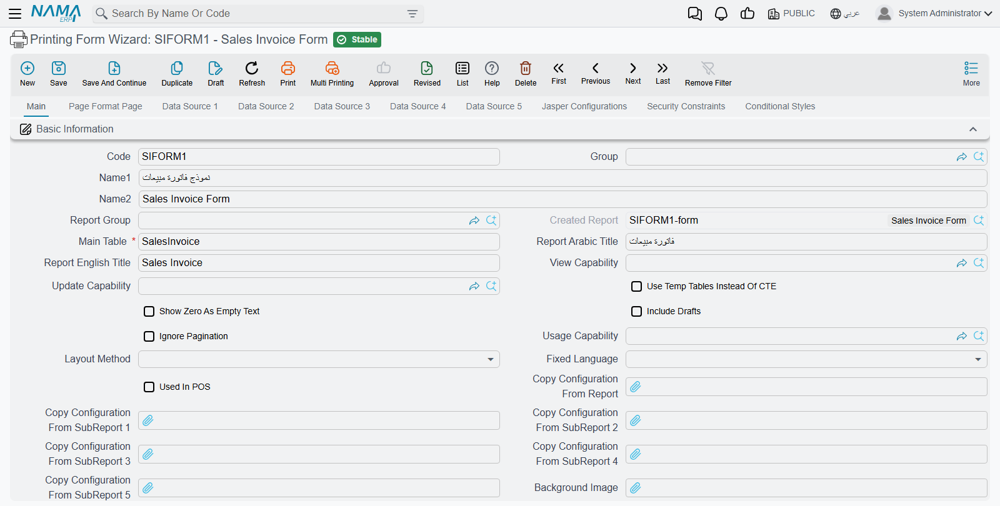
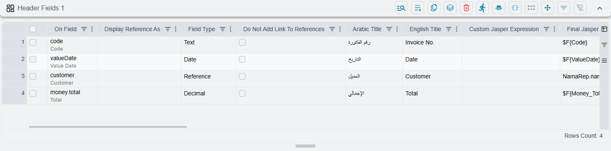
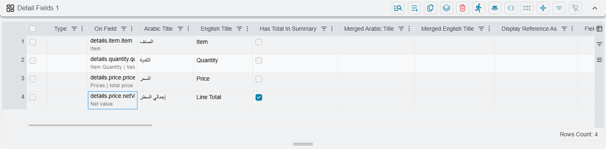
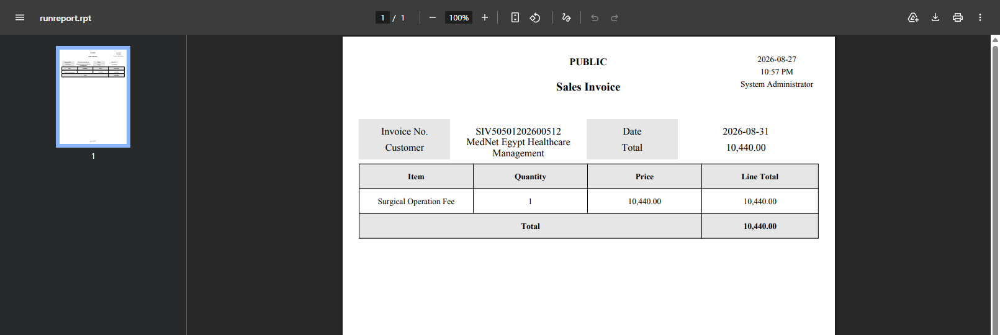

# Printing Form Wizard

Every business eventually needs its own invoice. Not the one the system ships with — one with the
company's own header, its own column order, its own totals, in the language its customers read.
Traditionally that meant handing the job to someone who could draw a Jasper report file, and waiting.

The Printing Form Wizard is the alternative. You describe the printed page as a list of fields —
these four boxes at the top, these four columns down the middle, total this one — and Nama builds the
printable form for you. No design tool, no file to upload, no developer.

::: info Where to find it
**Administration → Reports → Printing Form Wizard.**
:::

## What it makes, and when

The wizard is not the form. The wizard is the description of a form, and **saving it builds the real
one** — a report definition, named after the wizard's code with `-form` on the end, which is what
actually prints.

That happens on every single save. There is no Generate button and nothing to press afterwards,
because there is nothing to wait for: by the time the save has finished, the form is rebuilt and the
next person to press Print gets the new version.

::: warning A failed build fails the save
Because the two happen together, a form that cannot be built takes the save down with it. You are
told the save failed — not that the *build* failed. If a save is refused and the fields all look
valid, suspect something in the layout rather than the data.
:::

## Building one, start to finish

The walkthrough below builds a working sales invoice form: a header block with the invoice number,
date, customer and total, and a grid of the invoice lines with a total underneath.

### 1. Open a new record

Press **New**. The screen arrives **already half filled in**, and this is deliberate — A4, portrait,
a ten-column header grid, standard row heights and colours, and six rows already sitting in the
**Header Components** grid on the second tab.

Those six rows are the furniture at the top of the printed page: the login user, the logo, the date
and time, the page number, the report title and the legal entity. Leave them alone unless you want to
change that furniture. People routinely add them again by hand and end up with everything twice.

### 2. Fill in the basics

On the **Main** tab, in **Basic Information**:

| Field | What to put in it |
|---|---|
| **Code** | The form's code. The generated form takes this name, so pick something you will recognise later. |
| **Name1 / Name2** | The Arabic and English names. |
| **Main Table** | The document this form prints — a sales invoice, a receipt, a delivery note. This is the only field here you cannot leave empty. |
| **Report Arabic Title / Report English Title** | The heading printed across the top of the page. Leave both blank and the page prints without one. |

::: tip The English name becomes the file name
When someone prints this form, the file their browser downloads is named after **Name2**. "Sales
Invoice Form" downloads as a recognisable document; "SIFORM1" downloads as a puzzle.
:::

### 3. Describe the header block

The **Header Fields 1** grid is the labelled block at the top of the printed page — one row here is
one labelled box there. For the invoice:

| On Field | English Title | Arabic Title |
|---|---|---|
| Code | Invoice No. | رقم الفاتورة |
| Value Date | Date | التاريخ |
| Customer | Customer | العميل |
| Total | Total | الإجمالي |

::: warning The grid does not grow by itself
It opens with a single blank row, and filling that row does not add another. Every further row comes
from **Add New Line** in the grid's own toolbar, or in bulk from **Select Header 1 Fields** beneath
it. This catches nearly everyone once.
:::

### 4. Leave the positions empty

There are columns for position and size on every row, and the temptation is to fill them. Resist it —
not on a first form.

Left empty, the boxes flow automatically: the header is ten columns wide, and each field takes two
columns for its label and three for its value. Five into ten is **two labelled boxes per printed
row**, so the four fields above come out as a tidy two-by-two block without your having placed a
single one of them.

When you do want a different shape, change the shape rather than the coordinates — widen the header
to twelve columns, or narrow the default label and value widths. Hand-placing individual boxes is for
the final polish, not the first draft.

### 5. Describe the lines

Under **Grid 1 Title** sits **Detail Fields 1** — the table of document lines. Same idea, one row per
printed column:

| On Field | English Title | Arabic Title |
|---|---|---|
| Item | Item | الصنف |
| Quantity | Quantity | الكمية |
| Price | Price | السعر |
| Line Total | Line Total | إجمالي السطر |

Column widths are optional here too. Left blank, the columns share the page evenly.

To get the total row underneath the grid, tick **Has Total In Summary** on the line total column.
That tick is the only thing that produces it.

### 6. Save, then print

Press **Save**, then open a real document of the matching type and press **Print**. The form comes
out — with no picker, no menu and no choice offered, because Nama resolves exactly one form for that
document and runs it.

::: tip Nothing to preview
There is no Run or Preview action on this screen. To see your work you open a genuine document and
print it, or download the raw form file from the actions block. Building the form and looking at the
form are two different activities here.
:::

::: warning "There is no form to print", on a document you just made a form for
Whether a screen has a printable form is worked out once and remembered for the rest of that browser
session. If somebody had the document open and pressed Print *before* you created the form, they will
keep being told there is nothing to print no matter how many times they try. Reloading the page fixes
it.
:::

## Five of everything

The pattern you have just used repeats five times over. **Header Fields 1** through **5**, each with
its own **Grid N Title**, **Detail Fields N** and **Sort Fields N** beneath it.

They print interleaved — first header block, then first grid, second header block, second grid, and
so on down the page. A delivery note with a customer block, a list of goods, then a signature block
and a list of serial numbers is two of these pairs, not one complicated one.

Each detail grid that has anything in it becomes a separate table on the printed page, fetched
separately. Empty ones cost nothing and print nothing, so there is no reason to tidy them away.

::: tip Options set on the page belong to the header
The colours, striping and layout settings on the page-format tab shape the header block. The detail
grids are built as tables in their own right and take their appearance from their own columns and
from the styles you attach to them. If you set a striping option and the lines come out plain, this
is why.
:::

## Sorting

**Sort Fields N** orders the rows of the matching grid, and can stay empty — the lines then come out
in their natural order, which for most documents is the order they were entered.

If you do add a row, fill in the field it sorts on. A half-filled sort row blocks the save.

## Setting up the page

The second tab, **Page Format Page**, is where the printed sheet itself is described: paper size and
orientation, margins, the height of each band, and the fonts and colours of the column headers,
detail rows and summary.

Two things there are worth knowing about. **What To Do When No Data** decides what a form does when
the document has nothing to print — a blank page, or nothing at all. And the **Header Components**
grid is the six-row furniture from step 1, which is where you go to remove the logo, move the page
number, or drop the legal entity name from the top of the page.

## Deciding when a form is used

A single document type can have several forms — a full invoice, a delivery copy, a summary — and
something has to decide which one prints.

Three fields in the **Form Details** group take part in that decision:

| Field | What it does |
|---|---|
| **Form Order** | Orders this form against the others for the same document. |
| **Form Page** | Ties the form to a particular screen tab, for documents whose screens have more than one. |
| **Print As List** | Makes the form print a list of selected records instead of one document. |

Everything else about *which* form a given user gets — restricting it to one document book, one
term, one group of users, or documents matching particular criteria — is set on the **generated
report definition**, not here. Open the form the wizard produced and set it there.

[How Nama chooses which form prints](/platform/reports/printed-form-selection) covers that decision
in full, and is the page to read when the wrong form is coming out.

## Building a form from the screen you are looking at

Everything above builds a form from nothing. Most of the time you do not need to, because the form you
want already exists on screen — somebody has already decided which fields matter on that invoice, in
what order, grouped how, with which grid columns showing. That arrangement *is* the design.

So Nama will read it. From any edit or list screen, the **More** menu offers **Create Printing Form
From This Screen**, and what comes back is a wizard record already describing the screen in front of
you. Save it and you have a printable form.

This is the fastest route to a working form, and on a screen somebody has already tailored it is
usually the *best* one — the printed page comes out matching what users already recognise.

### Choosing how much of the screen to take

Documents have tabs, and a form does not have to cover all of them. On an edit screen you are asked
first, through **Pages Of The Form**:

| Option | What you get |
|---|---|
| **All Pages In One Form** | Every tab, folded into a single form. The default, and the right answer for most documents. |
| **Current Page Only** | Just the tab you had open. |
| **Main Page Only** | Just the first tab. |
| **Every Page In Separate Forms** | One form per tab — several forms created in a single go. |

That last option is worth knowing about for a document whose tabs are genuinely different papers: a
commercial invoice from the main tab, a packing list from the goods tab, a certificate from another.
Each finished form opens in its own browser tab so you can go straight to whichever needs adjusting.

A list screen asks nothing. It takes the columns you have arranged, in the order you arranged them,
and builds a form that prints the selected rows as a list.

### What transfers, and what it tells you

The reader is not left guessing what happened:

- **Fields grouped on the screen become the header block.** Composite fields are broken into their
  parts, and buttons are ignored.
- **Each grid on the screen becomes one of the five detail grids**, in the order it appears, and the
  grid keeps its own title.
- **Titles carry across only where somebody changed them.** A field still showing its standard label
  is left blank in the form, so it picks up the normal translation in whichever language the form is
  printed. Rename a column on screen and the rename follows; leave it alone and nothing is hard-coded.
- **Anything it could not take, it names.** Screen fields with no printable equivalent, list columns
  that render a template rather than a plain value, and any grid past the fifth all come back as
  warnings listing exactly what was skipped — so a form that is missing something tells you which
  something.

### Running it again

The generated form has a predictable code — built from the screen and the entity it belongs to — so
running the action a second time updates that same form rather than leaving you with duplicates.

::: danger Re-running discards hand-tuning
Because it rebuilds from the screen, it clears every field grid and grid title first. Column titles,
widths, totals and sort order you added by hand afterwards are gone. Use it to *start* a form, and
once you have tuned one, keep tuning it in the wizard rather than regenerating.
:::

::: info You need permission to create printing forms
The menu entry only appears for users who may create a printing form. If somebody cannot see it on a
screen where you can, that is why.
:::

## See also

- [How Nama chooses which form prints](/platform/reports/printed-form-selection) — the resolution
  rules, and what stops a form printing
- [Report Wizard Guide](/platform/reports/report-wizard-guide) — the sibling tool, for reports rather
  than printed documents
- [Report Styles](/platform/reports/report-styles) — reusable fonts, colours and borders for wizard
  fields
