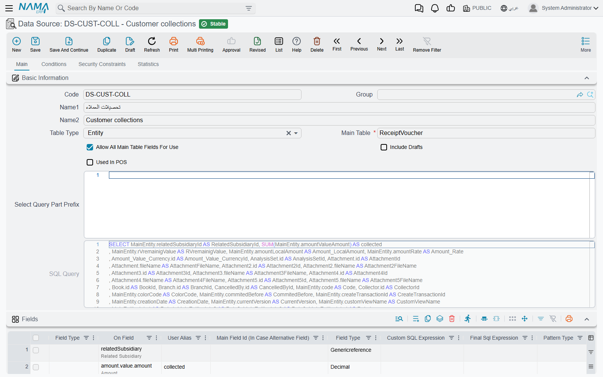
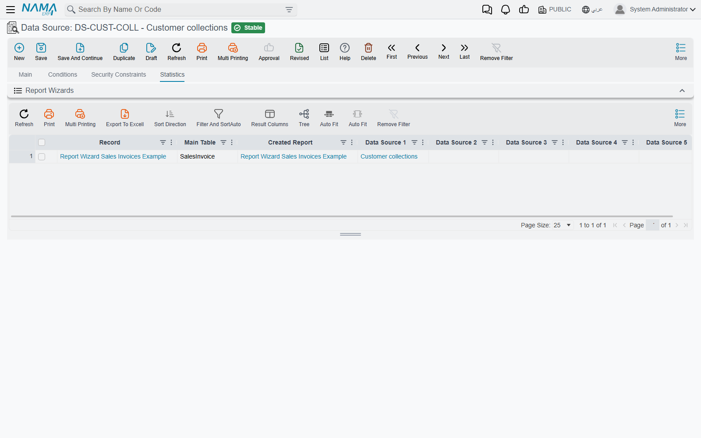

# Data Sources

Sooner or later a report needs a number that does not hang off its main table. A customer statement
starts from invoices but also wants each customer's collections. A stock report starts from items but
also wants the quantity still on open purchase orders. You cannot reach those figures by following a
field path from the main table, because they come from a different table with its own filters and its
own totals.

A **Data Source** is the answer: a saved query, built with the same screen and the same grids as the
Report Wizard, that a report can attach and read from. Think of it as a small report with no layout —
it decides *which rows* and *which columns*, and leaves the presentation to whichever report uses it.
Build it once, and any number of reports can attach it.

The screen is under **Administration → Reports → Data Source**. A data source is never run on its
own and has no menu entry for readers. It does its work inside a **Report Wizard** or a **Printing
Form Wizard**, each of which has five **Data Source** tabs (**Data Source 1** … **Data Source 5**).
How a report attaches one, lines it up and filters it is covered in
[Reaching data that is not on the main table](/platform/reports/report-wizard-guide#Reaching-data-that-is-not-on-the-main-table).
This page covers the record itself.

::: info Dashboards do not use this screen
A BI dashboard widget's "wizard data source" is a different record, the **Dashboard Widget Wizard**,
covered in the [BI module guide](/platform/bi/bi-module-guide#Data-Sources). A Data Source record can
be attached only to a Report Wizard or a Printing Form Wizard.
:::

## Building a data source

A worked example: you want a customer statement report built on sales invoices, with each customer's
total collections beside their invoices.

1. Open **Data Source**, click **New**, and give it a code and names. The name is what report authors
   will see as the branch label in their field picker, so make it say what it holds — "Customer
   collections", not "DS1".
2. Set **Table Type** and **Main Table** exactly as you would in the Report Wizard — here, the
   collection document's table.
3. In **Fields**, list the columns the data source returns: the customer and the amount. Set **SQL
   Aggregation Type** to **Sum** on the amount, and the data source returns one row per customer with
   the total.
4. Add any fixed filters (only one branch, only one book) in **Where Lines** on the **Conditions** tab.
5. Save. The data source builds its query and shows it, read-only, in **SQL Query**.

Then, in the report, choose this record on the **Data Source 1** tab and add a linking line that pairs
the data source's customer field with the report's customer field. From then on the collection total
is available in the report's field picker as `$dataSource1.` followed by the field path.

## The Main tab

| Field | What it does |
|---|---|
| **Table Type** / **Main Table** | Which table the query reads, exactly as in the [Report Wizard](/platform/reports/report-wizard-guide#Table-Type). Main Table is required. |
| **Allow All Main Table Fields For Use** | Ticked by default. Every field of the main table can be used by the reports that attach this data source, not just the fields you listed in **Fields**. Clear it to limit reports to the listed fields. |
| **Include Drafts** | Leave it clear and draft records are left out of the result. Tick it to read drafts as well. |
| **Used In POS** | Tick it only for a data source meant for a report or form that runs in point of sale. It must match the **Used In POS** setting of every wizard that attaches it, or that wizard's report cannot be built. |
| **Select Query Part Prefix** | Text placed straight after `SELECT` in the generated query, such as `DISTINCT` or `TOP 1`. |
| **SQL Query** | The query the data source produces, filled in when you save. Read-only. Copy it into SQL Server Management Studio when you need to see what the data source actually returns. |

The grids below the header work the same way as their Report Wizard counterparts, with the same
**Select Fields** buttons and SQL expression editors:

- **Fields** — the columns returned. At least one line is required, even when **Allow All Main Table
  Fields For Use** is ticked. Give a calculated column a **User Alias**: report authors pick it by that
  alias.
- **Parameters** — values the data source needs from outside. A data source has no run screen of its
  own, so it never asks these questions itself: every report that attaches it has to answer each one.
  See [Parameters must be answered by the report](#Parameters-must-be-answered-by-the-report) below.
- **Sort Fields** — the order of the returned rows. A data source with sort fields can only be attached
  as a sub query (see the messages below).
- **User Aliases** — your own short names for the joins the query makes, as in the Report Wizard.
- **Union Tables** — further tables read alongside the main table with the same field list, with the
  **Union Handling** column deciding what each table contributes, as described in
  [Reporting on several tables at once](/platform/reports/report-wizard-guide#Reporting-on-several-tables-at-once).

## The Conditions tab

**Static Where Condition** and **Static Having Condition** are free SQL added to the query's `WHERE`
and `HAVING` parts, written with the `@{…}@` field syntax used in every wizard expression. The
**Final** field under each one shows the condition after the field paths are turned into real columns.
**Where Lines** is the grid form of the same idea: a field, an operator and a fixed value or another
field, with no SQL to write. All three apply every time the data source is read, whichever report reads
it.

## The Security Constraints tab

The same grid as the Report Wizard's security constraints. It limits the rows to what the person
running the report may see — their own records, records of their legal entity or branch, records they
hold a view capability for. The limit is carried into every report that attaches the data source.

## Which reports use this data source

The **Statistics** tab lists the **Report Wizards** that attach this data source on any of their five
Data Source tabs. Printing Form Wizards that attach it are not listed there.

Check this list before you change a data source. A report built by the Report Wizard keeps the query it
generated when it was last saved, so an edit to a data source has no effect on a report until you open
that Report Wizard and save it again. A change that adds a parameter the report does not answer shows up
as a refusal when you save that wizard — not when you save the data source.

## Parameters must be answered by the report

A parameter on the data source is a value it needs from outside — "collections up to which date?" Only
the report can supply it. On the report's Data Source tab, add a **Filter Lines** row that pairs the
**Data Source Parameter** (the parameter's **Generated Parameter Name**) with a **Reporting Wizard
Parameter** (one of the report's own questions) or a **Reporting Wizard Field**. The reader answers the
report's question once, and the answer reaches the data source too.

A report that attaches the data source but leaves one of its parameters unanswered cannot be saved; the
refusal names the parameters that are left over.

## Messages you may see

These appear when you save the **Report Wizard** or **Printing Form Wizard** that attaches the data
source, not the data source itself. Only the first has an Arabic translation; the rest appear in English
on Arabic screens as well.

| Message | Why | What to do |
|---|---|---|
| *You must select the option {0} because the datasource {1} uses sort fields* — «يجب اختيار الاوبش {0} لأن مصدر البيانات {1} يستخدم حقول ترتيب» | The data source has **Sort Fields**, and they only work when it is read once per report row. | Tick **Use Data Source N As Sub Query** on that tab, or clear the data source's sort fields. |
| *There are one or more parameter with ids ({0}) are not handled* | The data source has parameters that no filter line on the report's tab answers. | Add a **Filter Lines** row for each parameter listed. |
| *You should define data source field or data source parameter* | A filter line names neither a **Data Source Field** nor a **Data Source Parameter**, or names both. | Fill exactly one of the two. |
| *You should define reporting wizard field or reporting wizard parameter* | A linking or filter line names neither a report field nor a report parameter, or names both. | Fill exactly one of the two. |
| *Could not find parameter with name {0}* | A linking or filter line points at a report parameter that the report's **Parameters** grid does not define. | Correct the name, or add the parameter to the report. |
| *The field {0} must be selected* | A filter line compares a data source field with a report *field*. That comparison is only possible when the data source is read once per report row. | Tick **Use Data Source N As Sub Query**, or compare with a report parameter instead. |
| *{0} should be false when {1} is true* | **Use Data Source N As Sub Query** and **Show All Values (N)** are both ticked on the same tab. They are opposite ways of attaching a data source. | Clear one of them. |
| *{0} should be have same size of {1}* | Two Data Source tabs both have **Show All Values** ticked but different numbers of linking lines. | Give both tabs the same number of linking lines, or tick Show All Values on only one. |
| *When wizard usedInPOS is true, {0} ({1}) must also have usedInPOS=true* | The wizard is ticked **Used In POS** and the data source is not. | Tick **Used In POS** on the data source, or attach a different one. |
| *When wizard usedInPOS is false, {0} ({1}) must also have usedInPOS=false* | The data source is ticked **Used In POS** but the wizard is not. | Clear it on the data source, or attach a non-POS data source. |

The **Fields**, **Parameters** and **Where Lines** grids of a data source are checked with the same
rules as the Report Wizard's, so a refusal on those grids reads exactly as it does there.
