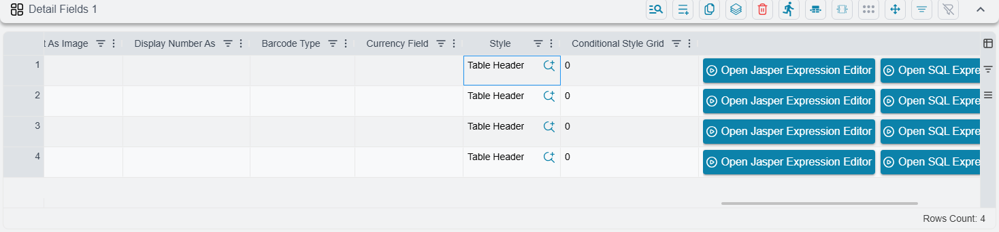
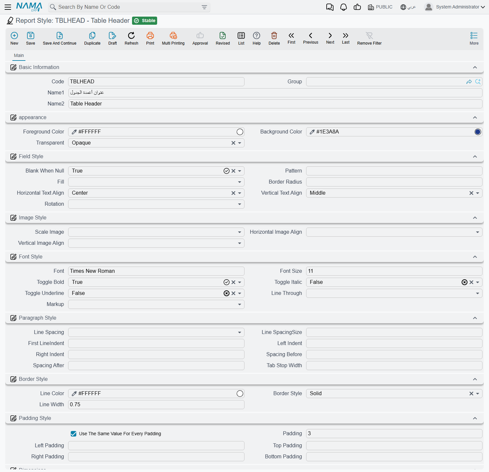

# Report Styles

Building a report or a printed form with a wizard means placing dozens of fields, and every one of
them needs a colour, a font, an alignment and a border. Setting all of that on each field, one field
at a time, is slow the first time and painful the second — especially when the finance manager asks
for the totals row to be one point larger across all eleven invoice layouts.

A **Report Style** solves that. It is a small master file that holds one complete look — foreground
and background colour, font family and size, bold/italic/underline, text and image alignment,
paragraph indents, border line and padding — under a code you choose, say `T01`. You then point
wizard fields at that code instead of formatting them individually. Change the style once and every
field that references it changes with it.

## Where a style takes effect — and where it does not

This is the single most important thing to know before you create one, because getting it wrong costs
an afternoon.

A Report Style is read by exactly two things: the **Report Wizard** and the **Printing Form Wizard**.
Those wizards assemble the report layout themselves, field by field, from what you entered on their
detail lines — and while they do that they look up the style you attached to each line and apply it.

Anything else ignores the record completely. A report whose layout was designed outside Nama and
uploaded to a Report Definition carries its own formatting inside the uploaded file, and the system
never consults Report Styles when it runs one. So if you create a style called `Header Blue` and
expect your existing hand-designed invoice to turn blue, nothing will happen — not because the style
is wrong, but because that invoice was never built from a wizard and has no line to attach the style
to.

::: warning A style is not a theme
There is no screen anywhere that says "apply this style to this report". The only way a style reaches
the page is by being selected on a wizard line. If you cannot find a Style column on the screen you
are editing, that report cannot use styles at all.
:::

That restriction sounds narrow, but the feature is genuinely used where it applies. Across the
customer configurations Nama keeps on file, **26 of roughly 150 printing forms** reference report
styles by code. Sites that use them tend to build a small family and reuse it everywhere — a `T01`,
`T02`, `T03` set with dark variants alongside, or a pair of receipt styles, one for header fields and
one for detail fields.

## Attaching a style to a wizard field

You do not attach the report to the style; you attach the style to each piece of the report. There
are four places a style reference appears, and which ones you see depends on which wizard you are in:

1. **Field lines.** Every field line in a wizard grid has a **Style** and a **Summary Style**. The
   first formats the field itself wherever it prints; the second formats its summary — the total or
   count at the end of a group or of the report — so you can print the detail rows in plain 10-point
   text and the totals in bold on a shaded background without creating two separate fields.
2. **Header field lines of a printing form.** These print a caption and a value side by side, so they
   carry two references — **Label Style** and **Value Style**. A common arrangement is a bold grey
   label style and a plain black value style, applied to every header field so the whole block lines
   up visually.
3. **Header components.** The blocks you add to a form's header — a title, a logo, a free text
   element — each take a single **Style**.
4. **Conditional style lines.** Here you pair a style with a **Condition Expression**, and the style
   is applied only where that condition is true. This is how you get negative balances in red or
   overdue rows on a yellow band: the field keeps its normal style, and the conditional style
   overrides it when the condition matches. Both halves are required on such a line — a style with no
   condition, or a condition with no style, is rejected when you save.

Referencing the same style from twenty different lines costs nothing. The system emits it once into
the generated layout and every line points at that single copy.

## What happens when you leave the style empty

Wizard fields are perfectly usable with no style at all; there is a built-in fallback. A field with no
style prints centred horizontally, middle-aligned vertically, in 10-point text, black on white,
**with no border**.

That last detail is worth pausing on, because it produces a result people rarely expect. When a field
*does* have a style and that style's Line Width is left empty, the width falls back to **0.5** — a
hairline border. So attaching a completely blank style to a field does not leave it unchanged: it
draws a thin box around it that was not there before. If you want a style that only sets, say, the
font, and you do not want borders appearing, set Line Width explicitly to 0.

Grids that use conditional styles arrive at the same place from a different starting point. They get a
base look built from the wizard's own detail band settings — the band's colours, Times New Roman at
size 10 or the band's own size, and a 0.5 border — and your conditional styles override that wherever
they match.

## Creating a style

Report Styles live under **Administration → Reports → Report Styles**. The screen is a single tab: the
usual master-file identity at the top — Code, Group, Name1, Name2 — then the formatting groups, then
the generic dimensions. The **Code** is what matters most in daily use, because it is what you see and
pick in the wizard's Style lookup. Give styles codes that describe their job (`Header`, `Totals`,
`T02-Dark`) rather than sequential numbers.

Nothing on this screen is validated beyond the code being unique. Colours must be written as a hex
code in the form `#RRGGBB` — `#1E3A8A`, `#FFFFFF`. A misspelled colour, or a font family that is not
installed on the server, is accepted quietly when you save and only shows up as a problem when a
report using the style is run.

::: info Arabic interface
Most of the labels on this screen have not been translated yet and appear in English even when the
rest of the system is in Arabic — including the menu entry itself, which reads **Report Styles**. The
field reference below therefore gives the English label for every field.
:::

### Appearance

| Field | What it does | Values / default |
|---|---|---|
| Foreground Color | The colour of the text | `#RRGGBB` — default black |
| Background Color | The fill behind the text | `#RRGGBB` — default white |
| Transparent | Whether the background is painted at all | Opaque, Transparent — default Opaque |

Setting Transparent lets whatever is behind the field — a band colour, a frame — show through, which
is usually what you want for a label sitting on a coloured header strip.

### Field Style

| Field | What it does | Values / default |
|---|---|---|
| Blank When Null | Print nothing at all when the value is empty | Default, TRUE, FALSE — default TRUE |
| Pattern | The formatting pattern for numbers and dates, for example `#,##0.00` or `dd/MM/yyyy` | free text |
| Fill | How the background area is filled | Default, Solid |
| Border Radius | Rounds the corners of the field's box | number |
| Horizontal Text Align | Where the text sits across the box | Left, Center, Right, Justified — default Center |
| Vertical Text Align | Where the text sits down the box | Top, Middle, Bottom, Justified — default Middle |
| Rotation | Turns the text inside its box — useful for narrow column headings | None, Left, Right, UpsideDown |

### Image Style

These three apply when the wizard line prints an image rather than text — a logo, a product photo, a
signature.

| Field | What it does | Values |
|---|---|---|
| Scale Image | How the picture is fitted into the space reserved for it | Default, Clip, FillFrame, RetainShape, RealHeight, RealSize |
| Horizontal Image Align | Where the picture sits across the box | Left, Center, Right |
| Vertical Image Align | Where the picture sits down the box | Top, Middle, Bottom |

`RetainShape` is the safe choice for logos — it fits the image into the box without distorting it.
`FillFrame` stretches it to fill the box exactly, and `Clip` crops whatever does not fit.

### Font Style

| Field | What it does | Values / default |
|---|---|---|
| Font | The font family name, exactly as it is installed on the server | free text — default Times New Roman |
| Font Size | Size in points | number — default 10 |
| Toggle Bold | Bold on or off | Default, TRUE, FALSE |
| Toggle Italic | Italic on or off | Default, TRUE, FALSE |
| Toggle Underline | Underline on or off | Default, TRUE, FALSE |
| Line Through | Strike-through on or off | Default, TRUE, FALSE |
| MarkUp | How the text content of the field is interpreted | None, styled, html, rtl |

Leaving one of the four toggles on **Default** is not the same as setting it to FALSE. Default means
"inherit", so the field keeps whatever the surrounding design gives it, while FALSE actively switches
the attribute off.

The font name is a plain piece of text and is looked up on the **server**, not on the workstation. A
font that renders beautifully in your browser will not appear in the printed output unless it is
installed on the application server, so stay with the families your reports already use.

### Paragraph Style

These control the shape of the text block inside the field, and only make a visible difference on
fields long enough to wrap — remarks, addresses, terms and conditions.

| Field | What it does |
|---|---|
| First LineIndent | Indents the first line of the paragraph |
| Left Indent | Indents every line from the left |
| Right Indent | Indents every line from the right |
| Spacing Before | Blank space above the paragraph |
| Spacing After | Blank space below the paragraph |
| Tab Stop Width | The width of a tab stop |

### Border Style

| Field | What it does | Values / default |
|---|---|---|
| Line Color | The colour of the border | `#RRGGBB` — default black |
| Border Style | The kind of line drawn | Solid, Dashed, Dotted, Double |
| Line Width | The thickness of the line; set it to 0 for no border | number — default 0.5 |

### Padding Style

Padding is the breathing room between the border and the text. Without it, text sits flush against the
box and printed tables look cramped.

| Field | What it does |
|---|---|
| Use The Same Value For Every Padding | Switches between one shared value and four separate ones |
| Padding | The single value applied to all four sides |
| Left Padding, Top Padding, Right Padding, Bottom Padding | The four individual values |

All six fields are shown together, but only one half of them is ever used. Tick **Use The Same Value
For Every Padding** and the system reads **Padding** alone and ignores the four individual fields — so
make sure Padding actually carries a value before you tick it. Leave the box unticked and it reads the
four individual fields and ignores Padding.

## A practical set

Most sites do not need many styles. A workable starting set for a printed form is four records:

- **`Label`** — the caption half of every header field. Bold, no border, small padding.
- **`Value`** — the value half. Plain weight, no border, the same padding, so labels and values sit on
  the same baseline.
- **`TableHeader`** — the column headings of the detail grid. Bold, white text on a dark background
  (leave Transparent on Opaque so the fill actually prints), centred, a solid 0.5 border.
- **`Total`** — attached as the **Summary Style** on the amount columns. Bold, one or two points
  larger than the detail rows.

Build those four, attach them across one form, print it, then adjust the style records rather than the
form. That is the whole point of the feature: the next form you build reuses the same four codes and
comes out looking identical without any further formatting work.

For how the wizard lines themselves are laid out, see the
[Report Wizard Guide](/platform/reports/report-wizard-guide). The [Printing Form Wizard](/platform/reports/printing-form-wizard-guide), which is where
report styles are most heavily used, has its own page.