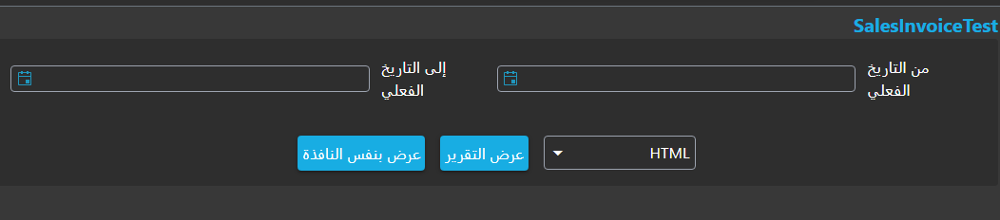
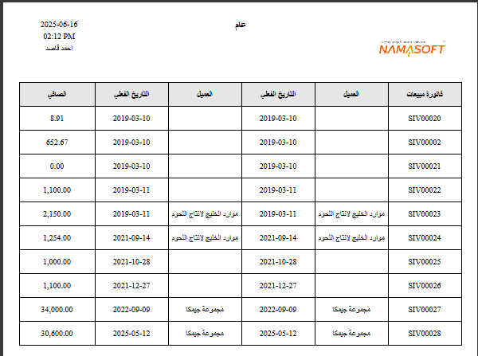

# Report Wizard Guide

Nama ERP provides an easy and effective way to create professional reports quickly using the Report Wizard tool.

This tool lets you build reports by selecting the main table, then choosing the required fields and adding filters in a simple, fast manner — as will be explained in detail through the examples below.

## Creating a Simple Report to Display Sales Invoices

To create a report that shows sales invoice data such as invoice code, customer name, invoice date, and net invoice value, follow these steps:

1. Create a new report using the Report Wizard and assign it an appropriate code and name.
2. In the **Main Table** field, select `SalesInvoice` from the search screen.
3. In the **Fields** table, add the following rows:

  * `this` to display the document code with a link to open the invoice details.
  * `customer` to display the customer name with a link to open the customer details.
  * `money.netValue` to display the net invoice value.
4. In the **Parameters** table, add a single row containing the `valueDate` field to define the time period.

::: tip

* You can use the **Select Fields** button to display a visual field selection interface without having to type field names manually.
* When you type part of a field name (in Arabic or English), you can press the down arrow to see suggested fields.
:::

::: details JSON for direct import

```json
{
  "mainTable": "SalesInvoice",
  "fields": [
    { "fieldId": "this" },
    { "fieldId": "customer" },
    { "fieldId": "valueDate" },
    { "fieldId": "customer" },
    { "fieldId": "valueDate" },
    { "fieldId": "money.netValue" }
  ],
  "parameters": [
    {
      "fieldId": "valueDate",
      "filterType": "Between"
    }
  ]
}
```
:::

After saving, click the **View Report** button. A screen similar to the following will appear:



Select an appropriate time period (from date - to date) and click **Run Now**. The report will appear as follows:



As you can see, a report with time filters and professionally organized columns was generated, and the company logo, run date and time, and username are displayed automatically.

## Detailed Explanation of Report Wizard Fields and Tables

In this section we provide a precise explanation of all fields used in the Report Wizard, clarifying the function of each field and how it affects the resulting report.

### `Report Group`

When you save a Report Wizard file, a new report file is automatically created in the system.
You can use this field to specify the group under which the report will be classified, which helps organize reports by department or function.

---

### `Table Type`

This field helps you narrow down the selection of the Main Table for the report by categorizing the available tables. It contains the following values:

* **`Entity`**
  Lets you choose any entity type available in the system, such as:

  * `SalesInvoice` (Sales Invoice)
  * `PaymentVoucher`
  * `Customer`
  * `Supplier`
  * `Employee`
  * `Account`
    and other main entities in the system.

* **`Detail Line`**
  Lets you choose one of the detail line tables associated with entities, such as:

  * `SalesInvoiceLine`: sales invoice line details
  * `CustomerContactInfo`: contact information in the customer file

* **`System Table`**
  Lets you choose internal system tables such as:

  * `ItemDimensionsQty`: displays item quantities across different warehouses
  * `FAPropertiesEntry`: displays fixed asset properties

* **`Virtual Entity`**
  Lets you choose one of the virtual entities defined by the user via a custom SQL query (such as a `UNION` of two tables or joining several tables with calculated expressions). These entities appear in the main table list just like real entities, with the same field-selection mechanism, translations, and automatic entity reference fields (Reference Fields).

  To define a new virtual entity or understand how to set up column mappings and the Bootstrap mechanism, see the [Virtual Entity Guide](../virtual-entity-guide.md).

---

### `Report Title (Arabic)` and `Report Title (English)`

These fields define the report title displayed at the top of the final report. The value shown depends on the user's language: if the interface is in Arabic the Arabic title is shown, and if it is in English the English title is shown.

---

### `Layout Method`

This field determines how fields and parameters are laid out inside the resulting report. It contains the following options:

* **`Manual`**
  Lets you manually specify properties for each field and parameter — such as position, width, and height — through the tables inside the Report Wizard file.

* **`From Uploaded File`**
  Allows you to upload a pre-built Jasper file (`.jrxml` extension) and use the field properties and positions already defined in it inside the report.

* **`From Editor`**
  Lets you use a visual editor to format fields and define their positions inside the report. The editor can be opened via the `Open Editor` button.

---

## Converting Quantities by Selected Unit of Measure

In inventory reports, quantities are typically stored in the item's base unit of measure, but users may want to display them in another unit (sales unit, purchase unit, etc.). The Report Wizard provides two complementary options to achieve this.

### Option 1: Add a `UOMConversion` Parameter

This parameter adds a dropdown in the report run screen that allows the user to select the unit of measure, and automatically adds the required joins.

1. Make sure the report contains a field from the `InvItem` table (such as `item.code`) — this is a prerequisite for activating the parameter.
2. In the **Parameters** table, add a new row and leave `Field ID` empty, then select `Parameter Type = UOMConversion`.
3. Save the report.

When saved, the following are added automatically:

* A `UOM` parameter in the JRXML file with values `baseUnit, reportingUnit1, defaultPurchaseUnit, defaultSalesUnit`.
* `LEFT JOIN UOM AS PrimaryUOM ON PrimaryUOM.id = <InvItem>.prim$P!{UOM}_id`
* `LEFT JOIN PrimaryItemUOMLine AS UL ON UL.invItem_id = <InvItem>.id AND UL.uom_id = <InvItem>.prim$P!{UOM}_id`

### Option 2: Convert a Quantity Field Value to the Selected Unit

After adding a `UOMConversion` parameter, you can enable conversion on any quantity field independently.

1. Confirm both conditions are met: the `UOMConversion` parameter exists + a field from `InvItem` is in the report.
2. On the field row you want to convert (such as `inBasePValue` or a custom expression), enable the **"Use unit of measure factor for quantity conversion"** checkbox.
3. Save the report.

The SELECT expression for the field changes to `(SUM(field)) / UL.rateToBase`, and `UL.rateToBase` is automatically added to `GROUP BY`.

::: tip
If the two conditions are not met (`UOMConversion` parameter + `InvItem` field), the checkbox is silently ignored and no conversion takes place.
:::

::: details JSON for direct import

```json
{
  "mainTable": "QtyTransLine",
  "fields": [
    {
      "fieldId": "in.base.primeQty.value",
      "customSqlExpression": "(@{in.base.primeQty.value}@-@{out.base.primeQty.value}@)",
      "useUOMParameterForQtyConversion": true
    },
    { "fieldId": "itemTransRef.item" }
  ],
  "parameters": [
    {
      "userAlias": "PrimaryUOM",
      "parameterType": "UOMConversion"
    },
    {
      "fieldId": "commonData.valueDate",
      "filterType": "Equals"
    }
  ]
}
```
:::
