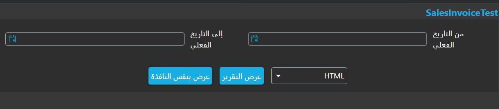
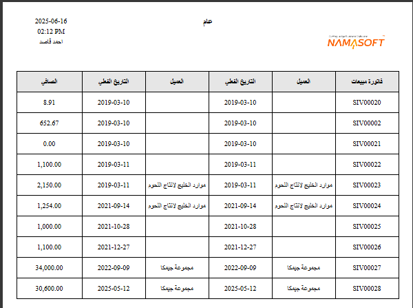

# Report Wizard Guide

Nama ERP provides an easy and effective way to create professional reports quickly using the Report Wizard tool.

This tool lets you build reports by selecting the main table, then choosing the required fields and adding filters in a simple, fast manner — as will be explained in detail through the examples below.

::: info Where to find it
**Administration → Reports → Report Wizard.**
:::

The Report Wizard shares most of its screen with the [Printing Form Wizard](/platform/reports/printing-form-wizard-guide). Data sources, the field list, page setup, styles and conditional formatting work identically in both — [Report and Form Wizards](/platform/reports/report-and-form-wizards) covers that shared half, and what follows here is what belongs to reports.

## Creating a Simple Report to Display Sales Invoices

To create a report that shows sales invoice data such as invoice code, customer name, invoice date, and net invoice value, follow these steps:

1. Create a new report using the Report Wizard and assign it an appropriate code and name.
2. In the **Main Table** field, select `SalesInvoice` from the search screen.
3. In the **Fields** table, add the following rows:

  * `this` to display the document code with a link to open the invoice details.
  * `customer` to display the customer name with a link to open the customer details.
  * `money.netValue` to display the net invoice value.
4. In the **Parameters** table, add a single row containing the `valueDate` field to define the time period.

::: tip

* You can use the **Select Fields** button to display a visual field selection interface without having to type field names manually.
* When you type part of a field name (in Arabic or English), you can press the down arrow to see suggested fields.
:::

::: details JSON for direct import

```json
{
  "mainTable": "SalesInvoice",
  "fields": [
    { "fieldId": "this" },
    { "fieldId": "customer" },
    { "fieldId": "money.netValue" }
  ],
  "parameters": [
    {
      "fieldId": "valueDate",
      "filterType": "Between"
    }
  ]
}
```
:::

After saving, click the **Run** button. A screen similar to the following will appear:



Select an appropriate time period (from date - to date) and click **Run**. The report will appear as follows:



As you can see, a report with time filters and professionally organized columns was generated, and the company logo, run date and time, and username are displayed automatically.

## Detailed Explanation of Report Wizard Fields and Tables

In this section we provide a precise explanation of all fields used in the Report Wizard, clarifying the function of each field and how it affects the resulting report.

### `Report Group`

When you save a Report Wizard file, a new report file is automatically created in the system.
You can use this field to specify the group under which the report will be classified, which helps organize reports by department or function.

---

### `Table Type`

This field helps you narrow down the selection of the Main Table for the report by categorizing the available tables. It contains the following values:

* **`Entity`**
  Lets you choose any entity type available in the system, such as:

  * `SalesInvoice` (Sales Invoice)
  * `PaymentVoucher`
  * `Customer`
  * `Supplier`
  * `Employee`
  * `Account`
    and other main entities in the system.

* **`Detail Line`**
  Lets you choose one of the detail line tables associated with entities, such as:

  * `SalesInvoiceLine`: sales invoice line details
  * `CustomerContactInfo`: contact information in the customer file

* **`System Table`**
  Lets you choose internal system tables such as:

  * `ItemDimensionsQty`: displays item quantities across different warehouses
  * `FAPropertiesEntry`: displays fixed asset properties

* **`Virtual Entity`**
  Lets you choose one of the virtual entities defined by the user via a custom SQL query (such as a `UNION` of two tables or joining several tables with calculated expressions). These entities appear in the main table list just like real entities, with the same field-selection mechanism, translations, and automatic entity reference fields (Reference Fields).

  To define a new virtual entity or understand how to set up column mappings and the Bootstrap mechanism, see the [Virtual Entity Guide](/platform/virtual-entity-guide).

---

### `Report Title (Arabic)` and `Report Title (English)`

These fields define the report title displayed at the top of the final report. The value shown depends on the user's language: if the interface is in Arabic the Arabic title is shown, and if it is in English the English title is shown.

---

### `Layout Method`

This field determines how fields and parameters are laid out inside the resulting report. It contains the following options:

* **`Manual`**
  Lets you manually specify properties for each field and parameter — such as position, width, and height — through the tables inside the Report Wizard file.

* **`From Uploaded File`**
  Allows you to upload a pre-built Jasper file (`.jrxml` extension) and use the field properties and positions already defined in it inside the report.

* **`From Editor`**
  Lets you use a visual editor to format fields and define their positions inside the report. The editor can be opened via the `Open Editor` button.

---

## Parameters — the questions the report asks before it runs

A report covers a range of records, so the first thing it does is ask the reader which range they
want. Every question on that run screen is one row in the **Parameters** grid, and the rows are asked
in the order you list them.

There are three ways to describe a parameter, and the one you pick depends on where the value it
narrows actually lives.

**Point it at a field.** Put a field path in **On Field** — `valueDate`, `customer`,
`money.netValue`. The wizard works out the data type on its own, builds the control that suits it (a
date picker, a customer lookup, a number box) and adds the matching condition to the report's query.
This is what you want almost every time.

**Point it at a column you already listed.** Leave **On Field** empty and type, in **User Alias (In
Case SQL Expression)**, the alias of a row from the **Fields** grid. The parameter then narrows that
column — including a column you calculated yourself.

**Give it its own expression.** Fill **Custom SQL Expression** on the parameter row and it narrows
that expression instead of a stored column. Use **Param Type** to tell the wizard what kind of value
it is, because there is no field to infer it from.

::: tip Select Parameters Fields
The **Select Parameters Fields** button opens the same visual field picker the **Fields** grid uses,
so you rarely have to type a path by hand.
:::

### Filter Type shapes the control, not just the condition

**Filter Type** says how the reader's answer is compared to the data — **Equals**, **Not Equal**,
**Greater Than**, **Less Than**, **Contains**, **In**, **Between** and so on. Leave it empty and the
wizard chooses one that suits the field's type. It also decides what the reader is handed:

- **In** and **Not In** turn one box into a multi-select, and **List Display Type** then decides how
  that list of choices is presented.
- **Contains**, **Does Not Contain**, **Starts With** and **Ends With** give a free-text box and
  match on part of the value.
- The **With Null** variants — **Equals With Null**, **Greater Than With Null** and their siblings —
  keep records whose value is empty instead of dropping them, which matters on optional fields.
- **Has Value Or Not** asks for no value at all. It offers a three-way choice: only records where the
  column has something, only records where it is empty, or all records — and it starts on *all
  records*, so the report is unfiltered until the reader says otherwise. **Has Value For Total** runs
  the same test against the column's total rather than each row.
- **Between** does something different enough that it needs its own section.

### Between asks two questions, not one

Set **Filter Type** to **Between** and the wizard does not create one parameter — it creates two, a
*from* and a *to*. It builds their captions out of your **Arabic Title** and **English Title** with a
`From` / `To` prefix (`من` and `إلى` in Arabic), so one row on the grid becomes two boxes on the run
screen.

Everything that comes in pairs on the parameter row exists because of this:

- **Default Value** fills the *from* box; **Default Value (works with Between)** fills the *to* box.
  The typed twins work the same way — **Date Default Value** and **Date Default Value (works with
  Between)**, and so on for date-and-time, time and reference values.
- **Generated Parameter Name** ends up holding *both* names, separated by a comma — for a Between on
  the value date it reads `FromvalueDate,TovalueDate`. That comma pair is not a mistake; it is how
  the rest of the wizard refers to the two halves.
- Tick **Show as Date Range** on a Between over a date and the two separate boxes are replaced by a
  single from–to range control.

::: info Generated Parameter Name is written for you
You do not fill **Generated Parameter Name** in — the wizard writes it when you save, from the field
path (or the user alias) and the filter type: a parameter on `customer` with **Equals** becomes
`customer_Equals`. Whenever something else on the screen needs to refer to a parameter by name, save
first and read the name out of this column rather than guessing it.
:::

### Default values, including ones that move

A parameter row carries a default value column for each kind of value: **Default Value** for text,
**Reference Default Value** for a lookup, **Date Default Value**, **Date Time Default Value** and
**Time Default Value** — each with its "(works with Between)" twin. Fill the one that matches your
parameter's type; when you save, the wizard folds whichever you used into **Default Value**.

**Default Value** also understands a family of moving tokens. They are resolved at the moment the run
screen opens, not when you build the report, so a report written in January still opens on the right
period in December.

| Token | Resolves to |
|---|---|
| `$today()`, `$now()` | Today / the current moment |
| `$monthStart()`, `$monthEnd()` | First and last day of the current month |
| `$previousMonthStart()`, `$previousMonthEnd()` | The month before |
| `$nextMonthStart()`, `$nextMonthEnd()` | The month after |
| `$yearStart()`, `$yearEnd()` | First and last day of the current year |
| `$previousYearStart()`, `$previousYearEnd()`, `$nextYearStart()`, `$nextYearEnd()` | The year before / after |
| `$quarterStart()`, `$quarterEnd()` | The current quarter |
| `$halveStart()`, `$halveEnd()`, `$thirdStart()`, `$thirdEnd()` | The current half-year / third of the year |
| `$todayPlusDays(7)`, `$todayMinusDays(7)` | A number of days either side of today |
| `$todayPlusWeeks(2)`, `$todayMinusWeeks(2)` | The same in weeks |
| `$todayPlusMonths(3)`, `$todayMinusMonths(3)` | The same in months |
| `$todayPlusYears(1)`, `$todayMinusYears(1)` | The same in years |

The pairing readers like most is `$monthStart()` in **Default Value** and `$today()` in **Default
Value (works with Between)**: the report opens on month-to-date every time it is run.

### Making the reader answer

**Required** refuses to run until that parameter is filled. **Required Group** is the softer version:
put the same text in the **Required Group** of several parameters and the reader must fill *at least
one* of them — useful when a report is too heavy to run wide open but there are three or four
reasonable ways to narrow it.

### The rest of the parameter row

- **Show Inside Report** prints the value the reader chose on the report itself, so a printed copy
  says which period and which branch it covers.
- **Allowed Values** turns the parameter into a fixed list of choices, written as a comma-separated
  list. **Arabic Allowed Values** and **English Allowed Values** give those choices readable captions
  in each language — same count, same order.
- **Reference Entity Type** makes the parameter a lookup on that record type, and **Filter** narrows
  what the lookup offers. Writing `@sysfilter@` inside **Filter** stands in for the filter the wizard
  would have applied on its own, so you can add to it instead of replacing it.
- **Source Parameter** feeds one parameter from another: name a parameter there and this one stops
  asking the reader anything and takes the other one's value. For a Between source, give the comma
  pair. **Source Property** then picks one property out of that value rather than the whole record.
- **Layout**, together with **Parameters Position** and **Number Of Parameters In Row** on the group
  above the grid, arranges the boxes on the run screen.

## Custom parameters — asking a question the query does not answer

Sometimes the report needs to ask the reader something that is not a filter on a field at all: a
threshold to compare against, a factor to multiply by, a switch that a calculated column reads. That
is what **Parameter Type = Custom** is for.

A custom parameter is a prompt and nothing else. The wizard puts the box on the run screen and
honours **Required**, **Allowed Values**, **Reference Entity Type**, **Filter** and the default value
columns exactly as it does for an ordinary parameter — and then adds **no condition whatsoever** to
the report's query. Nothing happens until you use the value somewhere yourself.

Building one takes three steps:

1. Add a row to **Parameters**, leave **On Field** empty, set **Parameter Type** to **Custom** and
   give the row a **User Alias (In Case SQL Expression)** — that alias is what the parameter will be
   named after. Set **Param Type** to the kind of value you want (text, number, date, and so on), and
   give it Arabic and English titles.
2. Save, reopen the record, and read the **Generated Parameter Name** column. That is the name to use
   in step 3 — remember it is a comma pair if you chose **Between**.
3. Use it. There are two places that accept a parameter name:
   - **A where line.** On the **Conditions** page, add a row to **Where Lines**, put the field you
     want to test in **LHS Field Id**, choose an **Operator**, and put the parameter's generated name
     in **Special Value**. The report is now filtered by the reader's answer.
   - **An expression.** Write `$P{TheGeneratedName}` inside a **Custom SQL Expression**, the **Static
     Where Condition** or the **Static Having Condition**, and the reader's answer drops straight
     into the calculation.

::: warning The name has to match
**Special Value** is matched against the parameters the wizard has already built. If it matches none
of them, nothing asks the reader for a value and the condition compares against an empty one — so
copy the name out of **Generated Parameter Name** rather than typing what you think it should be.
:::

## Columns you calculate yourself

Not every column exists as a stored field. A margin, a difference between two quantities, a label
stitched together out of three fields — these you write yourself, and the wizard has a first-class
place for them: **a row in the Fields grid with On Field left empty.**

Such a row is only accepted if it carries something the wizard can turn into a column — a **Custom
SQL Expression**, a **Custom Jasper Expression**, or **Union Handling**. Leave all of those empty as
well and saving fails, because there is nothing to select.

### Writing the expression

Inside **Custom SQL Expression** you refer to fields by wrapping their path in `@{` and `}@`. The
wizard resolves each one, brings in whatever the field needs to be reachable, and substitutes the
real column:

```
(@{in.base.primeQty.value}@ - @{out.base.primeQty.value}@)
```

You never write table names or aliases — naming the field is enough, and a field you reference only
inside an expression does not have to appear as a column of its own.

The **Open SQL Expression Editor** button on the grid opens this in a proper editor, with the same
field tree the picker uses, so you can insert paths by clicking instead of typing them.

### Naming and formatting the result

Two more columns matter on a calculated row:

- **User Alias** names the column. Give every calculated row one — it is how parameters, sort fields
  and other expressions refer back to it.
- **Pattern Type** decides how the result is treated and formatted: **Text**, **Date**, **Time**,
  **Date Time**, **Number**, **Currency** or **Quantity**. If you leave it empty and your expression
  mentions at least one field, the wizard copies the formatting of the *first* field you referenced —
  it sets **Pattern Type** to **Custom From Field** and fills **Pattern Field** with that field. So a
  difference between two quantity fields comes out formatted as a quantity without you doing
  anything, while an expression that mentions no field at all needs **Pattern Type** set by hand.

Everything else on the row behaves as it does for an ordinary column: **Arabic Title** and **English
Title**, width, style, conditional style, borders.

### Totals, aggregation and hidden columns

- **SQL Aggregation Type** — **Sum**, **Count**, **Distinct Count**, **Avg**, **Min**, **Max** —
  collapses the report to one row per combination of the columns that are not aggregated. Set it on a
  calculated column and the aggregate is applied to your whole expression.
- **Has Total In Summary** adds a grand total for the column at the end of the report. It produces a
  total for numeric columns only; on a text or date column the tick has no effect.
- **Hidden** keeps the column out of the printed report but keeps it in the query. That is how you
  sort by, filter on, or calculate from something the reader should not see.

### One expression per band

A column can print a different expression depending on where it appears. Press **Open Jasper
Expression Editor** on the field row and the dialog offers an **Expression For** list: **Details
Field Expression**, **Group 1 Header Expression** through **Group 5 Footer Expression**, and
**Summary**. Write an expression against each entry you care about and the report uses that one in
that band, falling back to the ordinary column value everywhere you left blank.

This is what lets a column show the row's own value in the detail band but a rate, a percentage or a
different aggregate in the group footers. The same dialog offers a function (**Sum**, **Count**,
**Average**, **Lowest**, **Highest**, **Distinct Count**, **Standard Deviation**, **Variance**,
**First**) and a reset level (**Report**, **Page**, **Column**, **Group 1** … **Group 5**), so you
can build the aggregate rather than write it out.

## Reaching data that is not on the main table

A report starts from one main table, and most of what you need hangs off it as an ordinary field
path. But some numbers simply are not reachable that way — a total from an unrelated document type, a
balance that has to be summed separately, a figure produced by a query somebody has already built.
That is what the five **Data Source** tabs are for.

A data source is its own saved query record. You attach one to the report on the **Data Source 1** …
**Data Source 5** tab, tell the wizard how its rows line up with the report's rows, and from that
moment its fields are available to the report like any other fields.

### The `$dataSource1.` prefix

Once a data source is attached, it appears in the field picker as a branch of its own, labelled with
the data source's name. Pick a field under that branch and the wizard writes the path with a prefix
that says which data source it came from:

```
$dataSource1.totalDebit
$dataSource3.lastVisitDate
```

The number is the tab number — `$dataSource1.` for the first tab, `$dataSource5.` for the fifth.
Those paths work everywhere an ordinary field path works: as a row in **Fields**, as a **Parameters**
row so the reader can filter on the data source's own columns, as a sort field, in group lines, and
inside `@{…}@` in a custom expression. Nothing else about them is special — the prefix simply tells
the wizard which query to go and look in.

### Lining the data source up with the report

Each data source tab carries two grids, and they do different jobs.

**Linking Lines** is how the data source's rows are matched to the report's rows — the equivalent of
saying "the same customer" or "the same item and the same warehouse". Each line pairs a **Data Source
Field** with either a **Reporting Wizard Field** (a field on the report's main table) or a
**Reporting Wizard Parameter** (the reader's answer to one of the report's questions). **Operator**
defaults to **Equals**, which is what you want unless you are matching a range.

Tick **Coalesce Null** on a linking line when one side may legitimately be empty. Without it a row
with an empty value on either side matches nothing at all; with it, empty is treated as a value in
its own right and empty matches empty.

**Filter Lines** narrows the data source itself before the match happens, so it returns less and
returns it faster. A filter line pairs a **Data Source Field** or **Data Source Parameter** with a
value taken from the report — again either a field or a parameter.

::: tip Parameters on data-source fields flow inwards
If you add a **Parameters** row whose **On Field** starts with `$dataSource2.`, the wizard pushes
that condition down into the second data source's own query rather than filtering afterwards. The
reader sees one question; the data source comes back already narrowed.
:::

### Use Data Source N As Sub Query

By default a data source is worked out once and joined to the report. Tick **Use Data Source N As Sub
Query** and it is evaluated per report row instead, with the linking lines applied inside it as
filters. That is the option to reach for when the data source has to be recalculated in the context
of each row — a balance as at each document's own date, for example — and the one to leave alone when
it does not, because working it out once is far cheaper.

## Show All Values

By default a data source can only add to rows the report already has. Start from sales invoices,
attach a data source of collections, and a customer who paid but was never invoiced simply is not in
the report — there is no invoice row for the collection to attach to.

**Show All Values (1)** … **Show All Values (5)**, on the corresponding data source tab, removes that
restriction. Tick it and the wizard stops hanging the data source off the report. Instead it collects
every distinct combination of the linking values from *both* sides — the report's rows and the data
source's rows — and uses that combined list as the report's backbone, attaching the report's own data
and the data source's data to it afterwards.

The practical result is the one the name promises: **a row appears for every value that exists on
either side.** A customer with invoices and no collections still appears, with the collection columns
empty. A customer with collections and no invoices *also* appears, with the invoice columns empty.
Neither side can hide a row from the other.

This is what makes statement-style and comparison reports possible — anything of the shape "show me
every account, whether or not it moved this period", "opening balances beside this period's
movement", "budget beside actual". Without it those reports quietly lose exactly the rows the reader
was looking for.

Two things follow from how it works:

- **The linking lines are what the backbone is built from.** A data source with **Show All Values**
  ticked and no linking lines has nothing to align on, so fill the lines in first.
- **Coalesce Null earns its keep here.** When one side may have an empty linking value — an
  unallocated entry, a movement with no branch — tick **Coalesce Null** on that linking line so the
  empty values on the two sides are treated as the same value and land on one row instead of two.

## Reporting on several tables at once

Some questions span document types that share nothing structurally. "Everything that moved this item
this month" has to look at issues, receipts, transfers and adjustments; "all money owed to us" spans
several kinds of document. Rather than one report per type, the **Union Tables** grid lets one report
read them all and present the result as a single list.

Add a row per extra table to **Union Tables** and name it in **Union Table**. The main table stays
what it is; the union tables are read alongside it. Every table is queried with the same field list,
the same filters and the same parameters, and the results are stacked — nothing is merged or
de-duplicated, so a row from the main table and an identical-looking row from a union table both
appear.

### Every column has to mean something in every table

That stacking is only possible if every column can be produced from every table, and this is the one
rule that catches people out. When you save, the wizard checks each field row against the main table
*and* against every union table. If a field path exists on some of them but not all, the save stops
and names both the field and the table that is missing it.

That is not an obstacle to work around — it is the question the wizard needs you to answer: *what
should this column show for the rows that come from that table?* You answer it in the **Union
Handling** column.

### Union Handling

Select a field row and press **Open Union Handling Editor**. The dialog lists every table taking part
— the main table and each union table — and lets you choose, per table, how that column is produced:

| Handling | What that table contributes to the column |
|---|---|
| **Normal** | The table's own field of that name. This is the default, and it is what stops the save if the table has no such field. |
| **Zero — No Value** | Nothing: zero for a numeric column, empty for anything else. The right answer when the concept simply does not apply to that table. |
| **Negated** | The table's own value with its sign flipped. This is how one column can hold ins as positive and outs as negative. |
| **Different Field** | Another field of that table, which you pick in the editor. It has to be the same kind of field as the original, and the wizard says so and stops if the two do not match. |
| **Custom Equation** | An expression you write for that table alone, using the same `@{…}@` field syntax as any other custom expression. |

The **Negated** row is worth dwelling on, because it is the reason unions are used as often as they
are. Put the quantity field in one column, set it **Normal** on the receipt tables and **Negated** on
the issue tables, and the report has a single signed movement column that sums correctly across all
of them — instead of two columns the reader has to subtract by eye.

Aggregation works across the whole union rather than per table: if any column carries an **SQL
Aggregation Type**, the wizard sums, counts or averages over the combined result, so a total is a
total of everything the report read.

### Letting the reader choose which tables are read

A union report that reads eight document types is not always what the reader wants; sometimes they
only care about two of them. **Include Tables By Parameters**, on the main page, turns that into a
question on the run screen.

Each row of the grid is one tick-box. Put the tables it governs in **Table 1** … **Table 10**, give it
a **Parameter Arabic Title** and **Parameter English Title** — leave those empty and the wizard
builds a caption itself out of the names of the tables you listed — and decide its starting state
with **Do Not Include The Table By Default**: left alone, the box starts ticked and those tables are
read; ticked, the box starts clear and they are not.

At run time the reader sees one tick-box per row, and the tables behind a box they clear contribute
nothing to the result. One row can govern several tables, and you can add as many rows as you need
groups.

## Converting Quantities by Selected Unit of Measure

In inventory reports, quantities are typically stored in the item's base unit of measure, but users may want to display them in another unit (sales unit, purchase unit, etc.). The Report Wizard provides two complementary options to achieve this.

### Option 1: Add a `UOMConversion` Parameter

This parameter adds a dropdown in the report run screen that allows the user to select the unit of measure, and automatically adds the required joins.

1. Make sure the report contains a field from the `InvItem` table (such as `item.code`) — this is a prerequisite for activating the parameter.
2. In the **Parameters** table, add a new row and leave **On Field** empty, then select `Parameter Type = UOMConversion`.
3. Save the report.

When saved, the following are added automatically:

* A `UOM` parameter in the JRXML file with values `baseUnit, reportingUnit1, defaultPurchaseUnit, defaultSalesUnit`.
* `LEFT JOIN UOM AS PrimaryUOM ON PrimaryUOM.id = <InvItem>.prim$P!{UOM}_id`
* `LEFT JOIN PrimaryItemUOMLine AS UL ON UL.invItem_id = <InvItem>.id AND UL.uom_id = <InvItem>.prim$P!{UOM}_id`

### Option 2: Convert a Quantity Field Value to the Selected Unit

After adding a `UOMConversion` parameter, you can enable conversion on any quantity field independently.

1. Confirm both conditions are met: the `UOMConversion` parameter exists + a field from `InvItem` is in the report.
2. On the field row you want to convert (such as `inBasePValue` or a custom expression), tick **Use UOM Parameter for Qty Conversion**.
3. Save the report.

The SELECT expression for the field changes to `(SUM(field)) / UL.rateToBase`, and `UL.rateToBase` is automatically added to `GROUP BY`.

::: tip
If the two conditions are not met (`UOMConversion` parameter + `InvItem` field), the checkbox is silently ignored and no conversion takes place.
:::

::: details JSON for direct import

```json
{
  "mainTable": "QtyTransLine",
  "fields": [
    {
      "fieldId": "in.base.primeQty.value",
      "customSqlExpression": "(@{in.base.primeQty.value}@-@{out.base.primeQty.value}@)",
      "useUOMParameterForQtyConversion": true
    },
    { "fieldId": "itemTransRef.item" }
  ],
  "parameters": [
    {
      "userAlias": "PrimaryUOM",
      "parameterType": "UOMConversion"
    },
    {
      "fieldId": "commonData.valueDate",
      "filterType": "Equals"
    }
  ]
}
```
:::
