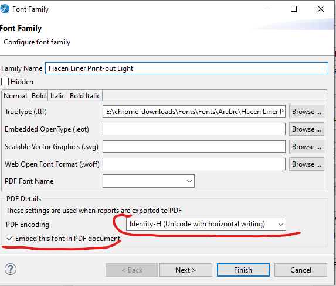

# دليل Jasper Reports الشامل لنظام Nama ERP {#Jasper-Reports-Complete-Guide-for-Nama-ERP}

## نظرة عامة (Overview) {#Overview}
يغطي هذا الدليل الشامل جميع جوانب تطوير Jasper Reports في نظام Nama ERP، بما فيها فئة NamaRep الأداتية القوية التي تمتد من ServerNamaRep. توفر NamaRep وظائف أساسية للترجمة والتوطين، واسترجاع البيانات، وربط الكيانات، وحسابات الأسعار، وغير ذلك.

## البداية السريعة: إضافة شعار الشركة إلى التقارير {#Quick-Start--Adding-Company-Logo-to-Reports}

لعرض شعار الشركة في تقاريرك:

1. أنشئ معاملاً باسم `loginLegalEntityLogo` من النوع `java.lang.Object` أو `java.io.InputStream`
2. أضف مكوّن صورة إلى تقريرك
3. اضبط تعبير الصورة على `$P{loginLegalEntityLogo}`

يُوفَّر الشعار تلقائياً من قِبل النظام عند تشغيل التقرير.

### إضافة أي مرفق أو صورة إلى التقارير {#Adding-Any-AttachmentImage-to-Reports}
```groovy
// لاسترجاع أي مرفق بواسطة معرّفه
NamaRep.getFile($F{attachmentId})
// أو
NamaRep.getAttachment($F{attachmentId})
```

## التقارير الفرعية (Subreports) {#Subreports}

يمكنك تضمين تقارير فرعية داخل التقرير الرئيسي. يمكن أن يكون التقرير الفرعي تقريراً آخر موجوداً أو ملف تقرير خارجياً.

### ربط التقارير الفرعية {#Linking-Subreports}
لربط تقرير فرعي:
1. أنشئ معاملاً بـ **نفس معرّف** التقرير الفرعي
2. اضبط نوع المعامل على `java.io.InputStream` أو `java.lang.Object`
3. سيمرّر النظام التقرير الفرعي إلى هذا المعامل تلقائياً

### موارد إضافية (صور، ملفات) {#Extra-Resources-Images-Files}
يمكنك إرفاق موارد إضافية كالصور بتقرير:
1. عرّف معاملاً بـ **نفس معرّف** المورد
2. اضبط نوع المعامل على `java.lang.Object`
3. سيكون المورد متاحاً من خلال هذا المعامل
## مرجع NamaRep API {#NamaRep-API-Reference}

### التوطين والترجمة الأساسية {#Core-Localization--Translation}

#### اختيار الاسم بناءً على اللغة {#Name-Selection-Based-on-Language}
```groovy
// اختيار الاسم العربي أو الإنجليزي تلقائياً بحسب اللغة الحالية
NamaRep.name(name1, name2)  // يُرجع name1 للعربية، name2 للإنجليزية

// مع الرجوع إلى الكود إذا كانت الأسماء فارغة
NamaRep.nameOrCode(code, name1, name2)

// اختيار اللغة مباشرةً
NamaRep.name(arabic, english)  // حيث arabic = name1 أو code، و english = name2 أو altCode
```

#### دوال الترجمة {#Translation-Methods}
```groovy
// ترجمة أي قيمة (نصوص، قيم منطقية، enums)
NamaRep.translate(value)

// ترجمة قيم enum
NamaRep.translate(enumValue)

// ترجمة القيم المنطقية إلى نص محلّي
NamaRep.translate(true)  // يُرجع "Yes" أو "نعم" بحسب اللغة

// ترجمة معرّفات الحقول مع سياق الكيان
NamaRep.title(entityType, fieldId)
NamaRep.translate(entityType, fieldId)

// الترجمة مع بادئة
NamaRep.translate("prefix", "value")  // يترجم "prefix.value"

// تقسيم النص المترجم بفاصل الأنبوب
NamaRep.head("header|subtitle")  // يُرجع "header"
NamaRep.sub("header|subtitle")   // يُرجع "subtitle"
```

### دوال التاريخ والوقت {#Date--Time-Functions}

#### أسماء الأيام {#Day-Names}
```groovy
NamaRep.dayName($F{dateField})     // يُرجع اسم اليوم باللغة الحالية
NamaRep.arDayName($F{dateField})   // اسم اليوم بالعربية
NamaRep.enDayName($F{dateField})   // اسم اليوم بالإنجليزية
NamaRep.dayName(dayNumber)         // 1=الأحد، 2=الاثنين، إلخ.
```

#### دعم التقويم الهجري {#Hijri-Calendar-Support}
```groovy
// تحويل التاريخ الميلادي إلى هجري
NamaRep.toHijri($F{date})                    // نص التاريخ الهجري الكامل
NamaRep.toHijriDate($F{date})                // كائن HijriDate
NamaRep.hijriDay($F{date})                   // اليوم الهجري (مع حشو)
NamaRep.hijriMonth($F{date})                 // الشهر الهجري (مع حشو)
NamaRep.hijriYear($F{date})                  // السنة الهجرية
NamaRep.hijri_yyyyMMdd($F{date})            // التنسيق: yyyyMMdd

// تنسيق مخصص
NamaRep.hijriDay($F{date})+"/"+NamaRep.hijriMonth($F{date})+"/"+NamaRep.hijriYear($F{date})
```

#### تحويل الوقت {#Time-Conversion}
```groovy
// تحويل الساعات العشرية إلى تنسيق الوقت
NamaRep.decimalToTime(9.5)                      // يُرجع "09:30"
NamaRep.decimalToTimeWithSeconds(9.5)           // يُرجع "09:30:00" (يتضمن الثواني)
NamaRep.decimalToTimeNullable(0)                // يُرجع null بدلاً من "00:00"
NamaRep.decimalToTimeWithSecondsNullable(0)     // يُرجع null بدلاً من "00:00:00"

// تحويل المللي ثانية إلى تنسيق الوقت
NamaRep.timeToString(9120000)        // يُرجع "02:32"
NamaRep.timeToStringNullable(0)      // يُرجع null بدلاً من "00:00"
```

#### حسابات فترات التاريخ {#Date-Period-Calculations}
```groovy
// حساب الفترة بين تاريخين (سنوات، أشهر، أيام)
// 1. أنشئ متغيراً بنوع إعادة تعيين none وزيادة none
java.time.Period.between(
  new java.util.Date($F{FromDate}.getTime()).toInstant()
    .atZone(java.time.ZoneId.systemDefault()).toLocalDate(), 
  java.time.LocalDate.now()
)

// 2. الاستخدام في تعبير حقل نصي
$V{period}.getYears()+" سنة "+$V{period}.getMonths()+" شهر "+$V{period}.getDays()+" يوم"

// حساب الأشهر بين تاريخين
NamaRep.dateDiffInMonth(date1, date2)
```

### تنسيق الأرقام وتحويلها {#Number-Formatting--Conversion}

#### الأرقام العربية {#Arabic-Numerals}
```groovy
// تحويل الأرقام الغربية إلى أرقام عربية-هندية (٠،١،٢،٣،٤،٥،٦،٧،٨،٩)
NamaRep.arNumbers("123")  // يُرجع "١٢٣"
NamaRep.arNumbers(value)
```

#### مساعدات الحقول الرقمية {#Numeric-Field-Helpers}
```groovy
// عمليات آمنة من القيم الفارغة
NamaRep.zeroIfNull(fieldOrVariable)        // يُرجع 0 إذا كانت null
NamaRep.oneIfZero(fieldOrVariable)          // يُرجع 1 إذا كانت صفراً
NamaRep.nullIfZero(fieldOrVariable)         // يُرجع null إذا كانت صفراً

// تحويل إلى BigDecimal
NamaRep.objectToDecimal(value)   // تحويل آمن إلى BigDecimal
```

#### رمز الريال السعودي {#Saudi-Riyal-Symbol}
```groovy
// يُرجع رمز SAR كـ InputStream لمكوّن الصورة
NamaRep.sar()
```

### التفقيط (تحويل الأرقام إلى كلمات) {#Tafqeet-Number-to-Words}
```groovy
// تحويل الأرقام إلى كلمات بلغات مختلفة
NamaRep.tafqeet(currencyCode, amount)        // اللغة الحالية
NamaRep.tafqeetArabic(currencyCode, amount)  // العربية
NamaRep.tafqeetEnglish(currencyCode, amount) // الإنجليزية
NamaRep.tafqeetFrench(currencyCode, amount)  // الفرنسية
```
يمكن إيجاد إعداد تفقيط العملات في الإعداد العام تحت `value.info.tafqeetInfo.currencyCode`
## حسابات الأسعار {#Price-Calculations}

### استخدام حاسبة الأسعار {#Price-Calculator-Usage}
```groovy
// حساب سعر الوحدة الأساسي
NamaRep.priceCalculator()
  .item($F{item})
  .uom($F{UOM})
  .qty($F{Quantity})
  .unitPriceOnly()
  .price()
```

::: tip إنشاء متغيرات الأسعار
يُرجع هذا التعبير كائن سعر كاملاً. يجب تخزينه في متغير:
- فئة المتغير: `java.lang.Object`
- الحساب: `No Calculation Function`
- نوع الزيادة: `None`
- نوع الإعادة: `None`
:::

#### دوال حاسبة الأسعار الكاملة {#Complete-Price-Calculator-Functions}
```groovy
// جميع دوال البنّاء المتاحة
NamaRep.priceCalculator()
  .item($F{itemIdOrCode})
  .customer($F{customerIdOrCode})
  .supplier($F{supplierIdOrCode})
  .uom($F{uomIdOrCode})
  .invoiceClassification($F{classificationIdOrCode})
  .ic($F{classificationIdOrCode})              // اختصار invoiceClassification
  .legalEntity($F{legalEntityIdOrCode})
  .le($F{legalEntityIdOrCode})                  // اختصار legalEntity
  .sector($F{sectorIdOrCode})
  .sc($F{sectorIdOrCode})                       // اختصار sector
  .branch($F{branchIdOrCode})
  .br($F{branchIdOrCode})                       // اختصار branch
  .department($F{departmentIdOrCode})
  .dep($F{departmentIdOrCode})                  // اختصار department
  .analysisSet($F{analysisSetIdOrCode})
  .anset($F{analysisSetIdOrCode})               // اختصار analysisSet
  .priceClassifier1($F{priceClassifier1IdOrCode})
  .pc1($F{priceClassifier1IdOrCode})            // اختصار priceClassifier1
  .priceClassifier2($F{priceClassifier2IdOrCode})
  .pc2($F{priceClassifier2IdOrCode})
  .priceClassifier3($F{priceClassifier3IdOrCode})
  .pc3($F{priceClassifier3IdOrCode})
  .priceClassifier4($F{priceClassifier4IdOrCode})
  .pc4($F{priceClassifier4IdOrCode})
  .priceClassifier5($F{priceClassifier5IdOrCode})
  .pc5($F{priceClassifier5IdOrCode})
  .revision($F{revision})
  .color($F{colorCode})
  .size($F{size})
  .qty($F{qty})
  .date($F{date})
  .unitPriceOnly()
  .price()  // يجب أن يكون آخر عنصر في السلسلة
```

#### الوصول إلى مكوّنات السعر {#Accessing-Price-Components}
بعد تخزين السعر في المتغير `$V{price}`، الوصول إلى المكوّنات:

```groovy
// القيم الرئيسية
$V{price}.unitPrice.primitiveValue
$V{price}.netValue.primitiveValue
$V{price}.custom.primitiveValue
$V{price}.totalCashShare.primitiveValue
$V{price}.totalPaymentMethodShare.primitiveValue

// مكوّنات الخصم (1-8 متاحة)
$V{price}.discount1.percentage.primitiveValue
$V{price}.discount1.value.primitiveValue
$V{price}.discount1.afterValue.primitiveValue
$V{price}.discount1.maxNormalPercent.primitiveValue

// خصم الرأسية (Header discount)
$V{price}.headerDicount.percentage.primitiveValue
$V{price}.headerDicount.value.primitiveValue
$V{price}.headerDicount.afterValue.primitiveValue

// مكوّنات الضريبة (1-4 متاحة)
$V{price}.tax1.percentage.primitiveValue
$V{price}.tax1.value.primitiveValue
$V{price}.tax1.afterValue.primitiveValue
$V{price}.tax1.maxNormalPercent.primitiveValue
```

## روابط الكيانات والتنقل {#Entity-Links--Navigation}

### روابط الكيانات الأساسية {#Basic-Entity-Links}
```groovy
// رابط بسيط للكيان
NamaRep.link(entityType, id)
NamaRep.link(serverUrl, entityType, id)

// بنّاء روابط متقدم مع القائمة والعرض
NamaRep.link()
  .entityType($F{entityType})
  .id($F{id})
  .viewName("theViewName")
  .menuCode("abcMenu")
  .url(serverUrl)
  .toString()
```

### روابط المرفقات {#Attachment-Links}
```groovy
// إنشاء رابط لمرفق/مستند
NamaRep.attachmentLink(id)
NamaRep.attachmentLink(serverUrl, attachmentId)
```

### روابط التقارير {#Report-Links}
```groovy
// رابط لتقرير آخر بواسطة الكود
NamaRep.repLinkByCode($P{REPORT_PARAMETERS_MAP}, "ReportCode")
  .p("p1 id").v(value expression)
  .p("p2 id").v(value expression)
  .copyParams()  // نسخ جميع المعاملات المشتركة من التقرير الحالي
  .toString()

// معاملات المرجع - تنسيقات متعددة متاحة
.p("param").v($F{id}, $F{entity}, $F{code}, $F{name1}, $F{name2})
.p("param").v($F{id}, $F{entity}, $F{code})
.p("param").ref($F{entityType}, $F{id})
.p("param").refCode($F{entityType}, $F{code})

// إذا كنت لا تريد إضافة عنوان URL الخادم (سيكون الرابط #rpt:xxx بدلاً من https://abc.namasoft.com/erp/#rpt:xxx) استخدم التالي
.directLink()

```

#### أمثلة روابط التقارير {#Report-Link-Examples}
```groovy
// المثال 1: كشف حساب
NamaRep.repLinkByCode($P{REPORT_PARAMETERS_MAP}, "Statement")
  .copyParams()
  .p("fromAccount").v($F{accountId}, $F{accountEntityType}, $F{accountCode})
  .p("toAccount").v($F{accountId}, "Account", $F{accountCode})
  .toString()

// المثال 2: ملخص أرباح المبيعات
NamaRep.repLinkByCode($P{REPORT_PARAMETERS_MAP}, "SalesProfitSummary")
  .copyParams($P{REPORT_PARAMETERS_MAP})
  .p("SalesInvoice").ref("SalesInvoice", $F{SSIid})
  .p("cust").refCode("Customer", "Customer501")
  .p("fromDate").v("23-04-2014")
  .p("showDetails").v("true")
  .toString()

// المثال 3: كشف حساب فرعي
NamaRep.repLinkByCode($P{REPORT_PARAMETERS_MAP}, "SubsidiaryAccountStatement")
  .p("subsidiaryType").v($F{CustomerEntityType})
  .p("fromSubsidiary").v($F{customerId}, $F{CustomerEntityType}, $F{customerCode})
  .p("toSubsidiary").v($F{customerId}, $F{CustomerEntityType}, $F{customerCode})
  .p("accuontType").v("mainAccount")
  .toString()
```

### روابط التقارير العامة (بدون مصادقة) {#Public-Report-Links-No-Authentication}
لمشاركة رابط تقرير خارجياً (مثلاً مع العملاء) دون الحاجة إلى تسجيل دخول:

```groovy
NamaRep.repLinkByCode($P{REPORT_PARAMETERS_MAP}, "ARG000046-report")
  .p("Code_Equals").ref($F{entityType}, $F{id})
  .toNoAuthResultLink()
```
### روابط عرض القائمة المفلترة {#Filtered-List-View-Links}

يمكنك إنشاء روابط تشعبية تفتح عرض قائمة مفلتراً لأي نوع كيان. وهذا مفيد عندما تريد أن ينقر المستخدمون على رابط في التقرير ليروا قائمة سجلات مُصفّاة مسبقاً.

#### الاستخدام الأساسي {#Basic-Usage}
```groovy
NamaRep.listView()
  .entityType("SalesInvoice")
  .criteria($P{REPORT_SCRIPTLET}.tempo("""
    customer.code,Equal,{customerCode},AND;
    valueDate,GreaterThanOrEqual,{fromDate},AND;
    """))
  .toString()

// لتفعيل الرابط المباشر لعرض القائمة، استخدم التالي
.directLink()
```

#### دوال البنّاء {#Builder-Methods}

| الدالة | الوصف |
|--------|-------------|
| `.entityType(String)` | نوع الكيان للعرض (مثلاً "SalesInvoice"، "Customer") |
| `.criteria(String)` | معايير الفلترة بتنسيق نصي (انظر أدناه) |
| `.listViewName(String)` | اسم عرض القائمة المحدد للاستخدام |
| `.menuCode(String)` | كود القائمة لفتح عرض القائمة فيه |
| `.orderBy(String)` | الحقل للترتيب حسبه |
| `.ascending(Boolean)` | اتجاه الترتيب (true = تصاعدي) |
| `.currentPage(Integer)` | رقم الصفحة للعرض |
| `.pageSize(Integer)` | عدد السجلات في الصفحة (-1 للكل) |
| `.showTree(Boolean)` | العرض كشجرة |
| `.extraCriteriaId(String)` | معرّف تعريف معايير إضافية |

#### استخدام Tempo للمعايير الديناميكية {#Using-Tempo-for-Dynamic-Criteria}

الميزة الأقوى هي دمج بنّاء عرض القائمة مع صيغة Tempo لحقن قيم حقول التقرير ديناميكياً في المعايير:

```groovy
$P{REPORT_SCRIPTLET}.tempo("""
  field,Operator,{value},AND;
  """)
```

داخل الأقواس المعقوفة `{...}`، يمكنك الإشارة إلى:
- **الحقول**: `{fieldName}` - استخدم أسماء الحقول مباشرةً دون `$F{}`
- **المعاملات**: `{paramName}` - استخدم أسماء المعاملات مباشرةً دون `$P{}`
- **المتغيرات**: `{varName}` - استخدم أسماء المتغيرات مباشرةً دون `$V{}`

#### مثال كامل {#Complete-Example}

لنفترض أن لديك تقريراً يعرض العملاء وتريد إضافة رابط يفتح كل فواتير المبيعات لهذا العميل:

```groovy
NamaRep.listView()
  .entityType("SalesInvoice")
  .criteria($P{REPORT_SCRIPTLET}.tempo("""
    customer.code,Equal,{customerCode},AND;
    valueDate,GreaterThanOrEqual,{fromDate},AND;
    valueDate,LessThanOrEqual,{toDate},AND;
    """))
  .listViewName("SalesInvoicesForCustomer")
  .orderBy("valueDate")
  .ascending(false)
  .toString()
```

يُنشئ هذا رابطاً قابلاً للنقر يفتح عرض قائمة فاتورة المبيعات مفلتراً بـ:
- كود العميل المطابق لحقل `customerCode` في الصف الحالي
- تاريخ القيمة بين معاملات `fromDate` و`toDate` في التقرير

#### مرجع تنسيق المعايير {#Criteria-Format-Reference}

يتبع نص المعايير [تنسيق معايير النص](../text-criteria-guide.md):

```
fieldID,operator,value,logic;
```

**العوامل المتاحة:**
- `Equal`، `NotEqual`
- `GreaterThan`، `GreaterThanOrEqual`
- `LessThan`، `LessThanOrEqual`
- `StartsWith`، `NotStartsWith`
- `EndsWith`، `NotEndWith`
- `Contains`، `NotContain`
- `In`، `NotIn`

**روابط المنطق:** `AND`، `OR`

**تنسيق التاريخ:** `dd-MM-yyyy`

**تنسيق المرجع:** `id:entityType:code` (الكود اختياري)

::: tip
يمكنك استخدام شاشة **Criteria Definition** لبناء شروط الفلترة بصرياً، ثم النقر على **Convert to Text** للحصول على التنسيق النصي. يمكن بعد ذلك استخدام هذا النص كقالب لمعاييرك المدعومة بـ Tempo.
:::

::: tip اختصار عناوين URL
يمكنك اختصار عناوين URL للتقارير باستخدام:
```groovy
NamaRep.shortenURL(serverurl, signature, url)
```
انظر قسم `{shortenurl()}` في وثائق Tempo لمزيد من المعلومات.
:::

## إنشاء الكيانات (Creators) {#Entity-Creation-Creators}

### Creator الأساسي {#Basic-Creator}
```groovy
// إنشاء كيان جديد بحقوله
NamaRep.newWithFields("ReceiptVoucher")
  .f("term").value("POTermCode")
  .f("book").value("POBook1")
  .f("remarks").v("Auto Created")
  .f("fromDoc#type").v("SalesInvoice")
  .f("fromDoc#code").v($F{code})
  .menuCode("NormalReceiptMenu")
  .viewName("NormalReceipts")
  .toString()

// صيغة بديلة
NamaRep.creator("ReceiptVoucher")
  .field("supplier").value(supplierId)
  .toString()
```

### Creator مع تفاصيل الأسطر {#Creator-with-Line-Details}
للتقارير ذات أحزمة التفاصيل التي تحتاج إلى إنشاء كيانات مع بنود:

1. **أنشئ المتغير** `creatorLink` مع تعبير القيمة الأولية:
```groovy
NamaRep.newWithFields("PurchaseOrder")
  .field("term").value("P.Order.Term")
  .root()
```

2. **في حزمة التفاصيل**، أضف بنود الأسطر:
```groovy
$V{creatorLink}
  .field("details.item.itemCode").value($F{code})
  .field("details.quantity").value($F{qty})
  .row($V{REPORT_COUNT})
```

3. **أنشئ الرابط النهائي**:
```groovy
$V{creatorLink}.toString()
```

## نظام الموافقة {#Approval-System}

### روابط موافقة المستندات {#Document-Approval-Links}
```groovy
// الموافقة/الرفض/الإرجاع لجميع الأسطر
NamaRep.approveAllLink($P{REPORT_PARAMETERS_MAP})
NamaRep.rejectAllLink($P{REPORT_PARAMETERS_MAP})
NamaRep.returnAllLink($P{REPORT_PARAMETERS_MAP})
NamaRep.returnAllToPreviousStepLink($P{REPORT_PARAMETERS_MAP})

// مع معامل القرار
NamaRep.approveAllLink($P{REPORT_PARAMETERS_MAP}, decision)  // decision: "Approve"، "Reject"، أو "Return"
```

### الموافقة لكل سطر (الأسطر المعنية) {#Per-Line-Approval-Concerned-Lines}
للمستندات ذات الموافقات على مستوى الأسطر:

```groovy
// الموافقة/الرفض لسطر محدد
NamaRep.approveLink($P{REPORT_PARAMETERS_MAP}, $F{lineNumber})
NamaRep.rejectLink($P{REPORT_PARAMETERS_MAP}, $F{lineNumber})
NamaRep.returnLink($P{REPORT_PARAMETERS_MAP}, $F{lineNumber})
NamaRep.returnToPreviousStepLink($P{REPORT_PARAMETERS_MAP}, $F{lineNumber})

// مع كود السبب
NamaRep.approveLink($P{REPORT_PARAMETERS_MAP}, $F{lineNumber}, reasonCodeOrId)
NamaRep.rejectLink($P{REPORT_PARAMETERS_MAP}, $F{lineNumber}, reasonCodeOrId)

// التحقق إذا كان السطر يحتاج إلى موافقة
NamaRep.isConcernedLine($P{REPORT_PARAMETERS_MAP}, $F{lineNumber})
```

### حوار موافقة JavaScript {#JavaScript-Approval-Dialog}
```groovy
// عرض حوار الموافقة في المتصفح
NamaRep.approveFromJS(entityType, entityId, nextStepName, 
                      concernedLines, nextStepSeq, summary)
```

## وظائف الموظفين والموارد البشرية {#Employee--HR-Functions}

### أرصدة الإجازات {#Vacation-Balances}
```groovy
// أنواع الإجازات الافتراضية (1، 2، 3)
NamaRep.getVacation1RemainderBalance(empIdOrCode)
NamaRep.getVacation2RemainderBalance(empIdOrCode)
NamaRep.getVacation3RemainderBalance(empIdOrCode)

// نوع إجازة محدد
NamaRep.getVacationRemainderBalance(empCodeOrId, vacationTypeIdOrCode)
NamaRep.getVacationRemainderBalance(empCodeOrId, vacationTypeIdOrCode, atDate)

// معلومات الإجازة التفصيلية
NamaRep.getVacationAssignedConsumedRemainder(employeeId, vacationType)
NamaRep.getVacationAssignedConsumedRemainder(employeeId, vacationType, atDate)

// الرصيد لكل السنوات
NamaRep.getRemainderBalancePerYears(employeeId, atDate, yearsCount)
```

## نقاط المكافأة {#Reward-Points}

### نقاط ومبالغ المكافأة المتاحة {#Available-Reward-Points--Amounts}
```groovy
// الحصول على نقاط المكافأة المتاحة لكيان (مثلاً Customer، Supplier)
NamaRep.availableRewardPoints("Customer", $F{customerId})
NamaRep.availableRewardPoints("Customer", $F{customerCode})

// الحصول على مبلغ المكافأة المتاح لكيان
NamaRep.availableRewardAmount("Customer", $F{customerId})
NamaRep.availableRewardAmount("Customer", $F{customerCode})
```

### النقاط المكتسبة (المستندات) {#Earned-Points-Documents}
```groovy
// الحصول على النقاط المكتسبة من مستند (مثلاً SalesInvoice)
NamaRep.earnedPoints("SalesInvoice", $F{invoiceId})
NamaRep.earnedPoints("SalesInvoice", $F{invoiceCode})
```

::: tip
- تعمل `availableRewardPoints` و`availableRewardAmount` مع أي ملف رئيسي.
- تعمل `earnedPoints` فقط مع كيانات المستندات (مثلاً SalesInvoice، NamaPOSSalesInvoice). تُرجع `null` للملفات الرئيسية.
- تقبل الدوال الثلاث معرّفاً أو كوداً كمعامل ثانٍ.
:::
## عمليات قاعدة البيانات {#Database-Operations}

### تنفيذ استعلامات SQL {#SQL-Query-Execution}
```groovy
// تنفيذ استعلام SQL مع معاملات
NamaRep.runSQLQuery(sql, paramName, paramValue, paramName, paramValue)

// مثال مع معاملات مسمّاة
NamaRep.executeQuery(
  "SELECT cast(w.name1 collate Arabic_CI_AI_KS_WS as varchar(250)) 
   FROM warehouse w WHERE w.id = :wid",
  "wid", $F{wid}
)

// تنسيق نتائج الاستعلام
NamaRep.formatQueryResult(results, "
", ",")  // فاصل الصفوف، فاصل الأعمدة
```

### الوصول إلى إعداد الوحدة {#Module-Configuration-Access}
```groovy
// الحصول على قيمة الإعداد
NamaRep.getValueFromModuleConfig(moduleId, fieldId)

// مثال
NamaRep.getValueFromModuleConfig("basic", "value.info.useCurrentUserAsSalesMan")
```

أسماء الوحدات المتاحة:
- accounting، basic، supplychain، fixedassets
- humanresource، dms، project، ecpa
- manufacturing، srvcenter، crm، contracting
- travel، realestate، housing، auditing
- education، namapos، mc

## الأمان والصلاحيات {#Security--Permissions}

### قيود الأمان للتقارير {#Security-Constraints-for-Reports}

### كيفية التصفية حسب الشركة، أو القطاع، أو أي مُحدد آخر {#How-to-Filter-by-Legal-Entity-Sector-or-Any-Other-Dimension}

نفترض أنك ترغب في تصفية البيانات بناءً على منشئ السجل، وصلاحيات التعديل أو العرض، وكذلك حسب الشركة أو القطاع أو الفرع أو غير ذلك من المُحددات ضمن سجل الحساب. للقيام بذلك، اتبع الخطوات التالية:

#### 1. إنشاء المعامل المخفي `SECURITY_CONSTRAINTS` {#1-Create-Hidden-Parameter-SECURITYCONSTRAINTS}

أنشئ معامل `String` مع "Not For Prompting" والتعبير الافتراضي:

```groovy
NamaRep.security()
  .fieldEntityType("Account")
  .tableAlias("acc")
  .capabilities("firstAuthor", "viewCapability", "usageCapability", 
                "updateCapability", "legalEntity", "branch", 
                "sector", "department", "analysisSet")
```

**مكوّنات التعبير:**
- `.fieldEntityType("Account")` - يحدد نوع الكيان للتصفية الأمنية
- `.tableAlias("acc")` - الاسم المستعار للجدول في استعلام SQL
- `.capabilities(...)` - قائمة المحددات الأمنية للتصفية بها

القدرات المتاحة:
- `firstAuthor` - التصفية حسب منشئ السجل
- `viewCapability`، `updateCapability`، `usageCapability` - التصفية المبنية على الصلاحيات
- `legalEntity`، `branch`، `sector`، `department`، `analysisSet` - التصفية التنظيمية

#### 2. الاستخدام في استعلام SQL {#2-Use-in-SQL-Query}

أدرج المعامل في جملة WHERE:

```sql
SELECT a, b, c 
FROM Account acc 
LEFT JOIN Table2 t2 ON t2.id = acc.someId 
WHERE acc.code <> 'abc' 
  AND $P!{SECURITY_CONSTRAINTS}
```

#### 3. أمان جداول متعددة {#3-Multiple-Table-Security}

للتصفية على جداول متعددة:

```groovy
NamaRep.security()
  .fieldEntityType("Account")
  .tableAlias("Account")
  .capabilities("firstAuthor", "viewCapability")
+ " AND " +
NamaRep.security()
  .fieldEntityType("FiscalYear")
  .tableAlias("FiscalYear")
  .capabilities("legalEntity", "branch", "sector")
```

::: tip ملخص
يُطبّق أسلوب التصفية الأمنية هذا قواعد رؤية البيانات وحقوق التعديل ديناميكياً بناءً على أدوار المستخدم والهيكل التنظيمي. يولّد النظام تلقائياً جمل WHERE المناسبة بناءً على صلاحيات المستخدم.
:::

### صلاحيات العرض {#Display-Permissions}
```groovy
// التحقق إذا كان بإمكان المستخدم عرض المعامل/الحقل
NamaRep.canDisplay($P{param})
```

## الوظائف المساعدة {#Utility-Functions}

### تحويل HTML إلى نص {#HTML-to-Text-Conversion}
```groovy
NamaRep.htmlToText(htmlContent)
```

### الأرقام التسلسلية {#Serial-Numbers}
```groovy
// توسيع الأرقام التسلسلية المضغوطة
NamaRep.expandSerials(serials)                      // فاصل السطر الافتراضي
NamaRep.expandSerials(serials, separator)           // فاصل مخصص
NamaRep.unzipSerials(serials)                      // يُرجع List<String>
NamaRep.unzipSerialsWithNewLines(serials)
NamaRep.unzipSerialsWithComma(serials)
NamaRep.unzipSerialsWithSeparator(serials, ";")

// ضغط نطاقات الأرقام التسلسلية
NamaRep.zipSerialsRange(serials)
```

### رموز QR لزاتكا (هيئة الزكاة والضريبة والجمارك) {#ZATCA-QR-Codes-Saudi-Tax-Authority}
```groovy
// توليد رمز QR لزاتكا
NamaRep.genZATCAQR(sellerName, vatNumber, timestamp, 
                   invoiceAmount, vatAmount)

// مع تواريخ القيمة والإنشاء المنفصلة
NamaRep.genZATCAQRWithCreationDate(sellerName, vatNumber, 
                                   valueDate, creationDate, 
                                   invoiceAmount, vatAmount)

// من كيان
NamaRep.genZatcaQrCodeFromEntity(entityType, idOrCode)
NamaRep.zatcaHashedInvoice(entityType, id)
```

### Mobile QR Integrator
```groovy
// إنشاء رمز QR للمسح الضوئي بالجوال وإنشاء/تحديث الكيانات
// سيتم معالجة رمز QR بواسطة Mobile QR Integrator عند المسح

// رمز QR أساسي مع كود الـ integrator
NamaRep.mobileQr()
    .code("IntegratorCode")
    .toString()

// رمز QR مع معاملات
NamaRep.mobileQr()
    .code("CustomerAttendance")
    .addParam("customer", $F{customerCode})
    .addParam("date", $F{valueDate})
    .addParam("amount", $F{totalAmount})
    .toString()

// رمز QR مشفّر (Base64 encoded)
NamaRep.mobileQr()
    .code("SecureIntegrator")
    .addParam("sensitive", $F{confidentialData})
    .encrypted()
    .toString()
```

**ملاحظات الاستخدام:**
- يحتوي رمز QR على JSON مع كود/معرّف الـ integrator والمعاملات
- المعاملات متاحة في مسارات الكيان عبر `$map.paramName`
- يتم فك تشفير رموز QR المشفّرة تلقائياً بواسطة تطبيق الجوال
- يجب تهيئة الـ integrator في كيان MobileQRIntegrator
## معاملات النظام في التقارير {#System-Parameters-in-Reports}

جميع التقارير لديها إمكانية الوصول إلى هذه المعاملات:

::: details انقر لرؤية جميع معاملات النظام
### معلومات المستخدم وتسجيل الدخول
- `loginLanguage` - اللغة الحالية (عربي/إنجليزي)
- `originalLoginLanguage` - لغة تسجيل الدخول الأصلية
- `loginUserId`، `loginUserCode`، `loginUserName1`، `loginUserName2`
- `loginUserTreatAsAuthorIds` - معرّفات المستخدمين المفوّضين
- `loginEmployeeId`
- `currentUser` - كائن المستخدم الحالي

### الهيكل التنظيمي
- `loginLegalEntityId`، `loginLegalEntityCode`، `loginLegalEntityName1`، `loginLegalEntityName2`
- `loginSectorId`، `loginSectorCode`، `loginSectorName1`، `loginSectorName2`
- `loginBranchId`، `loginBranchCode`، `loginBranchName1`، `loginBranchName2`
- `loginDepartmentId`، `loginDepartmentCode`، `loginDepartmentName1`، `loginDepartmentName2`
- `loginAnalysisSetId`، `loginAnalysisSetCode`، `loginAnalysisSetName1`، `loginAnalysisSetName2`

### معرّفات المنظمة العامة
- `publicLegalEntityId`، `publicSectorId`، `publicBranchId`
- `publicDepartmentId`، `publicAnalysisSetId`

### الشعارات والعلامة التجارية
- `loginLegalEntityLogo` - الشعار الرئيسي (InputStream)
- `loginLegalEntityLogo2` حتى `loginLegalEntityLogo5` - شعارات إضافية
- `reportsFooterNote1`، `reportsFooterNote2` - نص التذييل

### سياق التقرير
- `formEntityType` - نوع الكيان للنموذج (يمكن استخدامه للترجمة)
- `reportCode`، `reportId`، `reportName1`، `reportName2`
- `namaReportInstance` - كائن instance التقرير
- `runId` - معرّف فريد للتشغيل

### عناوين URL
- `guiServerURL` - عنوان URL لخادم الواجهة
- `externalServerURL` - عنوان URL للخادم الخارجي
- `currentGUIURL` - عنوان URL الحالي للواجهة

### نظام الموافقة
- `concernedLines` - الأسطر التي تحتاج إلى موافقة
- `candidateEmployeeId`، `candidateEmployeeCode`، `candidateEmployeeName1`، `candidateEmployeeName2`
- `approvedRecordId`، `approvedRecordType`، `approvedRecordCode`
- `approvalSecret`، `approvalStepSeq`

### الأمان والصلاحيات
- `allowedCapabilities`، `allowedEntities`، `allowedDocuments`، `allowedFiles`
- `notAllowedEntities`، `notAllowedDocuments`، `notAllowedFiles`
- `accessibleLegalEntityIds`، `accessibleSectorIds`، `accessibleBranchIds`
- `accessibleDepartmentIds`، `accessibleAnalysisSetIds`

### علامات الأمان
- `legalEntityNotUsedInSecurity`، `sectorNotUsedInSecurity`
- `branchNotUsedInSecurity`، `departmentNotUsedInSecurity`
- `analysisSetNotUsedInSecurity`

### أخرى
- `posShiftCode` - كود وردية نقطة البيع
- `currentReplicationSiteId`، `currentReplicationSiteCode`
- `currentReplicationSiteName1`، `currentReplicationSiteName2`
:::
## معاملات التقرير {#Report-Parameters}

### معاملات القائمة (التحديد المتعدد) {#List-Parameters-Multi-Selection}

لتعريف معامل يدعم تحديدات متعددة:

1. اضبط الخاصية `list = true`
2. للأنواع غير المرجعية، حدد الخاصية `listType`
3. التقاط القيم المحددة للعرض:
   - `<parameterName>_csv`: القيم المترجمة كسلسلة CSV
   - `<parameterName>_codecsv`: الأكواد كسلسلة CSV
   - `<parameterName>_name1csv`: حقول Name1 كسلسلة CSV
   - `<parameterName>_name2csv`: حقول Name2 كسلسلة CSV
4. لمنع العرض التلقائي للشبكة: `doNotAutoShowList = true`
5. للتحكم في أداة العرض للقائمة، اضبط `listDisplayType`:
   - `Default` — إدخال التحديد المتعدد القياسي (يُستخدم عند حذف الخاصية)
   - `Dropdown` — تُعرض القيم المحددة كشرائح قابلة للإزالة داخل إدخال؛ تفتح قائمة الخيارات الكاملة في قائمة منسدلة قابلة للبحث. مثالي عندما تكون مجموعة القيم كبيرة
   - `Chips` — تُعرض جميع القيم المسموحة كشرائح قابلة للنقر مع تبديل التحديد بالنقر. مثالي عند وجود خيارات قليلة فقط وتريد رؤيتها دون فتح قائمة

   مثال:
   ```xml
   <parameter name="MultiEmployee" class="java.util.List">
       <property name="entityType" value="Employee"/>
       <property name="list" value="true"/>
       <property name="listDisplayType" value="Chips"/>
   </parameter>
   ```

::: details مثال: معاملات التحديد المتعدد
```xml
<!-- معامل قائمة من نوع مرجعي -->
<parameter name="MultiEmployee" class="java.util.List">
    <property name="entityType" value="Employee"/>
    <property name="arabic" value="الموظفين"/>
    <property name="english" value="Employees"/>
    <property name="property" value="code"/>
    <property name="list" value="true"/>
    <property name="doNotAutoShowList" value="false"/>
</parameter>
<parameter name="MultiEmployee_csv" class="java.lang.String" isForPrompting="false"/>

<!-- معامل قائمة من نوع غير مرجعي -->
<parameter name="MultiDate" class="java.util.Date">
    <property name="english" value="Dates"/>
    <property name="arabic" value="التواريخ"/>
    <property name="defaultValue" value="$monthStart()"/>
    <property name="list" value="true"/>
    <property name="listType" value="java.util.Date"/>
</parameter>
<parameter name="MultiDate_csv" class="java.lang.String" isForPrompting="false"/>
```
:::

### معاملات نطاق التاريخ {#Date-Range-Parameters}

عند تصفية المستخدمين للتقرير بنطاق تاريخ، يعمل تعريف معاملَي "من تاريخ" و"إلى تاريخ" منفصلَين، لكنه يشغل صفّي مطالبة ولا تكون العلاقة بينهما واضحة بصرياً. يتيح خيار `showAsDateRange` تقديم منتقٍ موحّد لنطاق التاريخ في واجهة المطالبة مع الإبقاء على معاملَي التاريخ الفعليَّين كما هما لاستخدامهما في استعلام SQL.

يعتمد النمط على ثلاثة معاملات تعمل معاً:

1. **معامل نصي تحكّمي** مع `showAsDateRange = true`. هذا ما يراه المستخدم ويتفاعل معه؛ لا يحمل قيمة خاصة به.
2. **معامل "من تاريخ"** مع `isForPrompting="false"` — مُشار إليه بخاصية `fromDateId` للمعامل التحكّمي.
3. **معامل "إلى تاريخ"** مع `isForPrompting="false"` — مُشار إليه بخاصية `toDateId` للمعامل التحكّمي.

عندما يختار المستخدم نطاقاً، يكتب النظام التواريخ المختارة في معاملَي التاريخ الأساسيَّين. من منظور الاستعلام، لا شيء يتغير — تُشير إلى `$P{FromValueDate}` و`$P{ToValueDate}` تماماً كأي معامل تاريخ آخر.

* مثال

```xml
<parameter name="FromValueDate" class="java.util.Date" isForPrompting="false">
    <property name="arabic" value="من التاريخ الفعلي"/>
    <property name="english" value="From Value Date"/>
</parameter>

<parameter name="ToValueDate" class="java.util.Date" isForPrompting="false">
    <property name="arabic" value="إلى التاريخ الفعلي"/>
    <property name="english" value="To Value Date"/>
</parameter>

<parameter name="ValueDate" class="java.lang.String">
    <property name="showAsDateRange" value="true"/>
    <property name="fromDateId" value="FromValueDate"/>
    <property name="toDateId" value="ToValueDate"/>
    <property name="arabic" value="التاريخ الفعلي"/>
    <property name="english" value="Value Date"/>
</parameter>
```

ثم في استعلام SQL، أشر إلى معاملات التاريخ الأساسية مباشرةً:

```sql
WHERE valueDate >= $P{FromValueDate}
  AND valueDate <= $P{ToValueDate}
```

أو باستخدام صيغة $X{[BETWEEN]}

```sql
where $X{[BETWEEN],valueDate,FromValueDate,ToValueDate}
```

* المتطلبات

- يجب أن يكون المعامل التحكّمي من النوع `java.lang.String`.
- يجب أن يضبط كلا معاملَي التاريخ `isForPrompting="false"` حتى لا يظهرا كمطالبات منفصلة إلى جانب منتقي النطاق.
- يجب أن تتطابق قيم `fromDateId` و`toDateId` مع أسماء معاملَي التاريخ بالضبط.
### مرجع خصائص المعاملات {#Parameter-Properties-Reference}

#### الخصائص الأساسية {#Basic-Properties}
- **`list`**: `true`/`false` - تفعيل التحديد المتعدد
- **`listType`**: مطلوب للأنواع غير المرجعية (مثلاً `java.util.Date`)
- **`listDisplayType`**: الأداة المستخدمة لعرض معامل القائمة. إحدى `Default`، `Dropdown`، `Chips`.
- **`showAsDateRange`**: `true`/`false` - عرض معامل نصي كمنتقٍ موحّد لنطاق التاريخ. يُستخدم مع `fromDateId` و`toDateId`. انظر [معاملات نطاق التاريخ](#Date-Range-Parameters).
- **`fromDateId`**: اسم معامل "من تاريخ" الأساسي عند تفعيل `showAsDateRange`.
- **`toDateId`**: اسم معامل "إلى تاريخ" الأساسي عند تفعيل `showAsDateRange`.
- **`layout`**: تخطيط العرض (`alone`، `spanned`، `normal`، `spanned2`)
- **`required`**: `true`/`false` - وضع علامة إلزامي
- **`requiredGroup`**: تجميع المعاملات حيث يجب ملء واحد على الأقل
- **`hijri`**: `true`/`false` - استخدام التقويم الهجري للتواريخ
- **`nama-id`**: معرّف داخلي لوظائف Nama المحددة (معالج التقرير)

#### الاقتراحات للحقول النصية {#Suggestions-for-Text-Fields}
- **`suggestionquery`**: استعلام SQL للإكمال التلقائي
  - عمودان: الكود والعرض بالعربية
  - ثلاثة أعمدة: الكود، العربية، والإنجليزية

```sql
-- مثال استعلام اقتراح
SELECT DISTINCT TOP 25 revisionId, revisionName 
FROM ItemRevision 
WHERE invItem_id = {fItem} 
  AND (revisionId LIKE '%' + {revision} + '%' 
       OR revisionName LIKE '%' + {revision} + '%')
```

#### اختيار المرجع {#Reference-Selection}
- **`entityType`**: الكيان للاختيار منه
- **`property`**: الحقل للاستخراج (`code`، `name1`، `name2`، `startDate`)

#### القائمة المنسدلة (Combo Box) {#Combo-Box-Drop-Down}
- **`enumType`**: نوع enum للقيم المسموحة
- **`allowedValues`**: القيم المسموحة مفصولة بفواصل (تُعرض كـ combo box)
- **`allowedValuesAr`**: الترجمات العربية لقيم القائمة المنسدلة (مفصولة بفواصل، بنفس ترتيب `allowedValues`)
- **`allowedValuesEn`**: الترجمات الإنجليزية لقيم القائمة المنسدلة (مفصولة بفواصل، بنفس ترتيب `allowedValues`)

```xml
<parameter name="entityType" class="java.lang.String">
    <property name="enumType" value="EntityTypeDF"/>
    <property name="allowedValues" value="Employee,Supplier"/>
    <property name="allowedValuesAr" value="موظف,مورد"/>
    <property name="allowedValuesEn" value="Employee,Supplier"/>
</parameter>
```

#### تصفية القيم {#Filtering-Values}
- **`filter`**: صيغة تصفية الحقول: `field,operator,value[,relation]`
  - فلاتر متعددة مفصولة بفاصلة منقوطة
  - العلاقة الافتراضية `AND`
  - استخدم `${parameterId}` للإشارة إلى معاملات أخرى

العوامل المتاحة:
```
Equal, EqualOrEmpty, NotEqual, NotEqualOrEmpty,
GreaterThan, GreaterThanOrEmpty, GreaterThanOrEqual, GreaterThanOrEqualOrEmpty,
LessThan, LessThanOrEmpty, LessThanOrEqual, LessThanOrEqualOrEmpty,
StartsWith, StartsWithOrEmpty, NotStartsWith, NotStartsWithOrEmpty,
EndsWith, EndsWithOrEmpty, NotEndWith, NotEndWithOrEmpty,
Contains, ContainsOrEmpty, NotContain, NotContainOrEmpty,
OpenBracket, CloseBracket, In
```

أمثلة:
```
forType,Equal,Department,AND;isLeaf,Equal,true
documentType,Equal,ReceiptVoucher
forType,Equal,${subsidiaryType}
```

#### القيم الافتراضية {#Default-Values}
- **`defaultValue`**: قيمة نصية بناءً على نوع المعامل
  - التاريخ: `dd-MM-yyyy`
  - الوقت: `yyyy-MM-dd'T'HH:mm:ss.SSS`
  - المرجع: `id:entityType:code`

::: details دوال الإعداد الافتراضي الديناميكية
```
$now()                  $today()
$monthStart()           $monthEnd()
$yearStart()            $yearEnd()
$quarterStart()         $quarterEnd()
$thirdStart()           $thirdEnd()
$halveStart()           $halveEnd()
$previousMonthStart()   $previousMonthEnd()
$nextMonthStart()       $nextMonthEnd()
$previousYearStart()    $previousYearEnd()
$nextYearStart()        $nextYearEnd()
$currentFiscalPeriod()  $currentUser()
$currentEmployee()
$todayPlusDays(n)       $todayPlusWeeks(n)
$todayPlusMonths(n)     $todayPlusYears(n)
```
:::

للمعاملات متعددة القيم، استخدم الفاصل `@A=@X`:
```
id:entityType:code@A=@Xid:entityType:code@A=@X...
```

#### التحكم في العرض والتحقق {#Display-Control--Validation}
- **`NamaRep.canDisplay($P{param})`**: استخدم في `printWhenExpression`
- **`no-mirror = true`**: منع انعكاس العنصر

#### التحقق من النطاق {#Range-Validation}
- **`fromParam`**: ربط معامل "إلى" بمعامل "من"
- **`fromParamMaxGapInDays`**: الحد الأقصى للفجوة بالأيام بين التواريخ

```xml
<parameter name="toDate" class="java.util.Date">
    <property name="arabic" value="إلى تاريخ"/>
    <property name="english" value="To Date"/>
    <property name="fromParam" value="fromDate"/>
    <property name="fromParamMaxGapInDays" value="30"/>
</parameter>
```

#### خصائص أخرى {#Other-Properties}
- **`arabic`/`english`**: تسميات العرض
- **`resource`**: مفتاح المورد للترجمة
- **`src`**: إعادة استخدام خاصية من معامل آخر
- **`ignore`**: استبعاد من المطالبة
- **`type`**: معالجة خاصة للقيم الفارغة أو نوع المقارنة (مثلاً لمقارنات التاريخ مع عوامل `>`، `<`)

### خصائص التقرير {#Report-Properties}
خصائص خاصة على مستوى التقرير (استشر فريق التطوير للاستخدام):
- `preRunUtil` - أداة ما قبل التنفيذ
- `questionsChangeUtil` - معالج تغيير الأسئلة
- `comparisonType` - إعداد نوع المقارنة
## إنشاء تقارير بأحجام صفحات مختلفة {#Creating-Reports-with-Different-Page-Sizes}

### كيفية إنشاء تقرير يحتوي على تقارير فرعية بأحجام صفحات مختلفة باستخدام JasperReports {#How-to-Create-a-Report-with-Subreports-of-Different-Page-Sizes-Using-JasperReports}

يمكنك تنفيذ هذا النوع من التقارير بسهولة باستخدام JasperReports من خلال الخطوات التالية:

### استخدام تقارير Book لأحجام صفحات متعددة {#Using-Book-Reports-for-Multiple-Page-Sizes}

1. **إنشاء تقرير Book**: ابدأ بتقرير رئيسي من النوع *Book Report*
2. **إضافة استعلام SQL**: اكتب استعلام SQL بسيطاً مع حقول للعرض الشرطي
3. **إضافة أجزاء التقرير**: استخدم **Add Part to Content** لإضافة كل تقرير فرعي
4. **ضبط شروط الطباعة**: استخدم **Print When Expression** لكل جزء
5. **تمرير المعاملات**: عرّف جميع المعاملات المطلوبة ومررها إلى كل جزء

### مثال: صفحات A4 و A3 مختلطة {#Example--Mixed-A4-and-A3-Pages}
أنشئ قالب طباعة بجزأين بأحجام صفحات مختلفة (A4 وA3)، يُعرض بناءً على شرط من حقل ملاحظات المستند. يمكن أن يحتوي كل جزء على تقاريره الفرعية.

- 📥 [تنزيل قالب Excel للاستيراد](https://docs.google.com/spreadsheets/d/1TPjsTwB2fcCIth0JB30AqbmIxPymgEbG/edit)
- 📎 [تنزيل المرفق للاستيراد](https://drive.google.com/file/d/1r1FraUmyLue9xyOHURnzzKTKoap_hxQQ/view)

مرجع: طلب تطوير [SRDRQ05261](https://namasoft.com/reqs/SRDRQ05261)

## إيقاف التقارير التي تجاوزت وقت التنفيذ {#Kill-Reports-Running-for-More-Than-N-Seconds}

### إيقاف التقارير التي تجاوزت وقت تنفيذ معين {#Stopping-Reports-That-Have-Exceeded-a-Set-Execution-Time}

عند تشغيل تقارير كبيرة، قد يؤدي الضغط على النظام أحياناً إلى عدم قدرة المستخدمين الجدد على تسجيل الدخول. وفي بعض الحالات، نضطر إلى إيقاف خدمة **Tomcat** وإعادة تشغيلها لحل المشكلة.

لذا تم إنشاء أداة تقوم بإيقاف أي تقرير تجاوز وقت تنفيذ معين (مثلاً 10 أو 120 ثانية)، دون الحاجة لإعادة تشغيل الخادم.

### خطوات الإعداد {#Configuration-Steps}

1. **تعديل `nama.properties`**:
```ini
kill-reports-running-more-than-seconds=120
```
الرقم `120` يمثل الحد الأقصى المسموح به من الثواني لتنفيذ التقرير.

2. **تطبيق الإعداد**:
انتقل إلى: `/basic-services/monitorlogin?reload-config-and-kill-running-reports=true`

يُعيد هذا تحميل الإعداد ويوقف جميع التقارير التي تجاوزت الحد الزمني.

مرجع: طلب تطوير [ECPADR00932](https://namasoft.com/reqs/ECPADR00932)

## إضافة خطوط إضافية لطباعة PDF {#Adding-Extra-Fonts-for-PDF-Printing}

- [شاهد هذا الفيديو للخطوات التفصيلية](https://youtu.be/n08xmWekB1s)

يدعم نظام Nama ERP **Times New Roman** افتراضياً للنصوص العربية. لاستخدام خطوط تدعم العربية بشكل مختلف (Cairo، Amiri، Droid Arabic Naskh، إلخ):

### 1. إضافة الخط في Jaspersoft Studio {#1-Add-Font-in-Jaspersoft-Studio}
- افتح **Jaspersoft Studio**
- اذهب إلى `Window > Preferences`
- انتقل إلى `Jaspersoft Studio > Fonts`
- انقر على **Add**

### 2. إعداد خصائص الخط {#2-Configure-Font-Properties}
في مربع حوار **Font Family**:
- اختر ملف (ملفات) الخط `.ttf` أو `.otf`
- ضع علامة ✅ على **Embed this font in PDF documents**
- اضبط **PDF Encoding** على: `Identity-H`



- انقر على **Finish**

### 3. تصدير الخط كملف JAR {#3-Export-Font-as-JAR}
- بعد إضافة الخط، انقر على **Export**
- احفظ ملف `.jar` المولَّد

### 4. نشر ملف JAR للخط في Tomcat {#4-Deploy-Font-JAR-in-Tomcat}
- انسخ ملف `.jar` المصدَّر إلى مجلد `tomcat/lib`
- أعد تشغيل خدمة **Tomcat**

::: tip لتطبيقات نقطة البيع (POS)
لتطبيقات **POS**، ارفع ملف JAR للخط المصدَّر إلى حقل **Jasper Fonts** في **إعدادات واجهة نقطة البيع** (POS UI Settings). سينشئ النظام تلقائياً ملف امتداد الخط في مجلد `jasper-fonts-extension`:
- عند بدء تشغيل تطبيق POS
- عند حفظ سجل إعدادات واجهة نقطة البيع

**مهم:** بعد تحديث أجهزة POS إلى إصدار يدعم jasper-fonts-extension، يجب إعادة حفظ سجل إعدادات واجهة نقطة البيع لتشغيل نشر ملف الخط على كل جهاز.
:::

### 5. استخدام الخط في التقارير {#5-Use-the-Font-in-Reports}
- عيّن عائلة الخط الجديدة لحقول النص في ملفات `.jrxml`
- سيتم تضمين الخط وعرضه بشكل صحيح في ملفات PDF، بما فيها الأحرف العربية
## أفضل الممارسات {#Best-Practices}

### 1. إنشاء المتغيرات للكائنات المعقدة {#1-Variable-Creation-for-Complex-Objects}
عند العمل مع حسابات الأسعار أو روابط التقارير، أنشئ متغيرات:
```xml
<variable name="price" class="java.lang.Object" calculation="No Calculation Function">
  <initialValueExpression>
    NamaRep.priceCalculator().item($F{item}).qty($F{qty}).price()
  </initialValueExpression>
</variable>
```

### 2. الأمان من القيم الفارغة {#2-Null-Safety}
استخدم دائماً الدوال الآمنة من القيم الفارغة عند التعامل مع قيم محتملة الفراغ:
```groovy
NamaRep.zeroIfNull(value)              // بدلاً من الوصول المباشر للقيمة
NamaRep.nameOrCode(code, name1, name2) // الرجوع إلى الكود
```

### 3. التوطين {#3-Localization}
استخدم دائماً دوال الترجمة للنصوص التي يراها المستخدم:
```groovy
NamaRep.translate(enumValue)   // لقيم enum
NamaRep.name(arabic, english)  // للحقول ثنائية اللغة
```

### 4. تحسين الأداء {#4-Performance-Optimization}
- خزّن الحسابات المعقدة في متغيرات
- استخدم `copyParams()` عند ربط التقارير لتجنب تكرار المعاملات
- جمّع استعلامات SQL عند الإمكان

### 5. قيود الأمان {#5-Security-Constraints}
طبّق دائماً قيود الأمان عند الاستعلام عن بيانات حساسة:
```sql
SELECT * FROM Account acc 
WHERE acc.active = true 
  AND $P!{SECURITY_CONSTRAINTS}
```

## الترحيل من الدوال القديمة {#Migration-from-Legacy-Methods}

الاستبدالات الشائعة عند تحديث التقارير القديمة:

| الدالة القديمة | الدالة الجديدة |
|------------|------------|
| الوصول المباشر للحقل | `NamaRep.name(name1, name2)` |
| تنسيق التاريخ يدوياً | `NamaRep.datePattern()` |
| استعلامات الأسعار المخصصة | `NamaRep.priceCalculator()` |
| الترجمة اليدوية | `NamaRep.translate()` |

## استكشاف الأخطاء وإصلاحها {#Troubleshooting}

### المشكلات الشائعة وحلولها {#Common-Issues-and-Solutions}

1. **النص العربي لا يظهر**: تأكد من أن الخط يدعم العربية وأن ترميز PDF مضبوط على `Identity-H`
2. **استثناءات المؤشر الفارغ**: استخدم الدوال الآمنة مثل `zeroIfNull()`
3. **حسابات الأسعار تُرجع قيمة فارغة**: تحقق من توفير جميع المعاملات المطلوبة
4. **الروابط لا تعمل**: تحقق من صحة نوع الكيان والمعرّف
5. **قيود الأمان لا تُطبَّق**: تأكد من تطابق اسم المعامل تماماً في الاستعلام
6. **التحديد المتعدد لا يعمل**: تحقق من ضبط خصائص `list` و`listType` بشكل صحيح
7. **التقارير الفرعية لا تُحمَّل**: تحقق من تطابق معرّف المعامل مع اسم التقرير الفرعي تماماً

## مرجع الميزات المتقدمة {#Advanced-Features-Reference}

### مسار المراجعة (سجل الإصدارات) {#Audit-Trail-Version-History}

تتيح ميزة مسار المراجعة عرض سجل تغييرات مفصّل لأي سجل كيان في التقارير. هذا مفيد للامتثال وتتبع التعديلات وفهم كيفية تطور البيانات عبر الزمن.

#### دالة مسار المراجعة الأساسية {#Basic-Audit-Trail-Function}

```groovy
NamaRep.audit(entityType, id, versionNumber, actionType, language, outputFormat)
```

**المعاملات:**
- `entityType` - نوع الكيان (مثلاً "SalesInvoice"، "Customer")
- `id` - معرّف السجل
- `versionNumber` - رقم الإصدار للمقارنة (عادةً الإصدار الحالي)
- `actionType` - نوع الإجراء (عادةً "Update")
- `language` - لغة الإخراج: `"arabic"` أو `"english"`
- `outputFormat` - نوع التنسيق: `"html"` أو `"text"`

**مثال - عرض مسار المراجعة بالعربية HTML:**
```groovy
NamaRep.audit($F{entityType}, $F{id}, $F{versionNumber}, "Update", "arabic", "html")
```

**مثال - عرض مسار المراجعة بالإنجليزية نصاً:**
```groovy
NamaRep.audit("Customer", $F{customerId}, $F{currentVersion}, "Update", "english", "text")
```

#### ما يعرضه مسار المراجعة {#What-the-Audit-Trail-Shows}

يعرض مسار المراجعة:
- **تغييرات الرأسية**: تعديلات الحقول في السجل الرئيسي
  - اسم الحقل
  - القيمة القديمة
  - القيمة الجديدة
- **تغييرات أسطر التفاصيل**: التغييرات على عناصر المجموعة (مثلاً أسطر الفاتورة)
  - الأسطر المضافة
  - الأسطر المحذوفة
  - الأسطر المعدَّلة
- **معلومات التعديل**:
  - من أجرى التغيير
  - متى أُجري التغيير

#### تنسيقات الإخراج {#Output-Formats}

**تنسيق HTML:**
- يُنتج جداول HTML منسقة مع تنسيق CSS
- يتضمن رؤوساً وأقساماً منظمة
- مثالي للعرض المضمّن في التقارير والبريد الإلكتروني

**تنسيق النص:**
- إخراج نصي عادي مع مسافة بادئة
- وصف التغيير سطراً بسطر
- مناسب للرسائل القصيرة SMS، والبريد الإلكتروني النصي، أو العروض البسيطة

#### خيارات اللغة {#Language-Options}

- **العربية**: جميع التسميات وأسماء الحقول بالعربية
- **الإنجليزية**: جميع التسميات وأسماء الحقول بالإنجليزية


### ميزات متقدمة أخرى {#Other-Advanced-Features}

للاطلاع على ميزات متقدمة إضافية، استشر فريق التطوير:

- تعبيرات التجميع: `NamaRep.groupExpression(field1, field2, field3)`
- بنّاء Order By للفرز المعقد
- أدوات التشفير وفك التشفير
- Values Holder للعمليات المعقدة
- مراجع التقرير مع الترتيب المخصص
- أدوات إنشاء الخرائط (Map)
- عمليات الملفات واسترجاعها

## خلاصة {#Conclusion}

يوفر هذا الدليل تغطية شاملة لتطوير Jasper Reports في نظام Nama ERP. تقدم فئة NamaRep الأداتية أدوات قوية لإنشاء تقارير محلّية وآمنة وغنية بالميزات تتكامل بسلاسة مع نظام ERP. ارجع دائماً إلى هذا الدليل عند تطوير تقارير جديدة أو صيانة القائمة منها.

للحصول على دعم إضافي أو للاطلاع على ميزات غير موثقة، استشر فريق تطوير Nama ERP.
