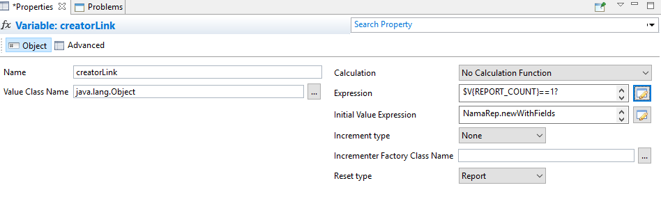

# NamaRep Expression Reference

Inside a report, anywhere JasperReports accepts an expression — a text field, a variable, a parameter default, a print-when condition — you can call `NamaRep`. It is the bridge between the layout and the rest of Nama ERP: it translates, formats dates and numbers, looks prices up, builds links back into the system, and applies the security rules a raw SQL query would otherwise ignore.

This page is a catalogue, organised so you can find a call and copy it. For how reports are built, deployed and parameterised, see the [Jasper Reports Complete Guide](/platform/reports/reports-guide).

Two conventions run through everything below. Arguments that name a record accept **either an id or a code** unless stated otherwise. And builder-style calls — `priceCalculator()`, `link()`, `listView()`, `newWithFields()` — are chains that end in a terminal call such as `.toString()` or `.price()`; nothing happens until the terminal runs.

## Names and translation

Records carry an Arabic name and an English name. `name()` picks the right one for the language the reader is running the report in, so a single text field serves both audiences.

```groovy
// Picks the Arabic or the English name according to the current language
NamaRep.name(name1, name2)

// Same, but falls back to the code when both names are empty
NamaRep.nameOrCode(code, name1, name2)
```

```groovy
// Translate a value — text, a yes/no, an option value
NamaRep.translate(value)
NamaRep.translate(true)          // gives the localised Yes / نعم

// Translate a field label, in the context of a record type
NamaRep.title(entityType, fieldId)
NamaRep.translate(entityType, fieldId)

// Translate "prefix.value"
NamaRep.translate("prefix", "value")

// Split a translation that carries a heading and a subtitle separated by |
NamaRep.head("header|subtitle")  // "header"
NamaRep.sub("header|subtitle")   // "subtitle"
```

## Dates and times

### Day names

```groovy
NamaRep.dayName($F{dateField})     // in the current language
NamaRep.arDayName($F{dateField})   // Arabic
NamaRep.enDayName($F{dateField})   // English
NamaRep.dayName(dayNumber)         // 1 = Sunday, 2 = Monday, ...
```

### Hijri dates

```groovy
NamaRep.toHijri($F{date})          // the full Hijri date as text
NamaRep.toHijriDate($F{date})      // a Hijri date object
NamaRep.hijriDay($F{date})         // day, zero-padded
NamaRep.hijriMonth($F{date})       // month, zero-padded
NamaRep.hijriYear($F{date})        // year
NamaRep.hijri_yyyyMMdd($F{date})   // yyyyMMdd

// Assemble your own format
NamaRep.hijriDay($F{date})+"/"+NamaRep.hijriMonth($F{date})+"/"+NamaRep.hijriYear($F{date})
```

### Times

```groovy
// Decimal hours to a clock time
NamaRep.decimalToTime(9.5)                    // "09:30"
NamaRep.decimalToTimeWithSeconds(9.5)         // "09:30:00"
NamaRep.decimalToTimeNullable(0)              // nothing, instead of "00:00"
NamaRep.decimalToTimeWithSecondsNullable(0)   // nothing, instead of "00:00:00"

// Milliseconds to a clock time
NamaRep.timeToString(9120000)                 // "02:32"
NamaRep.timeToStringNullable(0)               // nothing, instead of "00:00"
```

The `Nullable` variants exist so that an empty duration prints as an empty cell rather than a misleading `00:00`.

### Spans between two dates

```groovy
NamaRep.dateDiffInMonth(date1, date2)
```

For a years/months/days breakdown, compute the span into a variable with **reset type** and **increment type** both `None`:

```groovy
java.time.Period.between(
  new java.util.Date($F{FromDate}.getTime()).toInstant()
    .atZone(java.time.ZoneId.systemDefault()).toLocalDate(),
  java.time.LocalDate.now()
)
```

then print it:

```groovy
$V{period}.getYears()+" سنة "+$V{period}.getMonths()+" شهر "+$V{period}.getDays()+" يوم"
```

## Numbers, currency and amounts in words

### Arabic-Hindi numerals

```groovy
NamaRep.arNumbers("123")   // ١٢٣
NamaRep.arNumbers(value)
```

### Null-safe arithmetic helpers

An empty column in a report is not zero, and arithmetic on it fails. These convert before the sum reaches your expression:

```groovy
NamaRep.zeroIfNull(fieldOrVariable)   // empty becomes 0
NamaRep.oneIfZero(fieldOrVariable)    // zero becomes 1 — safe division
NamaRep.nullIfZero(fieldOrVariable)   // zero becomes empty — blank cells instead of 0.00
NamaRep.objectToDecimal(value)        // a safe conversion to a decimal
```

### The Saudi Riyal symbol

```groovy
NamaRep.sar()
```

Returns the symbol as an image stream, so it goes into an image element rather than a text field.

### Amounts in words (Tafqeet)

```groovy
NamaRep.tafqeet(currencyCode, amount)         // current language
NamaRep.tafqeetArabic(currencyCode, amount)
NamaRep.tafqeetEnglish(currencyCode, amount)
NamaRep.tafqeetFrench(currencyCode, amount)
```

How each currency is spelled — the name of the unit and of the fraction — comes from Global Configuration, under `value.info.tafqeetInfo.currencyCode`.

## Prices

`priceCalculator()` answers the question "what would this item cost, for this customer, on this date?" by running the same price-list resolution the sales screens use. It is the way to show a current price on a report without writing a query against the price lists yourself.

```groovy
NamaRep.priceCalculator()
  .item($F{item})
  .uom($F{UOM})
  .qty($F{Quantity})
  .unitPriceOnly()
  .price()
```

::: tip Store the result in a variable
`.price()` returns a whole price object, not a number. Declare a variable to hold it — class `java.lang.Object`, calculation `No Calculation Function`, increment type `None`, reset type `None` — and then read the components you need off `$V{price}`.
:::

If all you want is the number, end the chain with `.unitPrice()` instead of `.price()`; it returns the unit price on its own.

### Picking the price that applied on a date

Several price lists commonly cover the same item over overlapping periods. `.date(...)` decides which one wins — pass the report's own date parameter to price the row as of the day the user asked about, rather than as of today:

```groovy
// The price in force today
NamaRep.priceCalculator().item(@{details.item.item.id}@).unitPriceOnly().unitPrice()

// The price in force on the date the user chose
NamaRep.priceCalculator().item(@{details.item.item.id}@).date($P{FromDate}).unitPriceOnly().unitPrice()
```

::: warning Pass the legal entity, and do not test for null
Two things catch people out here.

Left unspecified, the calculation uses the default legal entity of the user running the report — which is not necessarily the legal entity the report is about. Say which one you mean: `.legalEntity($P{loginLegalEntityId})`. (`loginLegalEntityId` is the built-in parameter carrying the legal entity the user logged into. There is no `CompanyId` parameter.)

And the calculation never comes back empty in the Java sense. An item that cannot be resolved yields an empty price object; an item with no matching price list yields a real price object whose price is zero. So a report expression that checks for null never fires — check for zero, or for an empty value, instead.
:::

### The whole builder

```groovy
NamaRep.priceCalculator()
  .item($F{itemIdOrCode})
  .customer($F{customerIdOrCode})
  .supplier($F{supplierIdOrCode})
  .uom($F{uomIdOrCode})
  .invoiceClassification($F{classificationIdOrCode})
  .ic($F{classificationIdOrCode})               // short for invoiceClassification
  .legalEntity($F{legalEntityIdOrCode})
  .le($F{legalEntityIdOrCode})                  // short for legalEntity
  .sector($F{sectorIdOrCode})
  .sc($F{sectorIdOrCode})                       // short for sector
  .branch($F{branchIdOrCode})
  .br($F{branchIdOrCode})                       // short for branch
  .department($F{departmentIdOrCode})
  .dep($F{departmentIdOrCode})                  // short for department
  .analysisSet($F{analysisSetIdOrCode})
  .anset($F{analysisSetIdOrCode})               // short for analysisSet
  .priceClassifier1($F{priceClassifier1IdOrCode})
  .pc1($F{priceClassifier1IdOrCode})            // short for priceClassifier1
  .priceClassifier2($F{priceClassifier2IdOrCode})
  .pc2($F{priceClassifier2IdOrCode})
  .priceClassifier3($F{priceClassifier3IdOrCode})
  .pc3($F{priceClassifier3IdOrCode})
  .priceClassifier4($F{priceClassifier4IdOrCode})
  .pc4($F{priceClassifier4IdOrCode})
  .priceClassifier5($F{priceClassifier5IdOrCode})
  .pc5($F{priceClassifier5IdOrCode})
  .revision($F{revision})
  .color($F{colorCode})
  .size($F{size})
  .qty($F{qty})
  .date($F{date})
  .unitPriceOnly()
  .price()   // or .unitPrice() — the terminal call, always last
```

### Reading the price object

```groovy
// Headline values
$V{price}.unitPrice.primitiveValue
$V{price}.netValue.primitiveValue
$V{price}.custom.primitiveValue
$V{price}.totalCashShare.primitiveValue
$V{price}.totalPaymentMethodShare.primitiveValue

// Discounts — 1 to 8
$V{price}.discount1.percentage.primitiveValue
$V{price}.discount1.value.primitiveValue
$V{price}.discount1.afterValue.primitiveValue
$V{price}.discount1.maxNormalPercent.primitiveValue

// The header discount
$V{price}.headerDicount.percentage.primitiveValue
$V{price}.headerDicount.value.primitiveValue
$V{price}.headerDicount.afterValue.primitiveValue

// Taxes — 1 to 4
$V{price}.tax1.percentage.primitiveValue
$V{price}.tax1.value.primitiveValue
$V{price}.tax1.afterValue.primitiveValue
$V{price}.tax1.maxNormalPercent.primitiveValue
```

## Links back into the system

A printed report is a dead end; an on-screen report does not have to be. These builders turn a row into a hyperlink that opens the record, another report, or a filtered list.

### A record

```groovy
NamaRep.link(entityType, id)
NamaRep.link(serverUrl, entityType, id)

// The builder form, when you need a particular screen or menu
NamaRep.link()
  .entityType($F{entityType})
  .id($F{id})
  .viewName("theViewName")
  .menuCode("abcMenu")
  .url(serverUrl)
  .toString()
```

### An attachment

```groovy
NamaRep.attachmentLink(id)
NamaRep.attachmentLink(serverUrl, attachmentId)
```

### Another report

```groovy
NamaRep.repLinkByCode($P{REPORT_PARAMETERS_MAP}, "ReportCode")
  .p("p1 id").v(value expression)
  .p("p2 id").v(value expression)
  .copyParams()      // hand the current report's shared parameters over
  .toString()
```

`.p(...)` names the target parameter; what follows supplies its value:

```groovy
.p("param").v($F{id}, $F{entity}, $F{code}, $F{name1}, $F{name2})
.p("param").v($F{id}, $F{entity}, $F{code})
.p("param").ref($F{entityType}, $F{id})
.p("param").refCode($F{entityType}, $F{code})
```

Add `.directLink()` to leave the server address off, producing `#rpt:xxx` rather than a full URL — useful when the link is only ever followed from inside the application.

`.toNoAuthResultLink()` produces a link that runs without a login at all, for sending to customers. See [Sharing a report with someone who has no login](/platform/reports/reports-guide) in the guide for what has to be set up first.

::: details Three worked report links
```groovy
// Account statement
NamaRep.repLinkByCode($P{REPORT_PARAMETERS_MAP}, "Statement")
  .copyParams()
  .p("fromAccount").v($F{accountId}, $F{accountEntityType}, $F{accountCode})
  .p("toAccount").v($F{accountId}, "Account", $F{accountCode})
  .toString()

// Sales profit summary
NamaRep.repLinkByCode($P{REPORT_PARAMETERS_MAP}, "SalesProfitSummary")
  .copyParams($P{REPORT_PARAMETERS_MAP})
  .p("SalesInvoice").ref("SalesInvoice", $F{SSIid})
  .p("cust").refCode("Customer", "Customer501")
  .p("fromDate").v("23-04-2014")
  .p("showDetails").v("true")
  .toString()

// Subsidiary account statement
NamaRep.repLinkByCode($P{REPORT_PARAMETERS_MAP}, "SubsidiaryAccountStatement")
  .p("subsidiaryType").v($F{CustomerEntityType})
  .p("fromSubsidiary").v($F{customerId}, $F{CustomerEntityType}, $F{customerCode})
  .p("toSubsidiary").v($F{customerId}, $F{CustomerEntityType}, $F{customerCode})
  .p("accuontType").v("mainAccount")
  .toString()
```
:::

::: tip Shortening a long link
```groovy
NamaRep.shortenURL(serverurl, signature, url)
```
The `{shortenurl()}` section of the Tempo documentation covers the signature.
:::

### A filtered list

`listView()` opens a list screen already filtered — the natural "show me the invoices behind this total" link.

```groovy
NamaRep.listView()
  .entityType("SalesInvoice")
  .criteria($P{REPORT_SCRIPTLET}.tempo("""
    customer.code,Equal,{customerCode},AND;
    valueDate,GreaterThanOrEqual,{fromDate},AND;
    """))
  .toString()
```

Add `.directLink()` for a link without the server address.

| Call | What it sets |
|---|---|
| `.entityType(String)` | Which records to list, for example `"SalesInvoice"` or `"Customer"` |
| `.criteria(String)` | The filter, in text criteria format |
| `.listViewName(String)` | A particular list view to open |
| `.menuCode(String)` | The menu the list opens under |
| `.orderBy(String)` | The field to sort by |
| `.ascending(Boolean)` | Sort direction — `true` for ascending |
| `.currentPage(Integer)` | Which page to land on |
| `.pageSize(Integer)` | Rows per page; `-1` for all of them |
| `.showTree(Boolean)` | Show the list as a tree |
| `.extraCriteriaId(String)` | An additional saved criteria definition to apply |

#### Injecting row values into the filter

The criteria text is static; wrapping it in `tempo(...)` makes it dynamic. Inside curly brackets you name a field, parameter or variable and its current value is substituted — no `$F{}`, `$P{}` or `$V{}` needed:

```groovy
$P{REPORT_SCRIPTLET}.tempo("""
  field,Operator,{value},AND;
  """)
```

So a customer report can carry a link to that customer's invoices for the period the report was run for:

```groovy
NamaRep.listView()
  .entityType("SalesInvoice")
  .criteria($P{REPORT_SCRIPTLET}.tempo("""
    customer.code,Equal,{customerCode},AND;
    valueDate,GreaterThanOrEqual,{fromDate},AND;
    valueDate,LessThanOrEqual,{toDate},AND;
    """))
  .listViewName("SalesInvoicesForCustomer")
  .orderBy("valueDate")
  .ascending(false)
  .toString()
```

#### Criteria format

The filter follows the [Text Criteria format](../text-criteria-guide.md):

```
fieldID,operator,value,logic;
```

**Operators:** `Equal`, `NotEqual`, `GreaterThan`, `GreaterThanOrEqual`, `LessThan`, `LessThanOrEqual`, `StartsWith`, `NotStartsWith`, `EndsWith`, `NotEndWith`, `Contains`, `NotContain`, `In`, `NotIn`

**Logic connectors:** `AND`, `OR` — **dates:** `dd-MM-yyyy` — **references:** `id:entityType:code`, where the code is optional

::: tip Let the system write the criteria for you
Build the conditions visually on the **Criteria Definition** screen, then use **Convert to Text**. The result is a working template you can paste in and then make dynamic with `tempo(...)`.
:::

## Creating records from a report

A report can carry a button that opens a new, pre-filled record — a receipt voucher against the invoice on the row, a purchase order built from the shortage list being printed. The link does not save anything; it opens the new-record screen with the fields already populated, and the user commits it.

```groovy
NamaRep.newWithFields("ReceiptVoucher")
  .f("term").value("POTermCode")
  .f("book").value("POBook1")
  .f("remarks").v("Auto Created")
  .f("fromDoc#type").v("SalesInvoice")
  .f("fromDoc#code").v($F{code})
  .menuCode("NormalReceiptMenu")
  .viewName("NormalReceipts")
  .toString()

// The same thing, spelled out
NamaRep.creator("ReceiptVoucher")
  .field("supplier").value(supplierId)
  .toString()
```



### Generic reference fields need two parts

Fields such as `ref1` to `ref5`, and any other field that can point at more than one kind of record, need to be told the type as well as the value. Address the two halves separately by suffixing the field id:

```groovy
  .f("ref2#type").v("Warehouse")
  .f("ref2#code").v($F{warehouseCode})
```

`#entitytype` is accepted as a synonym for `#type`, and `#value` for `#code`.

You may leave `#type` out **when the field allows exactly one kind of record** — in that case the screen pre-selects the only permitted type and hides the type selector, so there is nothing left to set. Any field that allows two or more types silently ignores a value with no type beside it, and the field arrives empty.

### Building a record with lines

For a report whose detail band should contribute one line each:

1. Declare a variable — call it `creatorLink` — whose initial value expression starts the record and stops at `.root()`:

```groovy
NamaRep.newWithFields("PurchaseOrder")
  .field("term").value("P.Order.Term")
  .root()
```

2. In the detail band, add a line per row:

```groovy
$V{creatorLink}
  .field("details.item.itemCode").value($F{code})
  .field("details.quantity").value($F{qty})
  .row($V{REPORT_COUNT})
```

3. Where the link belongs — usually the summary — turn the accumulated builder into the link:

```groovy
$V{creatorLink}.toString()
```

## Approvals

Reports are how many approvals actually get done: the approver receives the document by e-mail and clicks a link in it.

```groovy
// Act on the whole document
NamaRep.approveAllLink($P{REPORT_PARAMETERS_MAP})
NamaRep.rejectAllLink($P{REPORT_PARAMETERS_MAP})
NamaRep.returnAllLink($P{REPORT_PARAMETERS_MAP})
NamaRep.returnAllToPreviousStepLink($P{REPORT_PARAMETERS_MAP})

// Or pass the decision in: "Approve", "Reject", "Return"
NamaRep.approveAllLink($P{REPORT_PARAMETERS_MAP}, decision)
```

For documents approved line by line:

```groovy
NamaRep.approveLink($P{REPORT_PARAMETERS_MAP}, $F{lineNumber})
NamaRep.rejectLink($P{REPORT_PARAMETERS_MAP}, $F{lineNumber})
NamaRep.returnLink($P{REPORT_PARAMETERS_MAP}, $F{lineNumber})
NamaRep.returnToPreviousStepLink($P{REPORT_PARAMETERS_MAP}, $F{lineNumber})

// With a reason
NamaRep.approveLink($P{REPORT_PARAMETERS_MAP}, $F{lineNumber}, reasonCodeOrId)
NamaRep.rejectLink($P{REPORT_PARAMETERS_MAP}, $F{lineNumber}, reasonCodeOrId)

// Is this line one this approver is being asked about?
NamaRep.isConcernedLine($P{REPORT_PARAMETERS_MAP}, $F{lineNumber})
```

Use `isConcernedLine` in a print-when expression so the buttons only appear beside the lines the reader can actually act on.

```groovy
// Open the approval dialog in the browser instead of acting immediately
NamaRep.approveFromJS(entityType, entityId, nextStepName,
                      concernedLines, nextStepSeq, summary)
```

## Employee vacation balances

Leave balances are calculated, not stored, which is why a report cannot simply select them from a column.

```groovy
// The three standard vacation types
NamaRep.getVacation1RemainderBalance(empIdOrCode)
NamaRep.getVacation2RemainderBalance(empIdOrCode)
NamaRep.getVacation3RemainderBalance(empIdOrCode)

// Any vacation type, optionally as at a date
NamaRep.getVacationRemainderBalance(empCodeOrId, vacationTypeIdOrCode)
NamaRep.getVacationRemainderBalance(empCodeOrId, vacationTypeIdOrCode, atDate)

// Broken down by year
NamaRep.getRemainderBalancePerYears(employeeId, atDate, yearsCount)
```

### Assigned, consumed and remaining together

`getVacationBalance` returns one object carrying every number the balance calculation produced, each under its own name. Read them with `$V{balance}.assigned`, `$V{balance}.consumed`, and so on.

```groovy
// Balance for one employee and one vacation type
NamaRep.getVacationBalance(employeeId, vacationType)
NamaRep.getVacationBalance(employeeId, vacationType, atDate)

// Pass the report parameters map as the first argument and the answer is
// remembered for the rest of the run, so asking for three numbers costs one calculation
NamaRep.getVacationBalance($P{REPORT_PARAMETERS_MAP}, employeeId, vacationType, atDate)
```

| Field | What it holds |
|---|---|
| `assigned` | Days the employee is entitled to for the current year |
| `consumed` | Days already taken |
| `remainder` | Days still available as at the date asked about |
| `yearRemainder` | Days still available once the whole year's entitlement is counted, not only the part accrued by the date asked about. It is the same number as `remainder` when *Calculate Vacation Balance Based On Start Date* is switched on in the HR configuration |
| `balance` | The accrued balance the calculation started from, before any added balance and the consumed days are applied |
| `assignedTillEndOfYear` | Total days the employee will have been entitled to by the end of the year — the year-end balance with the consumed days added back |
| `remainderTillEndOfYear` | Days that will still be available at the end of the year |

The usual layout is one variable for the balance and one text field per number:

```groovy
// Variable "balance", class java.lang.Object
NamaRep.getVacationBalance($P{REPORT_PARAMETERS_MAP}, $F{EmployeeCode}, $F{VacationTypeCode}, $P{atDate})

// Then, in three text fields
$V{balance}.assigned
$V{balance}.consumed
$V{balance}.remainder
```

Those short forms rely on the report's language being Groovy, which is the usual setting. In a report set to Java, write `$V{balance}.getAssigned()` instead.

::: tip
`getVacationAssignedConsumedRemainder` is the older form of the same call. It returns the same numbers packed into a nested pair — `assigned`, then a pair of `consumed` and `remainder`, then `yearRemainder` — which has to be unpacked as `.x`, `.y.x`, `.y.y` and `.z`. It still works, so reports written against it keep running, but use `getVacationBalance` for anything new.
:::

## Reward points

```groovy
// What a customer or supplier has available
NamaRep.availableRewardPoints("Customer", $F{customerId})
NamaRep.availableRewardAmount("Customer", $F{customerId})

// What a particular document earned
NamaRep.earnedPoints("SalesInvoice", $F{invoiceId})
```

::: tip
`availableRewardPoints` and `availableRewardAmount` work with any master file. `earnedPoints` only works with documents — for a master file it comes back empty. All three take an id or a code as the second argument.
:::

## Querying the database directly

Sometimes a single value is wanted that the report's own query cannot reach.

```groovy
NamaRep.runSQLQuery(sql, paramName, paramValue, paramName, paramValue)

NamaRep.executeQuery(
  "SELECT cast(w.name1 collate Arabic_CI_AI_KS_WS as varchar(250))
   FROM warehouse w WHERE w.id = :wid",
  "wid", $F{wid}
)

// Flatten several rows and columns into one string
NamaRep.formatQueryResult(results, "\n", ",")   // row separator, column separator
```

::: warning One query per row
An expression like this runs once for every row the report prints. On a hundred-row report that is a hundred round trips to the database. Where the value can come from a join in the report's own query, put it there instead.
:::

### Reading a module's configuration

```groovy
NamaRep.getValueFromModuleConfig(moduleId, fieldId)

NamaRep.getValueFromModuleConfig("basic", "value.info.useCurrentUserAsSalesMan")
```

Module ids: `accounting`, `basic`, `supplychain`, `fixedassets`, `humanresource`, `dms`, `project`, `ecpa`, `manufacturing`, `srvcenter`, `crm`, `contracting`, `travel`, `realestate`, `housing`, `auditing`, `education`, `namapos`, `mc`.

## Security constraints

```groovy
NamaRep.security()
  .fieldEntityType("Account")
  .tableAlias("acc")
  .capabilities("firstAuthor", "viewCapability", "usageCapability",
                "updateCapability", "legalEntity", "branch",
                "sector", "department", "analysisSet")
```

Returns a SQL boolean fragment for the current user, to be spliced into a `WHERE` clause with `$P!{}`. The full recipe, including the hidden parameter it belongs in and how to cover more than one table, is in [Limiting what each user sees](/platform/reports/reports-guide).

```groovy
// Is this user allowed to see the subject of this parameter?
NamaRep.canDisplay($P{param})
```

Use it in a `printWhenExpression` to hide a column rather than show a blank one.

## Text, serials and QR codes

### HTML to plain text

```groovy
NamaRep.htmlToText(htmlContent)
```

Rich-text fields are stored as HTML. Printing them raw shows the tags; this strips them.

### Serial numbers

Serials are stored compressed as ranges. Expand them to print one per line, or compress a list back into ranges to keep a column short:

```groovy
NamaRep.expandSerials(serials)                    // one per line
NamaRep.expandSerials(serials, separator)
NamaRep.unzipSerials(serials)                     // as a list
NamaRep.unzipSerialsWithNewLines(serials)
NamaRep.unzipSerialsWithComma(serials)
NamaRep.unzipSerialsWithSeparator(serials, ";")

NamaRep.zipSerialsRange(serials)                  // back into ranges
```

### ZATCA QR codes

For invoices that have to carry the Saudi tax authority's QR code:

```groovy
NamaRep.genZATCAQR(sellerName, vatNumber, timestamp,
                   invoiceAmount, vatAmount)

// When the value date and the creation date differ
NamaRep.genZATCAQRWithCreationDate(sellerName, vatNumber,
                                   valueDate, creationDate,
                                   invoiceAmount, vatAmount)

// Straight from the document, which fills the fields for you
NamaRep.genZatcaQrCodeFromEntity(entityType, idOrCode)
NamaRep.zatcaHashedInvoice(entityType, id)
```

### Mobile QR codes

A QR code that the Nama mobile app scans in order to create or update a record — a delivery signed off on the doorstep, an attendance scan on a customer's premises.

```groovy
NamaRep.mobileQr()
    .code("IntegratorCode")
    .toString()

// Carrying values into the record it creates
NamaRep.mobileQr()
    .code("CustomerAttendance")
    .addParam("customer", $F{customerCode})
    .addParam("date", $F{valueDate})
    .addParam("amount", $F{totalAmount})
    .toString()

// Encrypted, for anything confidential printed on paper
NamaRep.mobileQr()
    .code("SecureIntegrator")
    .addParam("sensitive", $F{confidentialData})
    .encrypted()
    .toString()
```

The code carries the integrator's code and the parameters as JSON; the app decrypts an encrypted one automatically. The parameters arrive in the entity flow as `$map.paramName`, and the integrator itself has to exist as a Mobile QR Integrator record before any of this does anything.

## Audit trail

Version history can be printed inside a report, which is what compliance reviews and change-approval packs need.

```groovy
NamaRep.audit(entityType, id, versionNumber, actionType, language, outputFormat)
```

| Argument | What to pass |
|---|---|
| `entityType` | The kind of record, for example `"SalesInvoice"` or `"Customer"` |
| `id` | The record's id |
| `versionNumber` | The version to compare against — usually the current one |
| `actionType` | Normally `"Update"` |
| `language` | `"arabic"` or `"english"` |
| `outputFormat` | `"html"` or `"text"` |

```groovy
NamaRep.audit($F{entityType}, $F{id}, $F{versionNumber}, "Update", "arabic", "html")
NamaRep.audit("Customer", $F{customerId}, $F{currentVersion}, "Update", "english", "text")
```

What comes back covers header field changes with their old and new values, line-level changes — added, removed, modified — and who changed what, when. `"html"` produces a styled table, suited to a report or an e-mail; `"text"` produces indented plain text, suited to an SMS or a plain message.

## Grouping several fields into one key

```groovy
NamaRep.groupExpression(field1, field2, field3)
```

Combines several fields into a single value, for a report group that has to break on a combination rather than on one column.

## Built-in system parameters

Every report is handed the parameters below without declaring them. Reference one with `$P{name}` — for example `$P{loginLegalEntityName1}` for the company name in the page header, or `$P{loginLegalEntityId}` to price a row against the company the user is logged into.

::: details The full list of system parameters
### User and login

- `loginLanguage` — the language the report is being run in
- `originalLoginLanguage` — the language the user logged in with
- `loginUserId`, `loginUserCode`, `loginUserName1`, `loginUserName2`
- `loginUserTreatAsAuthorIds` — the users this user acts on behalf of
- `loginEmployeeId`

### Organisation

- `loginLegalEntityId`, `loginLegalEntityCode`, `loginLegalEntityName1`, `loginLegalEntityName2`
- `loginSectorId`, `loginSectorCode`, `loginSectorName1`, `loginSectorName2`
- `loginBranchId`, `loginBranchCode`, `loginBranchName1`, `loginBranchName2`
- `loginDepartmentId`, `loginDepartmentCode`, `loginDepartmentName1`, `loginDepartmentName2`
- `loginAnalysisSetId`, `loginAnalysisSetCode`, `loginAnalysisSetName1`, `loginAnalysisSetName2`

### Public organisation ids

- `publicLegalEntityId`, `publicSectorId`, `publicBranchId`
- `publicDepartmentId`, `publicAnalysisSetId`

### Logos and branding

- `loginLegalEntityLogo` — the main logo, as an image stream
- `loginLegalEntityLogo2` to `loginLegalEntityLogo5` — further logos
- `reportsFooterNote1`, `reportsFooterNote2` — the two footer lines from Global Configuration

### Report context

- `formEntityType` — the record type the form is for, useful when translating labels
- `reportCode`, `reportId`, `reportName1`, `reportName2`
- `namaReportInstance` — the running report itself
- `runId` — a unique id for this run

### Addresses

- `guiServerURL`, `externalServerURL`, `currentGUIURL`

### Approvals

- `concernedLines` — the lines this approver is being asked about
- `candidateEmployeeId`, `candidateEmployeeCode`, `candidateEmployeeName1`, `candidateEmployeeName2`
- `approvedRecordId`, `approvedRecordType`, `approvedRecordCode`
- `approvalSecret`, `approvalStepSeq`

### Permissions

- `allowedCapabilities`, `allowedEntities`, `allowedDocuments`, `allowedFiles`
- `notAllowedEntities`, `notAllowedDocuments`, `notAllowedFiles`
- `accessibleLegalEntityIds`, `accessibleSectorIds`, `accessibleBranchIds`
- `accessibleDepartmentIds`, `accessibleAnalysisSetIds`
- `legalEntityNotUsedInSecurity`, `sectorNotUsedInSecurity`, `branchNotUsedInSecurity`, `departmentNotUsedInSecurity`, `analysisSetNotUsedInSecurity`

### Everything else

- `posShiftCode` — the POS shift the receipt belongs to
- `currentReplicationSiteId`, `currentReplicationSiteCode`, `currentReplicationSiteName1`, `currentReplicationSiteName2`
:::

::: warning There is no `currentUser` parameter
`$currentUser()` is a **default-value function** for a parameter, not a system parameter — `$P{currentUser}` does not exist and a report that references it fails to compile. For the user running the report, use `$P{loginUserId}`, `$P{loginUserCode}` or `$P{loginUserName1}` / `$P{loginUserName2}`. The default-value functions are listed in the [guide](/platform/reports/reports-guide).
:::
