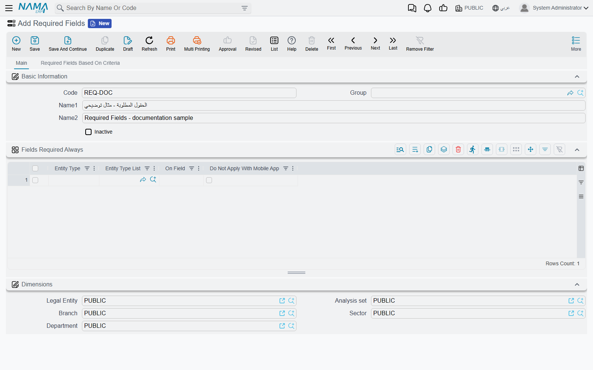
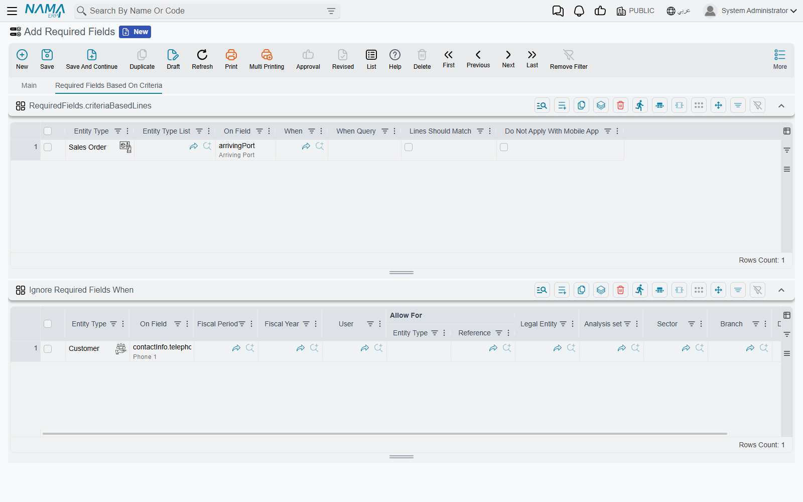

# Required Fields

Every screen in the system already knows which of its fields it cannot live without. A sales
invoice needs a customer, a journal entry needs a date, and nothing you configure will change that.
What the system does *not* know is what **your** organisation cannot live without: that a customer
record is useless to your collections team without a phone number, that your auditors insist every
payment voucher carries a manual reference, or that when a sales order is flagged as an export the
arriving port must be named.

The **Required Fields** screen is where you add those rules. You name an entity, you name a field,
and from that moment the field is mandatory — refused on save, with the same message the system uses
for its own built-in required fields. No programming, no restart, and it applies to everyone.

You reach it from **Administration → Display Customization → Required Fields**. It is an ordinary
master file: a code, a name, an **Inactive** checkbox that switches the whole record off, and three
grids. You can have as many records as you like — every active one is read and their rules are
merged, so it is normal to keep one record per department or per project rather than one enormous
list.

## The three grids, and which one you want

The screen has two pages. The **Main** page carries one grid, **Fields Required Always**. The second
page, **Required Fields Based On Criteria**, carries the other two: the criteria grid at the top and
**Ignore Required Fields When** below it.

| Grid | Use it when |
|---|---|
| Fields Required Always | The field is mandatory, full stop. No conditions, no exceptions. |
| Required Fields Based On Criteria | The field is mandatory *only* in certain circumstances — a particular document type, a particular customer, a value chosen elsewhere on the same record. |
| Ignore Required Fields When | You want a rule from either grid above lifted for a particular branch, company, period or group of users. |



All three start with the same scoping columns, and they behave identically everywhere:

| Column | What it does |
|---|---|
| Entity Type | The screen the rule applies to — Customer, Sales Invoice, Employee. |
| Entity Type List | A saved list of entity types, so one line covers several screens at once. |
| On Field | The field being made mandatory. Choose the entity type first and the column suggests the available field names, so you rarely have to type one from memory. |
| Do Not Apply With Mobile App | Tick to exempt records created from the Nama mobile application. The rule still applies everywhere else. |

You can fill in **Entity Type**, or **Entity Type List**, or both — a line with both applies to the
named type *and* to every type in the list.

## Fields Required Always

This is the grid you will use most of the time, and it is the one that behaves best, because a rule
written here does not merely reject the save: it makes the field genuinely required. The field is
marked as mandatory in the record's own definition, so the screen shows it the way it shows any
other required field, and the check runs wherever the system checks required fields — including on
records arriving through an import or an integration.

Say your collections team keeps chasing customers whose phone number nobody ever entered. One line —
**Entity Type** `Customer`, **On Field** `contactInfo.telephone1` — and the problem stops at the
source that same minute.

::: warning A line with no entity type at all applies to every screen
If you leave **both** Entity Type and Entity Type List empty, the rule is not ignored — it becomes
*generic*, and the field is required on **every** screen in the system that happens to have a field
of that name. A generic line on `description1` will make that field mandatory on hundreds of
screens, most of which you have never opened. This is occasionally what you want; far more often it
is a mistake that surfaces days later as "nobody can save anything any more". Name the entity type
unless you have specifically decided otherwise.
:::

::: tip It reaches remarks too
The suggestion list on this grid includes the fields of the **remarks** block that every record
carries — the remark text itself, its four attachments, its two reference fields, and its dates and
times. Requiring the remark text means nobody can add an empty remark; requiring the first
attachment means a remark must come with a file. See
[Remarks, Agenda and Work Tasks](/platform/remarks-and-agenda). These remark rules only work from
this grid — the criteria grid does not offer them.
:::

## Required Fields Based On Criteria

Rules that hold only sometimes go on the second page. Each line names the same entity type and field
as before, and then answers the question *when?* in one of two ways.



| Column | What it does |
|---|---|
| When | A saved criteria. The field is required only for records the criteria matches. |
| When Query | A query that answers yes-or-no for the record being saved. Same effect, written as a query instead of a saved criteria. |
| Lines Should Match | Only meaningful when the field lives inside a grid — see below. |

The classic case is one value on the record deciding the fate of another value on the same record.
Suppose your sales orders carry a classification in a description field, and orders classified as
*Export* must always name the arriving port. One line: **Entity Type** `SalesOrder`,
**On Field** `arrivingPort`, and a **When Query** of

```sql
select case when {description5} = 'Export' then 1 else 0 end
```

That is the whole rule. You never write the "is it filled in?" half — the system does that for you.
This is exactly the difference between this grid and
[Criteria Based Validation](/platform/criteria-based-validation), where you would have to write both
the *when* query and the *then* query yourself.

You can fill in **When** and **When Query** together, in which case the record has to satisfy the
criteria first and the query second. Leave both empty and the line has no condition left, so the
field is simply required — which is what Fields Required Always is for, and doing it here costs you
the on-screen marker for nothing.

::: warning A criteria line with no entity type does nothing at all
The generic behaviour described above for Fields Required Always does **not** exist on this grid. A
line here with neither an Entity Type nor an Entity Type List is silently discarded — no error, no
warning, and the rule you thought you wrote never fires. Always name the entity type on this grid.
:::

### When the field is inside a grid

If **On Field** points at a column of a document's lines — `details.description1`, say — the rule is
checked on every line of that document. **Lines Should Match** decides which lines that means.

Left unticked, a criteria or query that matches the record makes the field mandatory on **all** the
lines. Ticked, only the lines the criteria or query actually picked out are checked, and the rest
are left alone. So on a sales invoice you can insist on a serial number for the lines carrying a
particular item group, without demanding one for every other line on the document.

The error message names the line number, so the user is told exactly which row to fix.

::: tip Requiring the grid itself
Point **On Field** at the grid rather than at one of its columns — `details` rather than
`details.item` — and the rule means "this grid may not be empty". It is a neat way to insist that a
job offer carries at least one leave line, or that a maintenance visit records at least one action.
:::

## Ignore Required Fields When

Rules made for the whole company are rarely right for the whole company. The third grid is the
escape hatch: each line describes a situation in which a required-field rule is lifted.

| Column | The rule is lifted when… |
|---|---|
| Entity Type | …the record is of this type. Leave empty to mean any type. |
| On Field | …the rule is on this field. Leave empty to mean every field. |
| Fiscal Period / Fiscal Year | …the document falls in this period or year. Only documents have these; master files ignore the two columns. |
| User | …this specific user is the one saving. |
| Allow For | …the user saving is this employee, or belongs to this security profile, employee group or master group. The column comes in two parts — pick which of the four you mean, then pick the record. |
| Legal Entity, Analysis set, Sector, Branch, Department | …the record carries this dimension value. |

A line's blank columns simply do not restrict anything, and the line applies when *all* of its
filled columns match. That has a sharp edge worth knowing: a line with every column left blank
matches everything, and switches off every rule in the record.

::: danger Adding an exception changes how the "always" rules are enforced
This is the least obvious behaviour on the screen, and the one that causes support calls.

While a record's Ignore grid is **empty**, its Fields Required Always lines work as described above:
the field is genuinely marked required, the screen shows it as required, and the check runs
everywhere required fields are checked.

The moment you add **one line** to Ignore Required Fields When, that stops. The record's "always"
rules are moved into the same engine that handles the criteria rules — because that is the only
engine that knows about exceptions — and from then on they are checked when the record is
**committed**, not before. The field keeps working as a rule; what it loses is the on-screen
required marker.

So if a colleague reports that a field "stopped showing as required after we added an exception for
the Cairo branch", nothing is broken: this is why. If you want to keep the marker, put the
exception-free rules in one record and the rules that need exceptions in a second record — the
Ignore grid only ever affects rules that live in its own record.
:::

## What counts as empty

The check asks whether the field has a value, and its idea of "no value" is broader than you might
expect:

- A **text** or **reference** field is empty when it is blank.
- A **number** is empty when it is blank **or zero**. Requiring a quantity therefore means "must be
  something other than zero", which is almost always what you wanted.
- A **checkbox** is empty when it is unticked. Requiring a checkbox means the user has to tick it —
  a blunt but effective way to force an acknowledgement.
- A **grid** is empty when it has no lines.

## When the check runs

Required-field rules are checked when the record is **committed**. Saving a **draft** does not
enforce them — that is the whole point of a draft, and it applies to the system's own required
fields as well as to yours. A user can park an incomplete record as a draft all day; the rules bite
when they save it for real.

Changes to this screen take effect **immediately**. Save the record and the next document saved
anywhere in the system already obeys the new rule — there is no restart, no cache to clear, and no
action to press. Signed-in users do not need to sign out and back in, although a screen that is
already open will only show a newly required field as required once it is reopened.

::: warning The dimensions on this record do not scope its rules
Like every master file, a Required Fields record carries a dimensions group. It does **not** limit
where the rules apply — the system reads every active record regardless of its dimensions. To make a
rule apply only to one branch or company, use the **Ignore Required Fields When** grid to exempt the
others; do not rely on the dimensions of the record itself.
:::

## Which tool for which job

Three different screens can make a field mandatory-ish, and picking the wrong one wastes an
afternoon.

| You want to… | Use |
|---|---|
| Make a field mandatory, always or under a condition | **Required Fields** — this screen |
| Control the *shape* of a value that is entered — a pattern, a length, a prefix | [Input Rules and Limits](/platform/fields-and-entities-settings/fields-settings-input-validation). It never makes a field mandatory: an empty value always passes |
| Enforce a rule that involves more than one field, or compares against other records, or should warn rather than block | [Criteria Based Validation](/platform/criteria-based-validation) |
| Make a field mandatory on the point-of-sale terminals | The separate **Pos Required Fields** screen — the POS application has its own copy of this feature. See [Nama POS — Overview](/modules/pos/pos-overview) |

Criteria Based Validation can do everything this screen does, and more — but it makes you write the
"is it filled in?" query yourself, name the error field yourself, and write the message yourself.
When all you want is "this field must be filled in", Required Fields is one line instead of two
queries and a message.

## Worked examples

### A phone number on every customer

**Fields Required Always** — Entity Type `Customer`, On Field `contactInfo.telephone1`. That is the
entire configuration.

### An arriving port, but only on export orders

**Required Fields Based On Criteria** — Entity Type `SalesOrder`, On Field `arrivingPort`,
**When Query**:

```sql
select case when {description5} = 'Export' then 1 else 0 end
```

### A manual reference on payment vouchers, except for the accounting team

**Fields Required Always** — Entity Type `PaymentVoucher`, On Field `manualRef1`.

**Ignore Required Fields When** — On Field `manualRef1`, **Allow For** the accounting employee group.

Remember what that second line costs you: the field will no longer be marked as required on screen,
because the record now has an exception. If the marker matters more than the exception, split the
two rules across two records.

### At least one line on the leave grid of a job offer

**Fields Required Always** — Entity Type `JobOffer`, On Field `offerVacationLines`. Pointing at the
grid rather than at a column inside it means the grid may not be left empty.

### A serial number, but only on the lines that carry serialised items

**Required Fields Based On Criteria** — Entity Type `SalesInvoice`, On Field `details.serialNumber`, a
**When Query** that identifies the serialised lines, and **Lines Should Match** ticked so the other
lines are left alone.

## Related pages

- [Input Rules and Limits](/platform/fields-and-entities-settings/fields-settings-input-validation) — patterns, lengths and picklists for values that *are* entered.
- [Relaxing Built-In Restrictions](/platform/fields-and-entities-settings/fields-settings-relaxing-restrictions) — the opposite direction: removing rules the system imposes.
- [Criteria Based Validation](/platform/criteria-based-validation) — the general-purpose rule engine, for anything this screen cannot express.
- [Criteria from Text Parser](/platform/text-criteria-guide) — writing the criteria used by the **When** column.
- [Remarks, Agenda and Work Tasks](/platform/remarks-and-agenda) — the remark fields you can make mandatory from the first grid.
