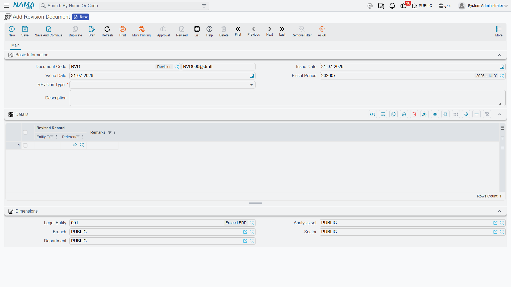
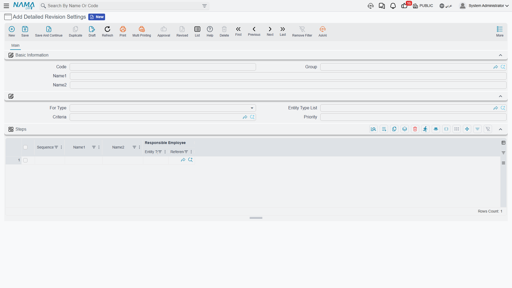

# Revise and Unrevise

Every business has records that someone other than the person who entered them is supposed to look at. The storekeeper writes the issue voucher, the stores supervisor checks it. The accountant posts the payment, the financial manager glances over it before month-end. Nama gives that "someone checked this" moment a formal place: **revising** a record.

Revising is deliberately lighter than an approval cycle. An approval happens *before* a document takes effect — it routes the document to people, collects decisions, and can send it back. Revising happens *after* the record is already committed and working: nothing is routed, nothing is pending, and the record's effects are already in the ledger and in the warehouse. What revising adds is a stamp — a named person, a date, and a lock that stops anyone from quietly changing the record afterwards.

If you need decisions and routing, use [approvals](/platform/approvals/approvals-system). If you need a checked-and-sealed marker on records that are already live, revise is the tool.

## What happens when you revise a record

The record must be **committed** first. A draft cannot be revised — the system will tell you the record is a draft — and a record sitting in an approval cycle cannot be revised either, because its content is not final yet.

Once you revise, three things happen:

1. **The record locks.** Any attempt to edit or delete it is refused with a message saying the record is revised. Correcting a revised record means unrevising it first.
2. **The revise level goes up by one.** Most installations use a single level, so one revise is all it takes. Where more than one check is required, the record climbs L1 → L2 → L3 as each person signs off.
3. **The event is recorded.** The record remembers who revised it, and the action history keeps a permanent line for each revise and unrevise, including the level it applied to.

**Unrevising** is the exact mirror: it steps the record back down one level, and once it reaches zero the record is editable again. Someone who revised at L2 gives back L2; the L1 sign-off underneath stays until its own owner takes it back.

::: tip Revising is not posting
A revised document has already done its work — the journal entry and the stock movement happened when it was committed. Revising changes nothing about the document's effects; it only records that a human checked it and freezes it in that state.
:::

## How many sign-offs a record needs

By default every entity needs one. You change that in **Global Configuration → Approvals and Revise**:

- **Default Revise Level** sets the number of sign-offs for entities that have no rule of their own.
- The **Revise Levels** table sets it per entity type — this is how you require two sign-offs on a payment voucher and one on a stock transfer.

When a record needs more than one level, the screen shows which level it has reached (L1, L2 …). With a single level there is nothing to disambiguate, so no label is shown — just the revised marker.

## Who is allowed to revise

Permission comes from the **security profile** (or the equivalent lines on the user record). Each entity line carries four settings that matter here:

| Setting | What it controls |
|---|---|
| **Revise** | Whether this profile may revise this entity at all |
| **Revise Levels** | Which levels it may take — leave empty to allow all of them |
| **Unrevise** | Whether this profile may unrevise |
| **Unrevise Levels** | Which levels it may give back — leave empty to allow all of them |

This is how you split a two-level scheme between two roles: the supervisor's profile gets Revise Levels `1`, the manager's gets `2`, and neither can stand in for the other.

::: warning Level lists are lists, not ranges
`1,2,3` means levels 1, 2 and 3. `1-3` does **not** mean "one through three" — it is read as the two levels 1 and 3, and level 2 is refused. Always write every level you want to allow, separated by commas.
:::

## The four ways to revise something

### From the record itself

Open the record and use the **Revise** and **Unrevise** buttons on the toolbar. Revise appears only while the record still has a level left to take, and Unrevise only when there is a level to give back — so on a fully revised single-level record you will see Unrevise and no Revise.

### In bulk from a list view

Select the rows you want in any list view and use the **Revise** / **Unrevise** buttons on the list toolbar. Each record is checked individually, so a batch where one record is still a draft will revise the rest and report the failure.

### Automatically when the record is committed

Sometimes the "check" is the act of committing itself, and you simply want the record sealed the moment it is saved. Turn on **Revise With Commit** on the master file group (for master files) or on the document book or document term (for documents), and every record created under it is revised as soon as it is committed — and therefore read-only from that point on.

### Through a Revision Document

The revise buttons act on one record at a time and leave nothing behind but a history line. A **Revision Document** turns the act of revising into a document of its own: it names a batch of records, carries a date, a description and remarks per line, and can itself be printed, approved and audited.

You will find it under **Basic → Documents → Revision Document**. Choose the **Revision Type** — *Revise* or *UnRevise* — then list the records in the **Details** grid, one **Revised Record** per line, with optional remarks. Committing the document applies the chosen action to every listed record; deleting or cancelling it reverses what it did, so a revision document taken back also takes back the sign-offs it granted.

If you want *all* revising to go through documents, turn on **Use Revise Document for All Entities** in Global Configuration, or tick the same option for individual entity types in the Revise Levels table. The plain Revise button then steps aside and the record's More menu offers **Create Revision Document**, **Create Unrevision Document** and **View Revision Documents** instead.

::: tip Revising in bulk from a query
For clean-up campaigns — "seal every sales invoice older than two days" — there is an entity flow, [EAReviseUnReviseFromQuery](/entity-flows/core/EAReviseUnReviseFromQuery), that revises or unrevises everything a query returns. Run it from a scheduled task when you need it to happen unattended.
:::

## Detailed Revision Settings: naming the steps and their owners

Plain revise levels tell you a record reached L2. They do not tell you what L2 *was*, or who was supposed to take it. **Detailed Revision Settings** fills that gap: you describe the revision as a short list of named steps, each with an owner, and Nama then enforces that only the owner can take their step.

You will find the screen under **Administration → Display Customization → Detailed Revision Settings**.

### Choosing which records a rule covers

| Field | What it does |
|---|---|
| **Code**, **Name1**, **Name2**, **Group** | Identify the rule; the names are what you will recognise it by in the revision history |
| **For Type** | The entity type this rule governs — payment voucher, sales invoice, and so on |
| **Entity Type List** | Use instead of (or alongside) For Type when one rule should govern several entity types |
| **Criteria** | Narrows the rule to some records only — invoices above a value, one branch, one customer class. Leave empty and the rule covers every record of the type |
| **Priority** | The order in which competing rules are examined |

When a record is about to be revised, Nama collects the rules registered for its entity type, walks them in **Priority** order starting from the smallest number, and uses the **first** one whose criteria the record satisfies. A rule with no criteria matches everything, so give your catch-all rule the largest priority number — otherwise it will swallow the records your specific rules were meant to catch.

::: warning Commit the settings record
Only committed settings take effect. A rule left as a draft is invisible to the revise process, and the record will fall back to the plain revise levels from Global Configuration.
:::

### Describing the steps

The **Steps** grid is the heart of the screen. Each line is one sign-off:

| Column | What it does |
|---|---|
| **Sequence** | The order of the step; the grid numbers new lines for you |
| **Name1** / **Name2** | The step's Arabic and English names — "Stores Check", "Financial Manager Sign-off" |
| **Responsible Employee** | The employee, or the employee group, allowed to take this step. Leave it empty and anyone with the permission may take it |

Once a rule applies to a record, four things change:

1. **The number of steps becomes the number of levels.** A three-step rule means the record needs three sign-offs, whatever Global Configuration says for that entity type.
2. **The record shows the step name instead of the level code.** Users see "Stores Check" rather than L1.
3. **Only the responsible person may take the step.** Anyone else is refused with a message naming the step they are not responsible for. If the responsible entry is an employee group, any member of that group qualifies.
4. **A revision case opens** to track how far the record has got — see the next section.

::: warning Responsibility is checked against the employee behind the user
The step owner is an *employee*, and the check compares it against the employee linked to the logged-in user. A user account with no employee linked to it is not stopped by the responsibility check, so make sure the people who log in to revise are properly linked to their employee records.
:::

### A worked example

Say payment vouchers above 50,000 need two pairs of eyes, and everything smaller needs one.

- Rule **DRC-1**, priority `1`, For Type *Payment Voucher*, criteria "value greater than 50,000", with two steps: `1 — Treasury Check` owned by the Treasury employee group, and `2 — Financial Manager Sign-off` owned by the financial manager.
- Rule **DRC-2**, priority `99`, For Type *Payment Voucher*, no criteria, with one step: `1 — Treasury Check` owned by the Treasury group.

A 70,000 voucher matches DRC-1, so it needs both sign-offs and the treasury clerk sees "Treasury Check" on the Revise button. A 4,000 voucher falls through to DRC-2 and is done after one.

::: tip Keep rules for the same entity type consistent
The step names shown on screen for an entity type are taken from its highest-priority rule, not from whichever rule turns out to apply to the record you are looking at. When several rules cover the same entity type, keeping their step names aligned avoids labels that read oddly for the records governed by the other rules.
:::

## Following progress: the revision history

Every record covered by a detailed revision rule gets a **revision case** — a small file that tracks the sign-offs as they come in. Open a revised record and choose **More → Show Revision History** to see it.

The case tells you:

- **The record being revised** and the settings rule being followed
- **The current level**, and the **next step** with its name and sequence
- **The candidates for the next step** — the individual employees who may take it, expanded from the responsible employee or group, so you know exactly whom to chase
- **Completed** and its **completion date**, set once the last step is taken
- A **steps grid** listing each sign-off already given: the step, who actually gave it, at which level, and when

Unrevising removes the most recent line from that history and recalculates the next step, so the case always mirrors the record's real state rather than accumulating reversed entries.

## What else reacts to revising

Revising and unrevising are proper events in the system, and other features can hang off them:

- **Entity flows** can be triggered on revise and on unrevise, so you can generate a follow-up document, stamp a field, or call an external system the moment a record is signed off.
- **Notifications** can be raised on the revise and unrevise events, which is the usual way to tell the next step's owner that something is waiting for them.
- **Criteria-based validations** can be written to run specifically at revise and unrevise time, letting you block a sign-off on a record that fails a last-minute check.
- **The action history** keeps its own permanent record of every revise and unrevise with the level involved — independent of the revision case, and available even for entities with no detailed revision rule.
