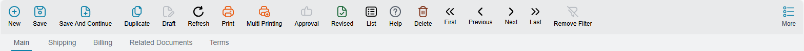
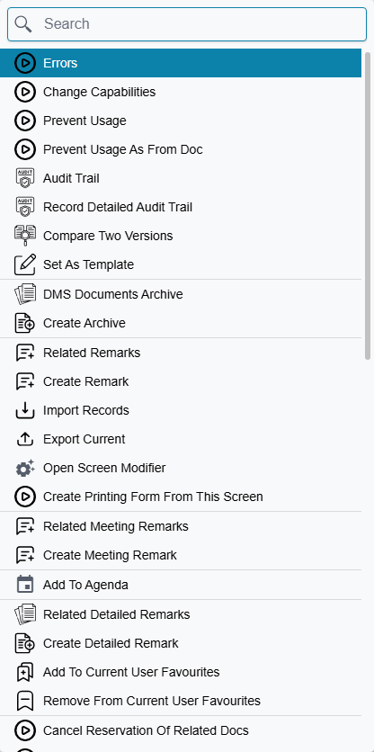
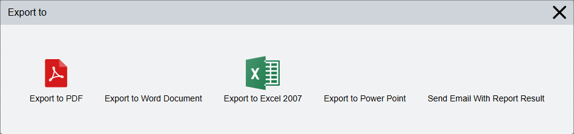
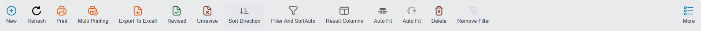
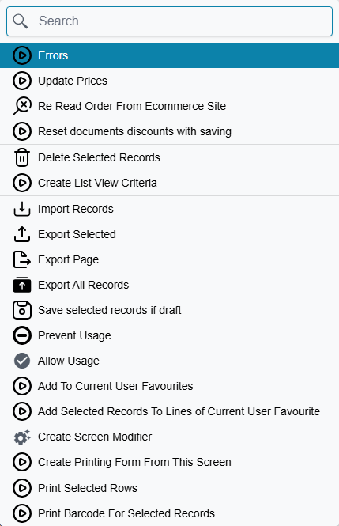
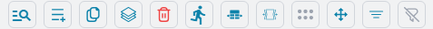

# Buttons on Every Screen

Nama has hundreds of screens, and almost none of them have their own buttons. A sales invoice, an
employee file, a fixed asset and a maintenance request all sit inside the same frame, and that frame
carries the same three sets of buttons everywhere: a toolbar at the top of an edit screen, a toolbar
at the top of a list screen, and a small cluster of buttons on every grid inside a document.

Learn these once and you have learned the controls of every screen in the system. What changes from
screen to screen is not the buttons — it is which of them are switched on.

## The edit screen toolbar

Open any record and the toolbar sits directly above the tabs.

| Button | What it does | Shortcut |
|---|---|---|
| New | Clears the screen and starts a fresh record of the same type | Alt + N |
| Save | Saves and commits the record | Ctrl + S |
| Save And Continue | Saves and commits, then immediately starts a new blank record — the button to use when you are entering a batch of documents one after another | Alt + S |
| Duplicate | Opens a new, unsaved record pre-filled from the one in front of you | Ctrl + D |
| Draft | Saves the record without committing it, so you can come back and finish it later | |
| Refresh | Re-reads the record from the server, throwing away unsaved edits | Alt + F5 |
| Print | Prints the record with its default printing form | Alt + P |
| Multi Printing | Opens the export dialog described below | |
| Approval | Opens the approval case of a record that is waiting on someone's decision | |
| Revised | Marks the record as revised — checked and sealed | |
| List | Leaves the record and goes to the list of records of this type | Ctrl + L |
| Help | Turns the on-screen help messages on and off | |
| Delete | Deletes the record, after a confirmation | Alt + Delete |
| First / Previous / Next / Last | Walks through the records of this type without going back to the list | Alt + Home / Page Down / Page Up / End |
| Remove Filter | Clears the filter that narrowed down what First, Previous, Next and Last walk through | |
| More | Opens the More menu | Ctrl + M |

A greyed-out button is not a fault. Draft is greyed on a record that is already committed, Approval
is greyed when nothing is waiting for a decision, and Delete disappears entirely for a user whose
permissions do not allow deleting. The toolbar always shows the same buttons in the same order — it
just dims the ones that do not apply right now.

::: tip The labels are optional
The words under the icons are a preference, not a fixed part of the toolbar. **Preferences → Show
toolbar labels** turns them off and leaves the icons alone, which buys back a row of vertical space
on a small screen. Every screenshot on this page has them switched on.
:::

## The More menu

Everything that did not fit on the toolbar lives behind More — and it is a long list, so the menu
opens with a search box at the top. Typing two or three letters is usually faster than scrolling.

The menu is assembled fresh every time you open it, in three layers. First come the actions that
belong to this document type in particular — on a sales invoice that means things like re-reading the
order from the e-commerce site. Then come the standard items that every record gets. Last come any
custom reports your implementer attached to this screen.

The standard items are worth knowing by name:

| Item | What it does |
|---|---|
| Errors | Re-opens the errors and messages of the current screen after you have dismissed them |
| Change Capabilities | Sets the view, update and usage security capability on this one record, overriding the entity-wide setting |
| Prevent Usage | Soft-deactivates the record: it stays in the system and in its old documents, but stops appearing in the pickers when someone creates something new — see [Preventing a record from being used](/platform/prevent-usage) |
| Prevent Usage As From Doc | The narrower version — the record can still be selected normally, but can no longer be used as the source document another document is generated from — see [Preventing a record from being used](/platform/prevent-usage) |
| Audit Trail / Record Detailed Audit Trail | Who changed this record, when, and what they changed — see [Audit trail](/platform/audit-trail) |
| Compare Two Versions | Puts two saved versions of the record side by side |
| Set As Template | Turns the record in front of you into a defaults template, so new records of this type can start pre-filled from it — see [Default Values Templates](/platform/default-values-templates) |
| DMS Documents Archive / Create Archive | The archived documents attached to this record, and a new one |
| Related Remarks / Create Remark | Free-text notes attached to this record. The same pair repeats for meeting remarks and for detailed remarks |
| Add To Agenda | Puts the record on your agenda as something to come back to |
| Import Records / Export Current | Bulk import into this screen, and export of the record you are looking at |
| Open Screen Modifier | Jumps to the layout editor for this screen — see [Screen Modifier](/platform/screen-modifier/) |
| Create Printing Form From This Screen | Starts a printing form built from the fields of the screen you are on |
| Add To / Remove From Current User Favourites | Puts the record in your own favourites menu |

If the record has been saved more than once, the menu ends with a short list of its recent versions,
so you can look at an older one without leaving the screen.

There is one more group that most users never see. A set of recovery items — recommit the record,
regenerate its accounting effects, regenerate its inventory effects, revert it to an earlier version,
show the internal field IDs — stays hidden until someone presses **Ctrl + Alt + X**, which is how
support switches them on for the session (see [Keyboard shortcuts](/platform/shortcuts)). They are
repair tools for a record whose effects went wrong, not part of daily work, and they leave the menu
again as soon as the page is reloaded.

## Printing, and the export dialog

Print sends the record straight to its default printing form. **Multi Printing** stops first and asks
what you want instead.

Four of the five choices produce a file — PDF, Word, Excel or PowerPoint. The fifth, *Send Email With
Report Result*, produces the same output but hands it to the mail dialog instead of downloading it,
which is the quickest way to get an invoice to a customer without saving a copy first.

The same button, with the same dialog behind it, sits on the list toolbar. There it works on the rows
you selected rather than on the record you are in.

## The list screen toolbar

The list screen carries its own toolbar, and about half of it is the same as the edit screen's.

New, Refresh, Print, Multi Printing, Delete and More mean exactly what they meant above, except that
they act on the rows you have ticked rather than on a single open record. The rest are the list's
own:

| Button | What it does |
|---|---|
| Export To Excel | Sends the grid as it currently stands — your columns, your sort, your filters — to an Excel file |
| Revised / Unrevise | Seals or unseals every selected row in one go — see [Revise and unrevise](/platform/revise-and-unrevise) |
| Sort Direction | Flips between ascending and descending. Right-click it to choose which fields the sort runs on |
| Filter and Sort | Opens the filter and sort panel |
| Result Columns | Chooses which columns the grid shows |
| Auto Fit | Two buttons that look alike and do different things: the first stretches the columns to fill the window, the second sizes each column to the widest value in it |
| Remove Filter | Clears every filter at once and returns the list to its full contents |

Behind More on a list screen is a different set again, built around acting on a selection.

Delete Selected Records, Prevent Usage and Allow Usage all apply to the ticked rows. *Save selected
records if draft* commits a batch of drafts in one pass. The three export items are worth separating
in your head: **Export Selected** takes the ticked rows, **Export Page** takes the page you are
looking at, and **Export All Records** takes the whole result set. **Create List View Criteria** turns
the filters you have set up into a saved, reusable filter.

Each of these is covered in full — including what happens when one record in a selection refuses —
in [Acting on Several Records at Once](/platform/list-views/mass-operations).

## Buttons on a grid

Inside a document, every detail grid has its own small cluster of buttons at the right of its
heading.

Reading from the left: find text inside the grid, add a line, copy the current line, copy the current
line many times over, delete the line, jump to a line by its number, the two auto-fit buttons, row
drag, column drag, view the sorted columns, and clear the grid's filters.

Multi Line Copy is the one people miss. It asks how many copies you want and makes them all at once —
if you are entering twenty lines that differ only in item code, filling in the first and copying it
nineteen times beats typing the rest from scratch.

Most of these have keyboard equivalents that are quicker once your hands are already on the grid:
**Insert** adds a line, **Ctrl + Insert** copies one, **Ctrl + Alt + Insert** opens the multi-copy
dialog and **Ctrl + Delete** removes a line. The full set is in
[Keyboard shortcuts](/platform/shortcuts).

## Why a button is missing

When a button you expected is not there, it is almost always one of four reasons.

**Permissions.** Delete, Export, Import and the More menu itself are each tied to a capability. A
user who does not hold it does not see the button at all.

**The kind of record.** Tree View only appears on master files that actually have a hierarchy.
Revised and Unrevise only appear where revision has been switched on for that record type.

**The state of the record.** Discard Draft appears only on a record that has both been committed
before and has an unsaved draft on top of it. Revoke Approval Request appears only while an approval
is genuinely pending.

**A screen modification.** An implementer can add actions to a screen and hide the ones the customer
does not use. If a button is missing on one customer's system and present on another's, this is
usually why — see [Screen Modifier](/platform/screen-modifier/).
