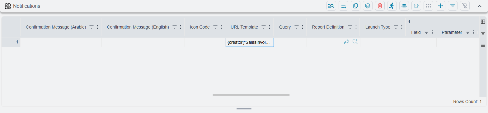
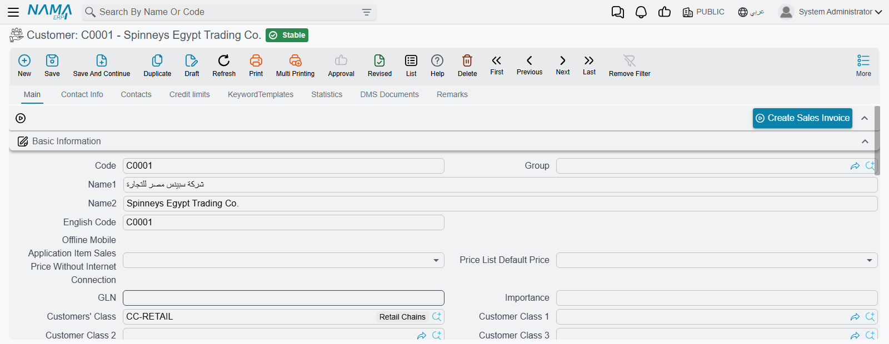
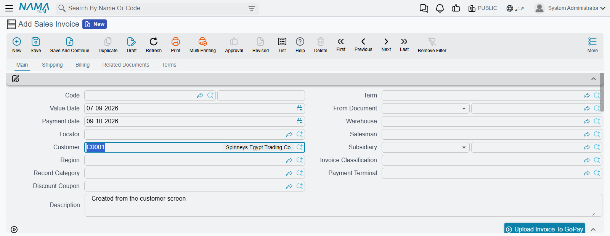

# Adding Buttons to a Screen

Nama's screens ship with the buttons the system needs, and no more. Sooner or later somebody asks
for one that is specific to how *their* company works: a button on the customer file that starts a
sales invoice for that customer, a button on the maintenance request that opens the complaint it
came from, a button on the employee card that runs one report with the employee already filled in,
a button that fires an entity flow on the document in front of you.

All of those are one screen customization: a line in the **Notifications** table of a
[Screen Modifier](/platform/screen-modifier/screen-modifier-overview.md). It is the single most
useful table on that screen and the least obviously named — its tab reads **Notifications**, the
table's own label is **Action Authorities**, and what it actually does is *add buttons*.

::: tip Where to find it
Open **Administration → Display Customization → Screen Modifier**, point the modifier at the screen
you want (**Applicable For** = *Entity Type*, **For Type** = e.g. *Customer*), then go to the
**Notifications** tab. Every line you add there is one button.
:::



## What a button can be made to do

A line is defined by *which* of the action columns you fill in. Fill in one — the rest stay empty.

| Fill in this column | And the button will |
| --- | --- |
| **Report Definition** | Run a report, with its parameters fed from fields on the record. **Launch Type** decides how it opens. |
| **URL Template** | Open a link that Nama builds from the current record — including a link that **opens a new, pre-filled record**. This is the one covered in detail below. |
| **Entity Flow** | Run an entity flow against the record. The flow must have at least one *manual* action line, or the modifier will not save. |
| **Notification Definition** | Send a notification about the record — the manual counterpart to a notification that normally fires on its own. |
| **GUI Post Actions** | Run a custom screen behaviour your implementer has written. It has to be defined as manual. |
| **Bulk Edit Config** | Open a bulk-edit dialog for the rows selected in a list. This one is **list-only** — ticking any of the edit-screen placement boxes on the same line is rejected when you save. |
| **System Action ID** | Not a new button at all: it re-places an *existing* system action, so you can move a standard button onto a page of your choosing or give it a different label and icon. |

## Where the button appears

Nothing appears anywhere until you say so. Each line carries its own set of placement switches, and
you can tick more than one:

| Column | Puts the button |
| --- | --- |
| **Show Button In Edit Screen** | In a button strip on the page named in **In Page** — this is the ordinary "button on the screen". |
| **Show In Edit Screen Toolbar** | Up in the edit screen's main toolbar, beside Save and Print. |
| **Show In More Menu For Edit Screen** | Inside the edit screen's **More** menu. |
| **Show In List Screen Toolbar** | In the list screen's toolbar. |
| **Show In More Menu For List Screen** | Inside the list screen's **More** menu. |
| **Show In List View Actions Column** | As a small button on every row of the list. |

Two columns are required on every line and control placement and grouping:

- **In Page** — which page (tab) the button strip belongs to. Use a number: `1` is the first tab, `2`
  the second. Text is matched against the page's *internal* name rather than the label you read on
  screen, so it is easy to get wrong — and when nothing matches, the button silently lands on the
  first page instead of reporting an error. Stick to numbers unless you know the internal name.
- **Notification Order** — its position. Lines that share the same order end up **in the same button
  strip**, side by side; a different order starts a new strip, placed at that position among the
  page's blocks. So two buttons that belong together should share one order number.

The rest of the line is presentation and control:

- **Arabic Title** / **English Title** — the label. Leave both empty and the button borrows the name
  of whatever it runs (the report's name, the flow's name, and so on) — convenient, but you usually
  want your own wording. **Resource ID** is the alternative: point at an existing system translation
  instead of typing the two titles.
- **Icon Code** — the icon on the button.
- **Confirmation Message (Arabic)** / **(English)** — fill either in and the button asks "are you
  sure?" with that text before it does anything. Worth adding to anything irreversible.
- **Security Id** — ties the button to an action permission, so a
  [Security Profile](/platform/security/security-profiles.md) can grant or deny it per user.
- **Run Custom Action On** — normally the button acts on the record you are looking at. Name a
  reference field here and it acts on the record that field *points at* instead. On a list, that
  means a button on the invoice list can operate on each row's customer. It cannot be combined with
  **System Action ID**.

## Opening a link: the URL Template column

**URL Template** is where the table stops being a list of things to run and becomes something much
more open-ended. Whatever you write in it is treated as a [Tempo](/admin/tempo.md) template,
evaluated on the server against the record the user is looking at, and the result is opened as a
link.

That "evaluated against the record" is the important half. You are not typing a fixed address — you
are typing a template that can read any field of the open record, including fields reached through
references:

```tempo
https://portal.example.com/customers/{code}?class={customerClass.code}
```

Because the template is rendered in record mode, dotted paths like `customerClass.code` work.
A link that starts with `http://` or `https://` is opened as an external site in a new browser tab;
anything else is understood as a location **inside Nama**. Add `{openinnewwindow}` at the very front
to force a new tab either way.

::: warning The record has to be saved
The button hands the server the record's identity, so it only works on a record that exists. Press
it on a screen with unsaved changes and Nama answers **"Record Must Be Saved"** and does nothing
else. Save first.
:::

## Creating a pre-filled record from a button

This is what most URL Template lines in the field are actually doing, and it is the answer to the
question that brings people to this page: *how do I put a button on the customer screen that opens a
new sales invoice with the customer already filled in?*

The tool is Tempo's **creator**. It builds a link to the new-record screen of any entity type, with
whichever fields you name already populated. It **saves nothing** — the user lands on a normal,
unsaved new record, checks it, completes it, and presses Save themselves.

Put this in **URL Template** on a modifier for the Customer screen:

```tempo
{creator("SalesInvoice")}
{f("customer")}{v(code)}
{f("remarks")}{v("Created from the customer screen")}
{endcreator}
```

Read it as pairs: **`{f("...")}` names a field on the record being created**, and the **`{v(...)}`
right after it supplies the value. Quoted text is a constant; unquoted text is a field read from
the record the user is standing on** — so `{v(code)}` means "the code of *this* customer".

Tick **Show Button In Edit Screen**, set **In Page** to `1`, give it an English and an Arabic
title, save, then run **Regenerate GUI For Applicable Types Only** from the toolbar. The button
appears on the customer's first tab:



Press it, and a new sales invoice opens with the customer resolved and the description filled:



::: tip A new button will not show up until the browser reloads
Regenerating rebuilds the screen on the server, but the browser session you already have open is
still holding the old layout — moving to another screen and back is not enough. Refresh the page
(F5) and the button is there.
:::

### Filling reference fields

A reference field is set by its **code**, exactly as a user would type it:

```tempo
{f("book")}{v("SVI02")}
{f("term")}{v("INV-02")}
{f("salesMan")}{v(salesMan.code)}
```

A **generic** reference — one that can point at several different types, such as *From Document* —
needs two entries, the type and the code, written with a `#`:

```tempo
{f("fromDoc#type")}{v(EntityType)}
{f("fromDoc#code")}{v(code)}
```

`EntityType` and `code` here are read from the current record, so this pair means "point the new
document's *From Document* back at the record I pressed the button on" — the standard way to build
a chain of related documents.

### Where the new record opens

`{creator(...)}` takes a few options inside its brackets:

| Option | Effect |
| --- | --- |
| `newwindow="true"` | Opens the new record in a new browser tab, leaving the original screen where it was. |
| `newwindow="popup"` | Opens it in a pop-up window inside Nama, so the user never leaves the screen. |
| *(omitted)* | Navigates the current tab to the new record. |
| `menu="..."` | Opens the new record under a particular menu entry, which matters when the same document type sits under more than one menu. |
| `view="..."` | Opens it with a particular named screen layout. |

A complete line as it appears in real installations:

```tempo
{creator("StockTransfer",newwindow="true")}
{f("book")}{v("VST")}
{f("fromDoc#type")}{v(EntityType)}
{f("fromDoc#code")}{v(code)}
{f("remarks")}{v(remarks)}
{endcreator}
```

The [Tempo manual](/admin/tempo.md) documents the creator in full, including counters and loops for
building a new document's **detail lines** from the lines of the one you are standing on.

::: warning One row at a time on a list screen
A URL Template button placed on a list screen runs against every row you selected, but only one link
is opened at the end. Treat these buttons as single-record tools and select one row.
:::

## Driving the link from a query instead of the record

The **Query** column changes where the template gets its values. Leave it empty and the template
reads the record's fields, which is what everything above assumes. Fill it in, and Nama runs your
query first and renders the template against the **result** instead — the placeholders then refer to
the columns the query returned, not to fields on the screen. Reach for it only when the value you
need to put in the link is not on the record and can only be worked out with a query.

## See also

- **[Overview & Concepts](/platform/screen-modifier/screen-modifier-overview.md)** — applicability,
  priority, and how to regenerate screens so your changes take effect.
- **[Edit-Screen Modifications](/platform/screen-modifier/screen-modifier-edit-screen.md)** — the
  other collections on the same record.
- **[Tempo Language Manual](/admin/tempo.md)** — the full template language, creators included.
- **[Buttons on Every Screen](/platform/screen-buttons.md)** — the standard buttons your new one
  sits beside.
