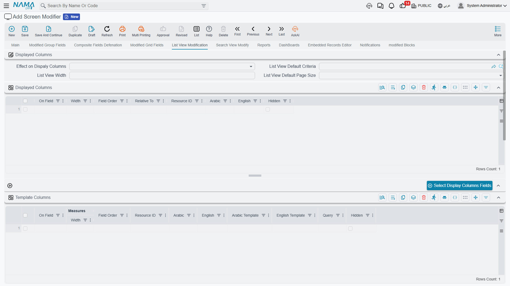
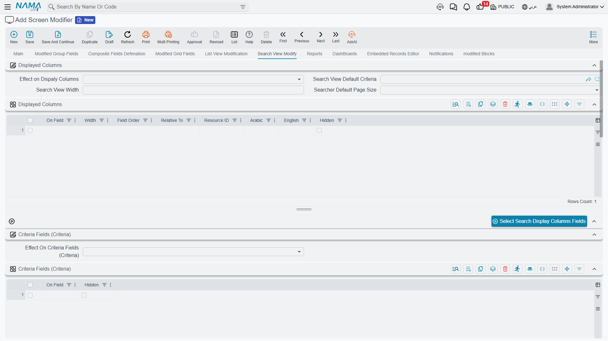

# Screen Modifier — List View & Selector Pop-up

Besides edit screens, a Screen Modifier can reshape the two places where records are *listed*:

- the **List View** — the full grid you open to browse, filter and manage records of a type, and
- the **Selector Pop-up** (the searcher) — the smaller pop-up that appears when you pick a value for a reference field on another screen.

The two are configured by parallel sets of collections: the list-view ones, and a matching set prefixed with *Search* for the selector pop-up. They work the same way, so once you understand one you understand both.

As on the edit screen, you enter each column or field by its **field id** (property path, e.g. `customer.name`), not its label, and suggestions are scoped to the type(s) in *For Type* / *For Type List*.

## Replace or add — the modification type

Several of these collections come with a companion **modification type** that decides how your list of columns/fields interacts with the ones already there:

- **Override Existing (Remove Existing)** — discard the current set entirely and use *only* what you list. Choose this to take full control of, say, the displayed columns.
- **Add To Existing** — keep the current set and append yours to it.

You will see this choice on display columns, criteria, sorting and the search-for fields, each with its own modification-type field.

## List View

| Setting | What it controls |
| --- | --- |
| **Display Columns** + *Display Modify Type* | The columns shown in the list grid, their order and placement (relative to an existing column). |
| **Criteria Fields** + *Criteria Modify Type* | The fields offered as filters in the list's search panel. |
| **Sort Fields** + *Sort Modify Type* | The fields the list is sorted by. |
| **Default Sort Type** | Whether the default sort is **Ascending** or **Descending**. |
| **Default Selector Popup Sort Type** | The same Ascending/Descending choice, but for the selector pop-up. |
| **Quick Filter** | One-click filter chips shown above the list, each backed by a saved criteria definition, so users can narrow the list without building a filter by hand. |
| **Template Columns** | **Computed columns** — extra columns whose values are calculated from a template rather than read straight from a single field. |
| **List View Default Page Size** | How many rows the list loads per page by default. |
| **List View** *(width)* | The default width of the list grid. |
| **List View Default Criteria** | A criteria definition applied automatically whenever the list opens, so users start from a pre-filtered view. |

## Selector Pop-up (the searcher)

These mirror the list-view settings, but apply to the pop-up used to pick a reference value:

| Setting | What it controls |
| --- | --- |
| **Search Display Columns** + *Search Display Modify Type* | The columns shown in the selector pop-up. |
| **Search Criteria Fields** + *Search Criteria Modify Type* | The filter fields available inside the pop-up. |
| **Search Sort Fields** + *Search Sort Modify Type* | The sort order in the pop-up. |
| **Criteria Fields (Used For "Search For")** + *Search For Modify Type* | The fields covered by the pop-up's single free-text **Search For** box — i.e. which columns a typed search term is matched against. |
| **Search Quick Filter** | Quick-filter chips for the selector pop-up. |
| **Searcher Template Columns** | Computed columns for the selector pop-up. |
| **Search Default Page Size** | Rows per page in the pop-up. |
| **Search View** *(width)* | The default width of the selector pop-up. |
| **Search View Default Criteria** | A criteria definition applied automatically every time the pop-up opens. |

::: tip
You don't have to type every column id by hand. The Screen Modifier toolbar has **Select … Fields** actions (Select Display Columns Fields, Select Search For Fields, Select Criteria Fields, Select Sort Fields, and their search-side equivalents) that open a field picker for the target type and fill the matching collection for you.
:::

## Reference columns (code, name and image)

When a column points at a **reference** (for example `lines.account`), you usually want to show something *about* that reference. Append a suffix to the column's field id to surface it as its own column:

- **`.code`** — the reference's code. Example: `lines.account.code`
- **`.name`** — the reference's name. Example: `lines.account.name`
- **`.image`** — the reference's image. Example: `lines.account.image`

These suffixes work anywhere you enter a column id — list display columns, search display columns, and grid columns on the edit screen alike.

## See also

- **[Overview & Concepts](/platform/screen-modifier/screen-modifier-overview.md)** — applicability, priority, and how to make changes take effect.
- **[Edit-Screen Modifications](/platform/screen-modifier/screen-modifier-edit-screen.md)** — for changes to the single-record edit screen.
- **[Quick Filters](/platform/list-views/quick-filters.md)** — more on building the quick-filter chips referenced above.
