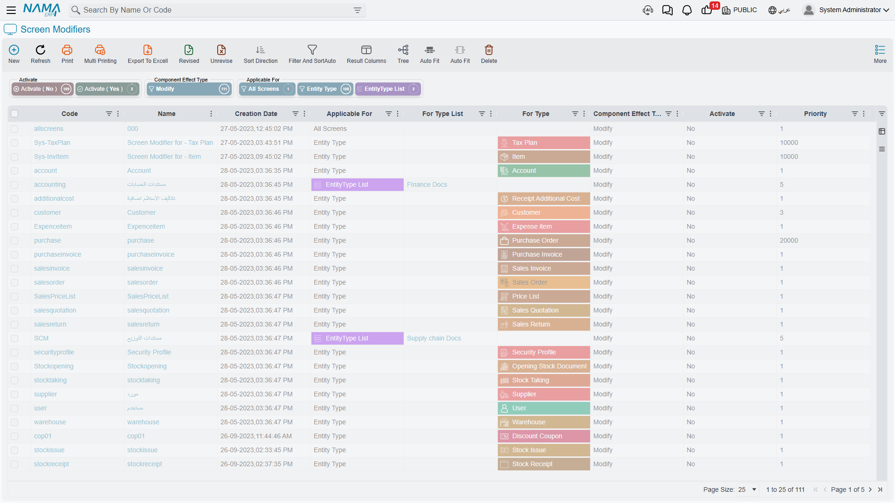
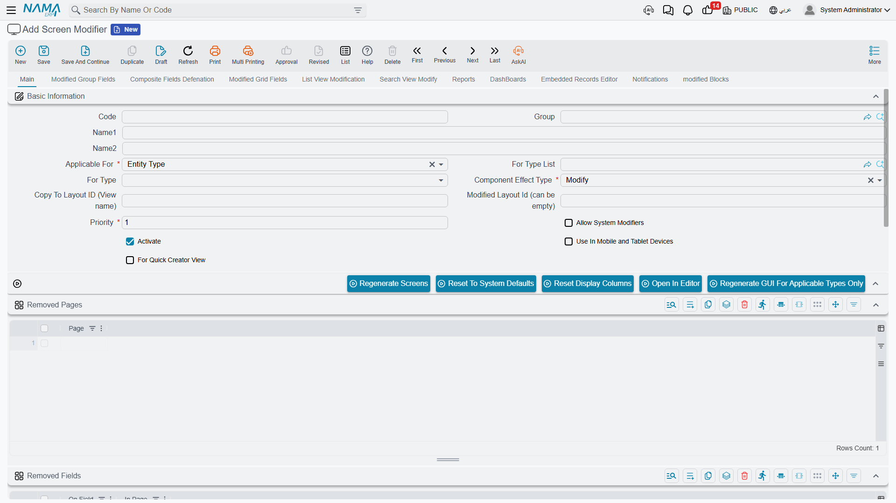

# Screen Modifier — Overview & Concepts

Every screen in Nama ERP — the edit screen of an invoice, the list view of customers, the pop-up you use to pick an item — ships with a default design. The **Screen Modifier** is how you change that design for your own installation without touching code or waiting for a new build.

Think of it as a set of instructions layered on top of the system's default screens. You tell Nama "on the Sales Invoice screen, hide these two fields, rename this tab, add a computed column to the list, and move this group to another page." Nama keeps the original design intact and applies your instructions on top of it whenever a screen is built.

You will find Screen Modifier under:

> **Administration → Display Customization → Screen Modifier**

## How a Screen Modifier is structured

A single Screen Modifier record answers three questions:

1. **Which screens does it apply to?** — controlled by the *Applicable For* field.
2. **Should it change the existing screen, or produce a brand-new named one?** — controlled by the *Effect Type* field.
3. **What exactly should change?** — described by the many collections inside the record (added groups, removed fields, display columns, quick filters, and so on), each documented in the pages linked below.

Everything else on the record — priority, activation, and the documentation attachments — controls *when* and *whether* those instructions run.

## Choosing which screens are affected — Applicable For

The **Applicable For** field decides the scope of the modifier:

| Applicable For | What it targets |
| --- | --- |
| **Entity Type** | A single screen — you pick exactly one type in the **For Type** field (e.g. Sales Invoice). |
| **EntityType List** | A specific set of screens — you list the types in the **For Type List** field, so one modifier can apply the same change to several screens at once. |
| **Master Files** | Every master-file screen (customers, items, accounts, …). |
| **Documents** | Every document screen (invoices, receipts, journal entries, …). |
| **All Screens** | Every screen in the system. |

When you choose **Entity Type**, only **For Type** is enabled; when you choose **EntityType List**, only **For Type List** is enabled. Switching between them clears the field you are no longer using.

::: tip
Use **Entity Type** for a targeted change to one screen, and **EntityType List** when the same tweak should land on a handful of related screens. Reserve **Master Files**, **Documents**, and **All Screens** for sweeping, system-wide changes — for example, removing an attachment from the discussion block everywhere.
:::

::: warning
Two actions — **Open In Editor** (the visual editor) and **Regenerate GUI For Applicable Types Only** — only work when *Applicable For* is **Entity Type** or **EntityType List**, because they need a concrete list of types to work with. They cannot run for the broad *All Screens* / *Master Files* / *Documents* scopes.
:::

## Modify or Copy (Effect Type)

The **Effect Type** field (labelled **Component Effect Type** on screen) has two options:

- **Modify** — change the screen the user already sees. Your instructions are applied on top of the default layout, and users keep opening the same screen as before, now altered.
- **Copy** — leave the original screen untouched and produce a **new, separately named layout**. When you pick *Copy*, the **Copy To Layout ID (View name)** field becomes available so you can give the new layout its own code. This is how you offer an *alternative* version of a screen (for example, a simplified data-entry layout) alongside the standard one.

The **Modified Layout Id** field lets you state which existing layout your changes should start from, when a screen has more than one layout defined.

## Priority and Activation

- **Priority** *(required)* — when several modifiers apply to the same screen, they run in priority order. Lower-priority instructions are applied first and higher-priority ones afterwards, so priority is your tool for controlling which change "wins" when two modifiers touch the same part of a screen.
- **Activate** — only activated modifiers are loaded and applied. Leaving this off is a safe way to keep a modifier on the shelf while you build or test it, without affecting anyone's screens.

## Special screen variants

A few flags target screens other than the normal desktop edit screen:

- **Use In Mobile and Tablet Devices** — the modifier applies to the mobile/tablet rendering of the screen rather than the desktop one.
- **For Quick Creator View** — the modifier applies to the compact "quick create" pop-up used to create a record inline from another screen.

## Layout codes and overriding the default

Internally, every screen is stored under a **layout code**. The system's built-in design uses the code `default`. You can override it in two ways:

- Create a layout with the code **`dbdefault`** to override the system default for the whole database.
- Create a layout with the code **`legalentitycodedefault`** (replacing `legalentitycode` with a company's actual code) to give a *specific company* its own default screen.

::: warning
Always remember to change the path/code to match the new code you are using. A layout saved under the wrong code simply will not be picked up.
:::

## Saving a modifier to an Implementation Repository

When you have built a modifier you want to reuse across installations, switch on **Save To Implementation Repository** and choose the target **Implementation Repository**. The modifier is then stored in that catalog so it can be carried to other databases instead of being rebuilt by hand. The **Screenshot**, **PDF Sample**, **Attachments**, **Related Entity**, and **Related To Module** fields are documentation metadata that travel with the modifier in the catalog.

## Making your changes take effect

A Screen Modifier does not change anything the moment you save it. Saving only records your *instructions* — the screens themselves are built (and cached) separately, so you have to ask Nama to rebuild them. The actions on the Screen Modifier toolbar do exactly that:

| Action | What it does |
| --- | --- |
| **Regenerate Screens** | Rebuilds **all** screens, applying the system defaults together with every active user modifier. Use this after a change that could affect many screens. |
| **Regenerate GUI For Applicable Types Only** | Rebuilds only the screens this modifier applies to. Faster and safer for a targeted change. *(Only for the Entity Type / EntityType List scopes.)* |
| **Reset To System Defaults** | Throws away user customizations and rebuilds screens from the system defaults only. Use this to get back to a clean, out-of-the-box state. |
| **Reset Display Columns** | Rebuilds just the list-view display columns from defaults. |
| **Delete Unused Layouts** | Cleans up layout records that are no longer referenced by any screen. |
| **Open In Editor** | Opens the screen in the [Visual Layout Editor](/platform/screen-modifier/screen-modifier-visual-editor.md) so you can redesign it by hand. *(Only for the Entity Type / EntityType List scopes.)* |

::: tip
The usual rhythm is: build or adjust your modifier → **Save** → run **Regenerate GUI For Applicable Types Only** → reopen the affected screen to confirm. Reach for the full **Regenerate Screens** only when a change is broad enough to touch many screens.
:::

## Where to go next

- **[Edit-Screen Modifications](/platform/screen-modifier/screen-modifier-edit-screen.md)** — reshape the edit screen: pages, groups, grids, fields, actions, formulas, embedded editors, and discussion options.
- **[List View & Selector Pop-up](/platform/screen-modifier/screen-modifier-list-and-search.md)** — change columns, criteria, sorting, quick filters, and computed columns in lists and search pop-ups.
- **[Visual Layout Editor](/platform/screen-modifier/screen-modifier-visual-editor.md)** — design a screen visually and save it back into a modifier.
- **[Frequently Asked Questions](/platform/screen-modifier/screen-modifier-faq.md)**

### Videos

- [Screen Modifier — Video 1](https://youtu.be/LaBbI6yyIhg?si=exaaxilwJCZRNo2k)
- [Screen Modifier — Video 2](https://www.youtube.com/watch?v=RX83qUZGr60)
