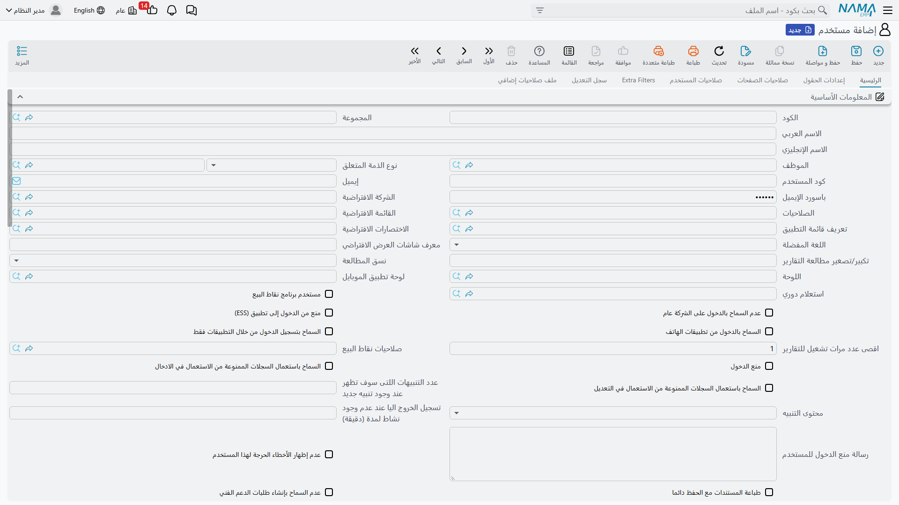
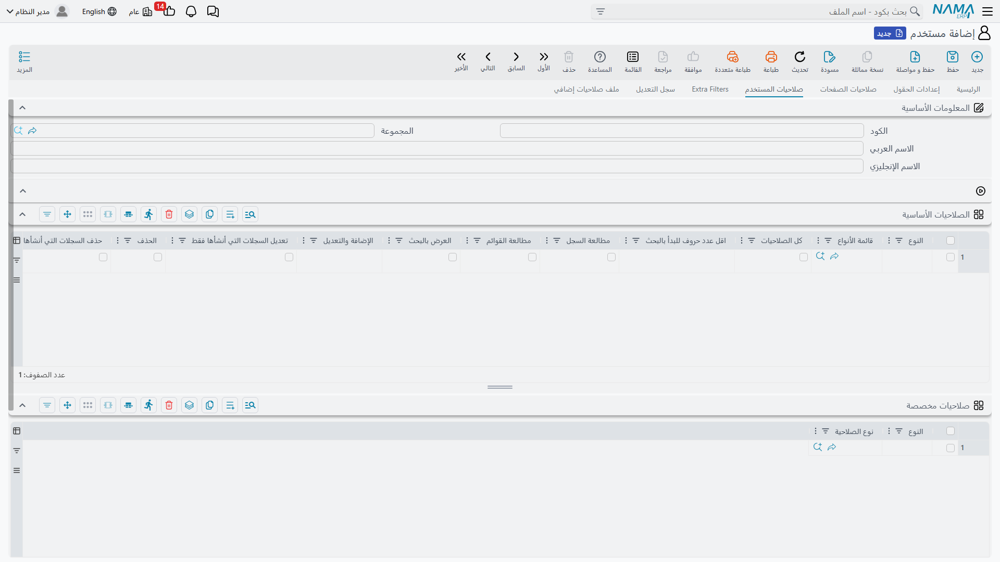

# Users and Login

The **User** record is where identity, authentication, and personal permission overrides converge. This page covers creating users, user-level permission overrides, and everything related to login: passwords, LDAP, two-factor authentication, and session control.

**Path**: Administration > Security > User

## User Record Components

The most important parts of the main page:

- **Login ID** — The name typed at login. If left blank it takes the value of the record code. Must be unique system-wide.
- **Password** — Stored encrypted with a hash function (see *Passwords* below).
- **Employee** — Links the user to an employee record in HR; mandatory for POS users, and is the source of contact data and many behaviors. When set, it is automatically used as the related entity if none is specified.
- **Related Entity Type / Related Entity** — Who this user *is* in business terms: employee, customer, supplier, salesman… This reference powers additional filters ("show me only my records") — see [Record-Level Security](/platform/security/record-level-security.md).
- **Security Profile** — The role template this user inherits. See [Security Profiles](/platform/security/security-profiles.md).
- **Default Settings** — Default company, default menu, shortcuts, preferred language, dashboard, reading theme, plus personal preferences such as fonts and notification sounds.

### User Dimensions and Login Dimensions

Like any master file, the user record itself carries the five dimensions (company, branch, department, sector, analysis group) — these define the broadest scope the user can work within. The **Login Dimensions** set and the alternative login dimensions table define what the user acts as in each session. The full story is in [Record-Level Security](/platform/security/record-level-security.md).

## User-Level Permission Overrides

The user screen repeats the permission tables you know from the Security Profile — and user rows always take precedence over profile rows when the scope matches:

- **User Security tab** — Basic and custom permissions, and the *Treat Users as Creator* table.
- **Field Settings tab** — Field-level permissions specific to this user.
- **Page Security tab** — Page-level permissions specific to this user.
- **Extra Filters tab** — Row-level filters specific to this user.
- **Audit Log tab** — Who modified this user record and when.
- **Additional Security Profile tab** — Delegation documents that currently grant this user extra permissions; see [Temporary Additional Permissions](/platform/security/security-delegation.md).

The intended workflow: keep roles in Security Profiles, and use user-level tables only for personal exceptions. A few rows on a user is healthy; fifty rows usually means you need a new Security Profile.

## Login Control

| Setting | Purpose |
|---|---|
| **Prevent Login** | Disable the account. The adjacent **Prevent Login Message for User** field lets you tell the user why. |
| **Max Login Sessions** | Maximum concurrent sessions (defaults to 1 for new users). With **Auto Logout on Exceeding Max Sessions** enabled, a new login logs out the oldest session instead of being rejected. |
| **Auto Logout Time (minutes)** | Minutes of inactivity before the session ends. |
| **Allow Login From Apps** | Permits login from mobile applications. Mobile users count against the *mobile users* limit in the license. |
| **Login From Apps Only** | The inverse restriction — no browser login. |
| **Prevent ESS Login** | Block access to the Employee Self-Service portal. |
| **Prevent Public Login** | Force the user to choose a specific company at login instead of the general context. |
| **POS User** + **POS Security Profile** | Marks the user for the POS application and assigns a dedicated POS security profile; POS users must be linked to an employee. |

From the user list screen, the **Change Multi Users Password** action helps administrators reset passwords for several accounts at once, while the **allowLoginAfterFailedLogins** action on the user screen unlocks an account that was locked due to repeated failed login attempts.

## Passwords

- Passwords are stored **hash-encrypted** (irreversible) unless the organization explicitly operates in legacy plaintext mode.
- The **Password Must Be Changed** flag forces a new password on next login; the system tracks **Last Password Change Date** for auditing and policy enforcement.
- The **changePassword** action on the user screen is the administrative reset path; users change their own passwords from the session menu.

## LDAP / Active Directory

When **Use LDAP for users login** is enabled in General Settings, the system authenticates users through the directory instead of a local password. Two exceptions exist for accounts that must remain local:

- The **Do Not Use LDAP For Login** flag on the user,
- The same flag on the Security Profile (useful for entire roles, such as service accounts).

The `admin` user never authenticates via LDAP.

## Two-Factor Authentication (2FA)

The **Login 2FA Method** setting in General Settings accepts:

- **Authenticator App** — TOTP codes from apps such as Google Authenticator,
- **Message OTP** — A one-time code sent to the user,
- **Estidamah API** — Saudi identity-verification integration (Estidamah), or
- **None**.

Individual users can be exempted via the **Exclude From 2FA** flag. Full setup steps are in the [Two-Factor Authentication Guide](/getting-started/two-factor-authentication.md).

## Administrative Privileges

### The admin User

The account whose code/login ID is `admin` is the built-in super user. It bypasses the permission model, and the system **protects it from being weakened** — on save it rejects any attempt to:

- Prevent its login, force a password change, or restrict it to mobile-only login,
- Assign it any Security Profile other than the default full-access profile,
- Give it non-global dimensions or a user level, or hide critical errors and system messages from it,
- Change its code or login ID.

### Treat As Admin

The **Treat As Admin** flag in user settings does *not* grant data permissions — it grants access to restricted *administrative functions*: the maintenance page `utils.html`, stopping running tasks, logging out other users, and similar. Grant it carefully to senior system administrators who operate the system but are subject to a normal Security Profile for business data.

### User Level

Licenses can define named user levels with different counts. The **User Level** field places the user in one of the levels available in your license; the system verifies the level exists and enforces the licensed counts (integrated with **Users Counter** records that can also be linked at the Security Profile level).
