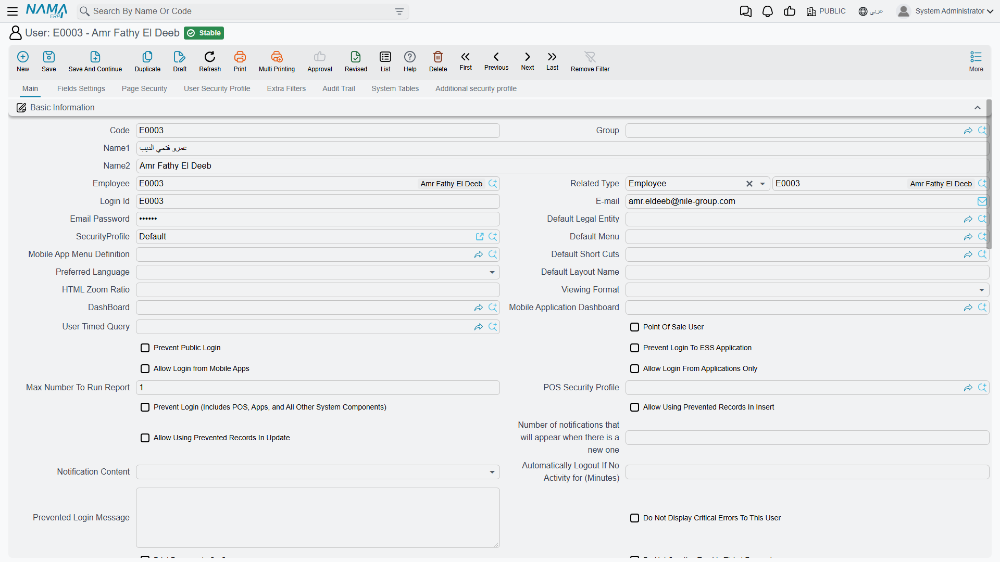
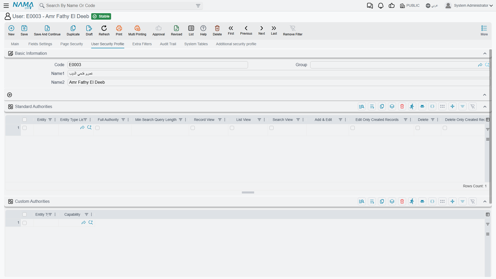

# Users and Login

The **User** record is where identity, authentication, and personal permission overrides converge. This page covers creating users, user-level permission overrides, and everything related to login: passwords, LDAP, two-factor authentication, and session control.

**Path**: Administration > Security > User

## User Record Components

The most important parts of the main page:

- **Login ID** — The name typed at login. If left blank it takes the value of the record code. Must be unique system-wide.
- **Password** — Stored encrypted with a hash function (see *Passwords* below).
- **Employee** — Links the user to an employee record in HR; mandatory for POS users, and is the source of contact data and many behaviors. When set, it is automatically used as the related entity if none is specified.
- **Related Entity Type / Related Entity** — Who this user *is* in business terms: employee, customer, supplier, salesman… This reference powers additional filters ("show me only my records") — see [Record-Level Security](/platform/security/record-level-security.md).
- **Security Profile** — The role template this user inherits. See [Security Profiles](/platform/security/security-profiles.md).
- **Default Settings** — Default company, default menu, shortcuts, preferred language, dashboard, reading theme, plus personal preferences such as fonts and notification sounds.

### User Dimensions and Login Dimensions

Like any master file, the user record itself carries the five dimensions (company, branch, department, sector, analysis group) — these define the broadest scope the user can work within. The **Login Dimensions** set and the alternative login dimensions table define what the user acts as in each session. The full story is in [Record-Level Security](/platform/security/record-level-security.md).

## Self-service user requests

Users do not have to be created by hand. **Basic → Documents → User Add Request** is a document that
asks for one, so the request can be reviewed, approved and kept on file instead of arriving as a
phone call — which is how a customer or a supplier gets a portal login.

The request carries only what a requester can reasonably know: the **Login Id**, the Arabic and
English user name, the e-mail and phone number, the preferred language, the dimensions the user
should work in, and an **Added User Type** — *Customer*, *Supplier*, *Contractor* or *Employee*.

Pressing **Add User** on the request creates the real user, and three things are decided for you at
that moment:

- The new user's code comes from the **User Coding Group** on the request's *Term Config*, so
  requested users are numbered by the same rules as everything else.
- The **Security Profile** is looked up in the *Term Config*'s grid by matching the **Added User
  Type** — that is how "a customer login" and "a contractor login" end up with different
  permissions without anybody choosing a profile by hand. If the type has no row in that grid, the
  user is created with no profile at all.
- The login id, names, e-mail and dimensions are copied across, and the created user is written back
  onto the request in **Created User**, so you can always get from the request to the user it made.

Two refusals are worth recognising:

| Message | Why |
|---|---|
| *User login id {0} is already existing* | A committed user already uses that login id. Login ids are unique system-wide; drafts do not count. |
| *You do not have the authority {1} on entity {0}* — «لا توجد لديك الصلاحية {1} على النوع {0}» — here with **Commit** and **User** in the placeholders | Pressing **Add User** needs commit authority on the User screen itself. Being able to save the request is not enough — the request is a request, not a permission. |

*User login id {0} is already existing* has no Arabic string in the product, so it appears in English on Arabic screens too.

The parallel screens for changing an existing party's own data — *Modify Customer Info Request* and
its supplier and contractor siblings — are described under
[requests raised from the portal](/platform/customers-suppliers-and-parties#Requests-raised-from-the-portal).

## User-Level Permission Overrides

The user screen repeats the permission tables you know from the Security Profile — and user rows always take precedence over profile rows when the scope matches:

- **User Security tab** — Basic and custom permissions, and the *Treat Users as Creator* table.
- **Field Settings tab** — Field-level permissions specific to this user.
- **Page Security tab** — Page-level permissions specific to this user.
- **Extra Filters tab** — Row-level filters specific to this user.
- **Audit Log tab** — Who modified this user record and when.
- **Additional Security Profile tab** — Delegation documents that currently grant this user extra permissions; see [Temporary Additional Permissions](/platform/security/security-delegation.md).

The intended workflow: keep roles in Security Profiles, and use user-level tables only for personal exceptions. A few rows on a user is healthy; fifty rows usually means you need a new Security Profile.

## Login Control

| Setting | Purpose |
|---|---|
| **Prevent Login** | Disable the account. The refusal reads *You are prevented from login*, unless **Prevent Login Message for User** is filled — that text replaces the standard message entirely. |
| **Max Login Sessions** | Maximum concurrent sessions (defaults to 1 for new users). With **Auto Logout on Exceeding Max Sessions** enabled, a new login logs out the oldest session instead of being rejected. |
| **Auto Logout Time (minutes)** | Minutes of inactivity before the session ends. |
| **Allow Login From Apps** | Permits login from mobile applications. Mobile users count against the *mobile users* limit in the license. |
| **Login From Apps Only** | The inverse restriction — no browser login. |
| **Prevent ESS Login** | Block access to the Employee Self-Service portal. |
| **Prevent Public Login** | Force the user to choose a specific company at login instead of the general context. |
| **POS User** + **POS Security Profile** | Marks the user for the POS application and assigns a dedicated POS security profile; POS users must be linked to an employee. |

From the user list screen, the **Change Multi Users Password** action helps administrators reset passwords for several accounts at once, while the **Allow Login After Failed Logins** action on the user screen unlocks an account that was locked by repeated failed login attempts.

Two settings in Global Configuration drive that lock: **Max Failed Login Attempts** is how many wrong passwords are tolerated, and **Minutes To Remember Failed Logins** is how long the block lasts. The block is held in the server's memory, not on the user record, which has three consequences worth knowing: it **clears itself** once that many minutes have passed since the last failed attempt, it is lost when the server restarts, and every further attempt while blocked re-starts the clock — so a user who keeps retrying never gets in. The administrator's unlock is the fast route, not the only one.

## Passwords

- Passwords are stored **hash-encrypted** (irreversible) unless the organization explicitly operates in legacy plaintext mode.
- The **Password Must Be Changed** flag forces a new password on next login; the system tracks **Last Password Change Date** for auditing and policy enforcement.
- The **changePassword** action on the user screen is the administrative reset path; users change their own passwords from the session menu.

## Actions on this screen

- **Allow Login After Failed Logins** — this is the unlock. It clears the failed-attempt block immediately, and it answers with something support can use: *The user was unblocked, here are the IPs that caused the block: {0}* — the addresses the wrong passwords came from — or *The user was not blocked* if there was nothing to clear. The user record must be saved first. Neither reply has an Arabic translation, so both appear in English.
- **Change Password** — sets a new password for the user without knowing the old one. It asks for the **new password** and a **confirm** of it, and then, optionally, an email address and its password to send from, a **password must be changed** switch that forces the user to set their own at the next sign-in, and whether to notify them **by email** or **by SMS**. The user record must be saved first.
- **Add Types Related To Current Types** — on the permissions grid. Standing on a permission line, it looks at the entity that line covers, works out every entity it points at through its reference and generic-reference fields, and adds a line for each one that is not already in the grid. It is how you grant the supporting read access an entity needs without hunting for the related types by hand. The same button is on the Security Profile screen, over the same grid.

**On the User Add Request:** **Add User** — the request must be saved; it then creates the actual user from the request, which is what turns an approved request into a login.

## LDAP / Active Directory

When **Use LDAP for users login** is enabled in General Settings, the system authenticates users through the directory instead of a local password. Two exceptions exist for accounts that must remain local:

- The **Do Not Use LDAP For Login** flag on the user,
- The same flag on the Security Profile (useful for entire roles, such as service accounts).

The `admin` user never authenticates via LDAP.

## Two-Factor Authentication (2FA)

The **Login 2FA Method** setting in General Settings accepts:

- **Authenticator App** — TOTP codes from apps such as Google Authenticator,
- **Message OTP** — A one-time code sent to the user,
- **Estidamah API** — Saudi identity-verification integration (Estidamah), or
- **None**.

Individual users can be exempted via the **Exclude From 2FA** flag. Full setup steps are in the [Two-Factor Authentication Guide](/getting-started/two-factor-authentication.md).

## Administrative Privileges

### The admin User

The account whose code/login ID is `admin` is the built-in super user. It bypasses the permission model, and the system **protects it from being weakened** — on save it rejects any attempt to:

- Prevent its login, force a password change, or restrict it to mobile-only login,
- Assign it any Security Profile other than the default full-access profile,
- Give it non-global dimensions or a user level, or hide critical errors and system messages from it,
- Change its code or login ID.

### Treat As Admin

The **Treat As Admin** flag in user settings does *not* grant data permissions — it grants access to restricted *administrative functions*: the maintenance page `utils.html`, stopping running tasks, logging out other users, and similar. Grant it carefully to senior system administrators who operate the system but are subject to a normal Security Profile for business data.

### User Level

Licenses can define named user levels with different counts. The **User Level** field places the user in one of the levels available in your license; the system verifies the level exists and enforces the licensed counts (integrated with **Users Counter** records that can also be linked at the Security Profile level).

## Messages you may see

| Message | Why | What to do |
|---|---|---|
| *You are prevented from login* — «تم منع دخولك الي النظام» | **Prevent Login** is ticked on the user. If the account shows a different message instead, it came from **Prevent Login Message for User**. | Untick Prevent Login on the user record. |
| *You have exhausted your max failed login attempts, please try again after {0} minutes or contact your system administrator - user name: {1}* — «لقد استنفذت أقصى عدد من محاولات الدخول الخطأ. يرجي المحاولة مرة أخرى بعد {0} دقيقة أو التواصل مع مدير النظام. اسم المستخدم: {1}» | More wrong passwords than **Max Failed Login Attempts** allows. | Wait out **Minutes To Remember Failed Logins** without trying again, or have an administrator press **Allow Login After Failed Logins**. |
| *The user was unblocked, here are the IPs that caused the block: {0}* | The unlock worked, and the message names the addresses the failed attempts came from. | Nothing — but the IP list is worth reading before you assume the user simply mistyped. |
| *The user was not blocked* | The unlock was pressed on a user who is not blocked. | Look elsewhere: **Prevent Login**, the licence limits, or the user's level. |
| *User login id {0} is already existing* | A committed user already holds that login id. Login ids are unique system-wide; drafts do not count. | Choose another login id, or find the existing user. |

The two unlock replies have no Arabic translation and appear in English on Arabic screens.
