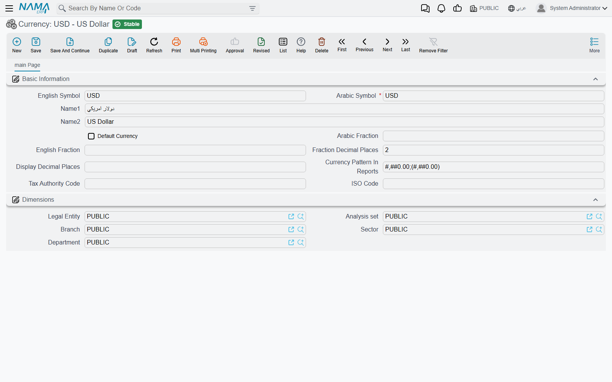
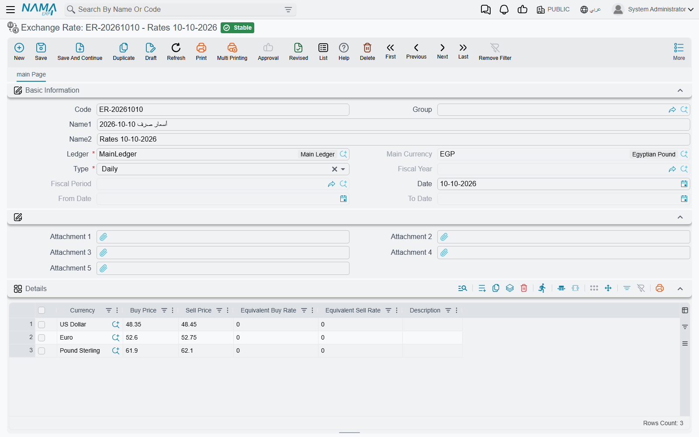

# Currencies and Exchange Rates

"Where do I enter today's dollar rate?" is one of the first questions any company that buys or sells in a foreign currency asks. The answer is the **Exchange Rate** screen — not the **Exchange Rate Update** document, which is a different thing that revalues balances you already hold. This page covers the currency master file, the Exchange Rate screen, and how a document picks its rate from it.

## The local currency comes from the ledger

Every legal entity points at a **Ledger** (دفتر الحسابات), and the ledger's **Main Currency** is that legal entity's local currency — the currency the books are kept in. Every amount on a document is stored twice: in the document's own currency, and as a **Local amount** in the main currency. The link between the two is the **Currency Rate** on the document: *local amount = amount × rate*. A rate of 48.5 on a USD invoice means one dollar is worth 48.5 units of the local currency.

The ledger also has a **Reporting Currency** field. It is recorded on the ledger and printed on its form, but no document or report converts amounts into it.

Once a legal entity uses a ledger, its main currency is fixed — changing it is refused with *Cannot change record after using it*.

## The Currency master file

**Currency** (`Basic → Master Files → Currency`, also under the accounting settings menu) holds one record per currency. Besides the code and the two names, it has:

- **English Code** — a required second code.
- **Arabic Fraction** / **English Fraction** — the name of the fractional unit (piaster, halala, cent).
- **Fraction Decimal Places** — how many decimals an amount in this currency carries. A new currency starts at 2; set 3 for dinars that split into 1000 fils.
- **Tax Authority Code** and **ISO Code** — the codes the e-invoicing integrations send for this currency.

Writing an amount in words ("one thousand pounds only") is configured separately, on the [Currencies Tafqeet](../global-config/global-config-currencies.md) tab of the global configuration.

## The Exchange Rate screen

**Exchange Rate** (`Basic → Documents → Exchange Rate`, also in the accounting documents menu) is where rates are entered. One record holds the rates of several currencies against one ledger's main currency for one stretch of time:

- **Ledger** — required; **Main Currency** fills itself from it.
- **Type** — how long the record is valid, which decides which date fields open:
  - **Daily** — one **Date**.
  - **Date Range** — a **From Date** and **To Date**.
  - **Period** — a **Fiscal Year** and **Fiscal Period**.
  - **Annual** — a **Fiscal Year**.
- The grid: one line per **Currency** with a **Buy Price** and a **Sell Price**. Type the buy price and an empty sell price is filled with the same figure; the two **Equivalent** columns show the inverse rate (1 ÷ rate) for reference.

::: warning Only the Buy Price is used
Documents take the **Buy Price** — for sales and purchases alike. The Sell Price and the equivalent rates are kept for reference only.
:::

A company that changes its rate every day creates one **Daily** record per day. A company that fixes a rate for the month creates a **Period** record. Both can live side by side.

## How a document picks its rate

When you pick a currency on a document, the system looks up the rate for the document's legal entity's ledger, its value date, its fiscal period and its fiscal year, in this order:

1. a **Daily** record for exactly the value date;
2. a **Date Range** record whose range contains the value date;
3. a **Period** record for the document's fiscal period;
4. an **Annual** record for its fiscal year.

The first match wins. A currency that is the main currency itself always gets rate 1.

There is no "latest earlier rate" fallback. A Daily rate entered for 9 October does **not** serve a document dated 10 October; if nothing matches, the rate is left empty for you to type. If your rates are not entered every day, keep a Period or Annual record behind the daily ones as a safety net.

The rate is fetched when the currency is chosen and is an ordinary field after that: you can overwrite it, and the document keeps the figure it was saved with. Correcting a rate on the Exchange Rate screen does not reach back into documents already saved. (The salary document term has an **Update Currency Rate Value With Save** option that re-fetches on every save — see [HR salary terms](../../modules/hr/document-terms/hr-terms-salary-and-dues.md).)

## Related settings

- **Rate Fractional Decimal Places** (global configuration, default 5) — how many decimals a rate field accepts. See [Global Configuration → General](../global-config/global-config-general.md).
- **Subsidiary Currency Should Match Accounts Currency** — see [Accounting settings](../global-config/global-config-accounting.md).
- **Add Currency And Rate Source To Terms** — lets a document term supply the currency and rate. See [Documents settings](../global-config/global-config-documents.md).
- **Rate Pattern In Reports** — how rates print. See [Reports settings](../global-config/global-config-reports.md).

## When rates move: revaluation

The Exchange Rate screen only feeds new documents. To restate the local value of a foreign balance you already hold, use the **Exchange Rate Update** document, described in [Journal entries & adjustments](../../modules/accounting/journal-entries.md#Exchange-Rate-Update), with the background in [Fiscal periods, period locking & multi-currency](../../modules/accounting/support/accounting-periods-and-currency.md).

## Messages you may see

Most of these have no Arabic text in the product and appear in English on Arabic screens too.

| Message | Why | What to do |
|---|---|---|
| *There is another record with same date* | A Daily record for this ledger and date already exists. | Open the existing record and edit its lines. |
| *There is another record with same period* / *There is another record with same year* | The same, for a Period or Annual record. | Edit the existing record. |
| *Can not specify exchange rate for the main currency* | A grid line names the ledger's main currency, whose rate is always 1. | Delete the line. |
| *Currency repeated in line {0}* | The same currency appears on two lines. | Keep one line per currency. |
| *Fiscal year does not belong to the ledger calendar {0}* | The fiscal year belongs to another calendar than the ledger's. | Pick a year of the ledger's calendar. |
| *Fiscal period does not belong to the selected fiscal year {0}* | The period and the year do not match. | Pick a period of that year. |
| *Cannot change record after using it* — «لا يمكن تعديل السجل بعد إستخدامه» | You changed the main currency, reporting currency, chart type or calendar of a ledger that a legal entity uses. | These cannot change once the ledger is in use. |
| *Currency must be the account currency ({0}) or the local currency ({1}). Account {2}, transaction currency {3}* — «يجب ان تكون العملة عملة الحساب {0} أو العملة المحلية {1}. الحساب {2} - عملة الحركة {3}» | A line posts to an account held in one foreign currency using a different foreign currency. | Use the account's currency or the local currency on that line. |
| *Rate must be 1 because the currency is the same as the local currency* — «المعدل يجب ان يكون 1.0» | A line in the local currency carries a rate other than 1. | Set the rate to 1. |
