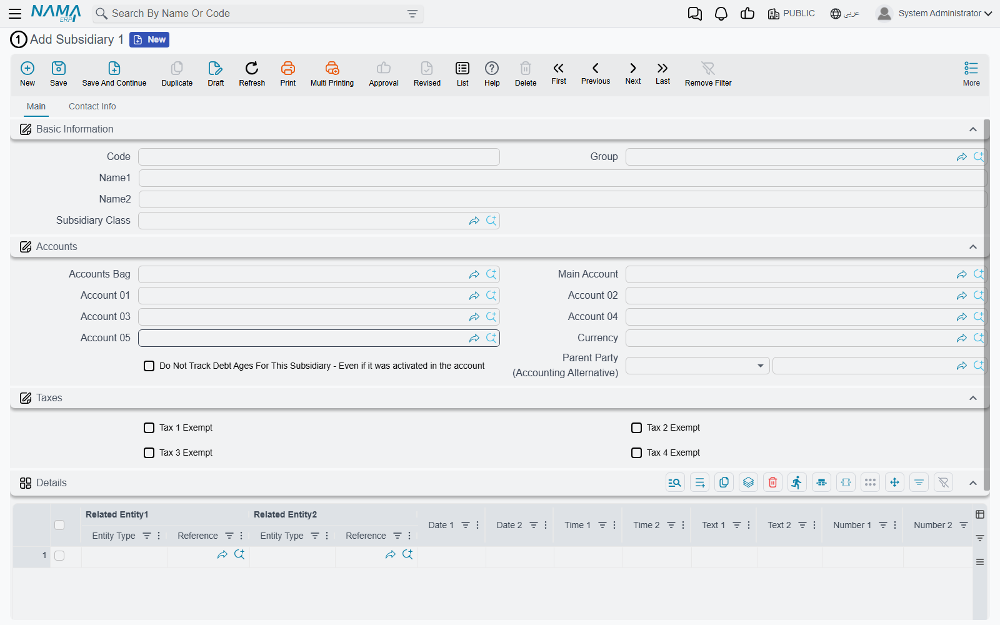
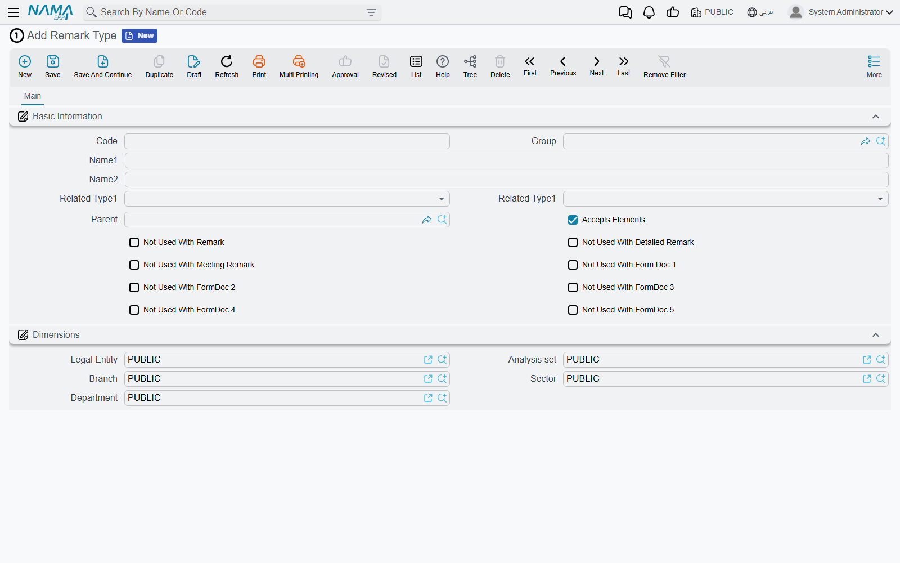

# Spare Master Files

[Form documents](/platform/form-documents.md) solve the problem of a customer needing a document
nobody else needs. The same problem turns up one shelf down: sometimes what the customer needs is
not a document at all but a **file** — a register of something, a list of parties, a small
catalogue that no module in Nama has a screen for.

A transport company keeps a list of the checkpoints its lorries pass through. A clinic keeps a
register of referring practices that are not suppliers, customers or employees. A factory keeps a
list of moulds that belong to its clients. None of these justifies a new master file in the
product — and each of them is a five-field record that somebody needs to pick from a lookup.

Nama keeps two sets of spare master files for exactly this, and they are stored in the same corner
of the menu as the form documents:

> **Basic → Remarks**

The two sets look similar and are built from the same set of unnamed spare fields, but they differ
in one way that decides which you should use: **one of them can carry an account.**

## Subsidiary 1 to 5 — spare files that can post to the ledger

There are five of them. Each is a full master file with a code, a name, dimensions and the same
bank of spare fields a form document carries — fifty numbers, thirty texts, twenty dates, twenty
switches, twenty reference fields, five classification levels, eleven attachments and four grids.

What makes them different from anything else in this corner of the system is the middle of the
screen:

Those are real accounting fields. A Subsidiary record carries an **accounts bag**, a **main
account** and twenty numbered account slots, a currency, tax exemption switches, a parent party
and its own control over debt-age tracking — the identical set a customer or a supplier has.

And they are not decoration. `Subsidiary 1` through `Subsidiary 5` are genuine subsidiary types as
far as the general ledger is concerned: a journal entry, a receipt voucher or an accounting side
configuration can name one exactly as it would name a customer. Balances accumulate against them,
debt ages track against them, and they appear in the subsidiary-based reports.

That makes them the right choice whenever the one-off file is a **party** — something money is
owed to or by, or something costs should be accumulated against. The transport company's
checkpoints do not need this. A list of client-owned moulds against which storage charges are
billed very much does.

::: tip Restrict which class goes with which file
**Subsidiary Class** (in the same menu folder) is the classification for these files, and it
carries a "not used with" switch for each of the five. Set them so that a class meant for the
mould register cannot be picked on the referring-practice register — the same discipline that
stops the two files drifting into one another.
:::

The second tab of a Subsidiary carries a complete contact block — addresses, phones, email, a
birth date, marital status, residency and passport details, a tax block and full bank details with
IBAN and SWIFT. If the one-off file is a *person* or a *company*, that is a great deal of structure
you get without configuring anything.

## The remarks family — spare files with no accounts

**Remark**, **Detailed Remark** and **Meeting Remark** are documented as a note-taking feature on
[Remarks, Agenda and Work Tasks](/platform/remarks-and-agenda.md), and that is what most sites use
them for. But structurally they are the same thing as a Subsidiary minus the accounting: a master
file with a code, a name, five classification levels, the full bank of spare fields, and ten grids
on the detailed and meeting versions.

So they work as an escape hatch too, and they are the better choice when the one-off file has no
financial dimension:

- it is a register, a checklist or a log rather than a party;
- nothing is ever owed to or by it;
- it does not need to appear in a subsidiary lookup.

Use **Detailed Remark** or **Meeting Remark** when the record has repeating parts, since those two
show a grid on their screen. Plain **Remark** shows none — though the same ten grids sit behind it,
so a Screen Modifier can surface one if you have already committed to that file.

::: warning Repurposing a remark file has a cost
The three remark files are wired into the More menu of every screen in the product — *Create
Remark*, *Related Detailed Remarks*, and so on. If you turn Detailed Remark into the customer's
*Site Visit Report*, then every screen in the system now offers to create a site visit report
against an item, an account or a payroll run, and the ordinary note-taking those commands were for
has nowhere to go.

On a site that already uses remarks as remarks, take a Subsidiary or a form document instead. Only
repurpose a remark file when the customer does not use that feature at all — and check before you
assume they don't.
:::

## Remark Types — the classification all of them share

All of the files above, and the form documents, classify themselves through the same five
independent trees: **Remark Type** through **Remark Type 5**.

Three things on that screen are worth knowing.

**The five levels are independent trees, not one hierarchy.** Remark Type 2 is not "a child of
Remark Type 1" — it is a separate classification with its own records. Each level can, optionally,
point at the level above it, and when it does the lookups narrow accordingly: choose a Remark Type,
and Remark Type 2 offers only the records that name it. That gives you a cascading classification
when you want one, and five unrelated tags when you don't.

**Related Type 1 and Related Type 2 pre-fill the links.** A remark type can nominate the kind of
record the two general-purpose reference fields should point at. Pick that type on a document and
Related Entity 1 and 2 are set to those kinds automatically. On a repurposed screen this is often
all the restriction you need — the heavier
[Fields and Entities Settings](/platform/fields-and-entities-settings/) approach is only necessary
when you want the field locked down rather than defaulted.

**Accepts Elements marks a leaf.** Only types marked this way can be selected on a record; the
rest are branches that exist to organise the tree.

::: warning The "not used with" switches stop at Form Document 5
The row of switches — Not Used With Remark, Not Used With Detailed Remark, Not Used With Meeting
Remark, Not Used With Form Doc 1 … 5 — is the whole list. There is no equivalent for Form Documents
6 to 16, and none for the Subsidiaries.

The practical effect is that on Form Documents 6 to 16 the Remark Type lookup is unfiltered: it
offers every type in the system, leaf or not. If the customer's form leans on classification, put
it on one of Form Documents 1 to 5 where the filter works.
:::

## Choosing between them

| If the one-off thing is… | Use |
| --- | --- |
| an event that happens on a date, with a number and a printout | a [form document](/platform/form-documents.md) |
| a party — money is owed to or by it, or costs accumulate against it | Subsidiary 1 … 5 |
| a register or catalogue with no financial side, with repeating lines | Detailed Remark or Meeting Remark — if the site does not use them as notes |
| a register or catalogue with no financial side and no lines | Remark — same caveat |
| a way of grouping any of the above | Remark Type 1 … 5, or Subsidiary Class |

Whichever you pick, the configuration work is the same as for a form document, and the
[worked example there](/platform/form-documents.md#Building-one----a-worked-example) applies
unchanged: rename the file and its fields with a Translation Overrider, surface the fields you
need with a Screen Modifier, restrict the reference and text fields in Fields and Entities
Settings, and add whatever calculation and validation the customer needs.

And the rule from that page applies here too, with no exceptions: **raise the requirement with the
development team before you decide it is a one-off.**
