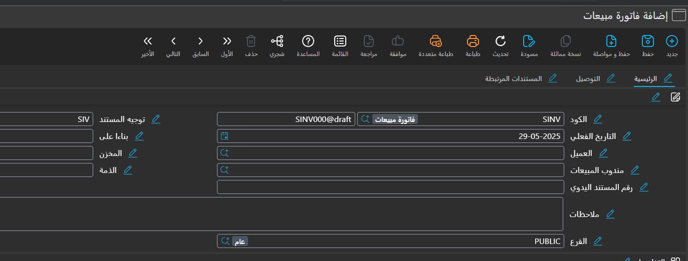
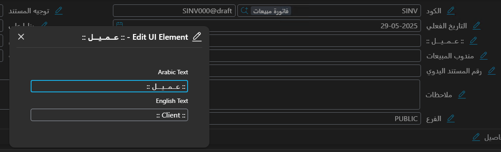
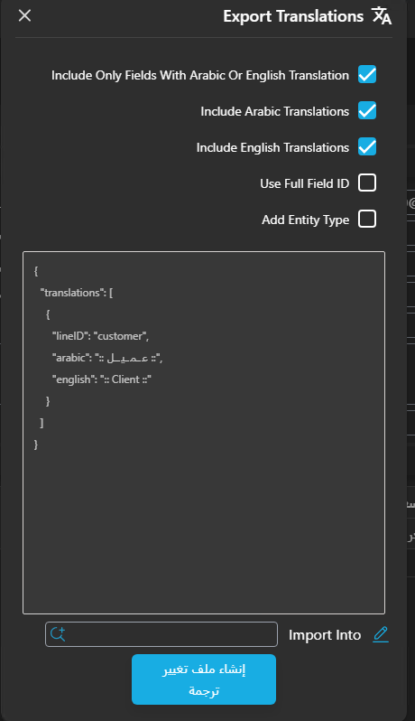

# Modifying Translations

Every label in the system — a field, a screen name, a page title, a group heading, an action button — comes with an Arabic and an English text. When a customer calls a field by a different name, or wants "Customer" to read "Client" everywhere, you do not need a new release: you record the change in a **Translation OverRider** record (**Basic → Settings → Translation OverRider**), and it replaces the shipped text.

Each line of a Translation OverRider names the label it changes and gives the new **Arabic** text, the new **English** text, or both; a language left empty keeps its shipped text. A record marked **Inactive** is ignored. Saving the record applies the change straight away, with no restart.

## Supported languages

The lines carry Arabic and English only. French is not a third column: when **Use French Instead of English** is switched on in [Global Configuration → General](/platform/global-config/global-config-general), the English side of the interface is replaced by French.

## Translating screen names (singular and plural)

Every screen has two names: the singular one on the edit screen (*Sales Invoice*) and the plural one on the list screen (*Sales Invoices*). Both are changed from the same kind of line:

* **Singular**: choose the screen in **For Type**, leave **ID** empty, then fill in **Arabic** and **English**.
* **Plural**: choose the same screen in **For Type**, type `s` in **ID**, then fill in **Arabic** and **English**.

## Translating fields

A field is identified by its field ID, and how widely a new label applies depends on what else the line names:

* **Everywhere the field appears**: enter the field ID in **ID** and fill in **Arabic** and **English**.
* **On one screen only**: also choose that screen in **For Type**.
* **On several screens**: create an **Entity Type List** record holding those screens and choose it in the line's **Entity Type List** field.

## Editing translations from the screen itself (Alt + Ctrl + T)

Finding field IDs by hand is slow, so the system can collect them for you while you look at the screen you want to change.

* Press **Alt + Ctrl + T** to show an edit button next to each field and heading.

* Clicking a button opens a box with two fields, Arabic and English.

* The new text shows on the screen at once, but only temporarily — it is not saved anywhere yet.
* When you are done, choose **Export Translations** from the **More** menu to turn your changes into a Translation OverRider record.

## The Export Translations window

This window decides which of the changes you made on screen go into the record, and how each line identifies its label:

* **Include Only Fields With Arabic Or English Translation**
  Include only the fields whose translation you changed.

* **Include Arabic Translations**
  Add the Arabic text to each line.

* **Include English Translations**
  Add the English text to each line.

* **Use Full Field ID**
  Write the full field ID on each line.

* **Add Entity Type**
  Fill **For Type** with the current screen, so the new labels apply on this screen only.

After choosing the options, click **Create Translation Overrider Record**. A Translation OverRider record opens holding the selected lines; fill in the remaining data and click **Save**, and the translations take effect immediately.
